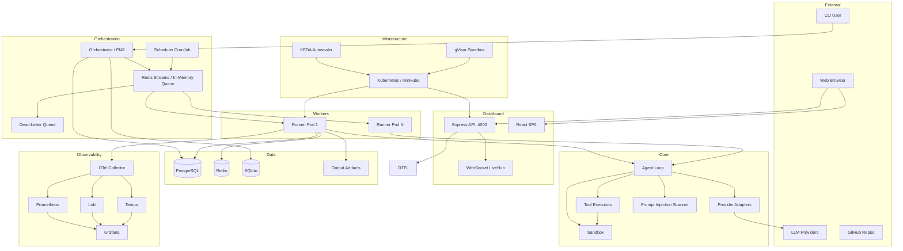
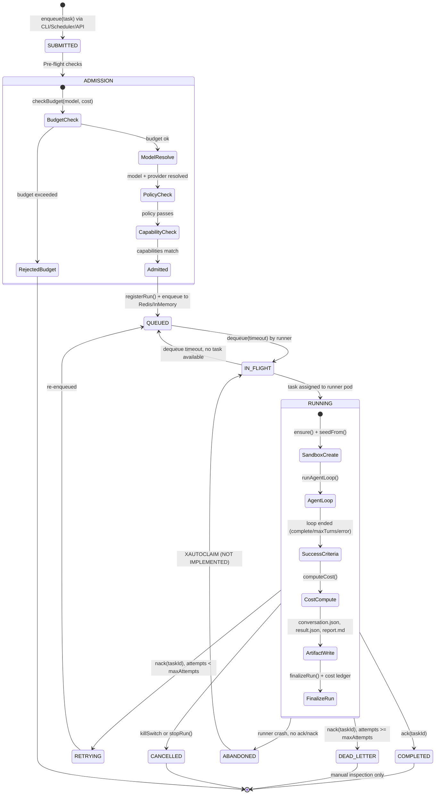
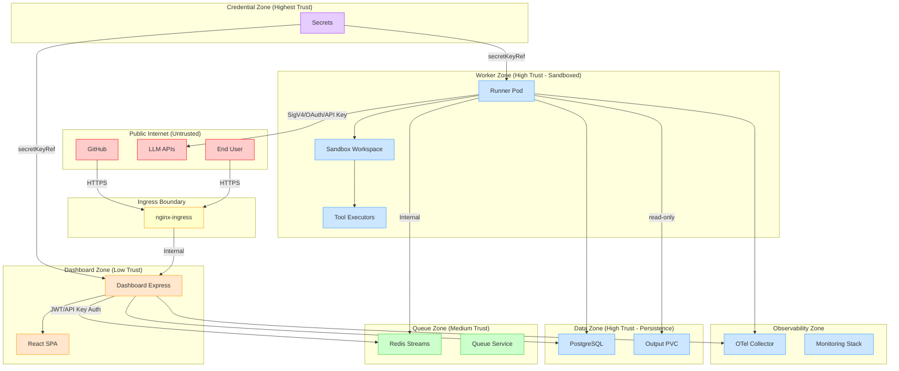
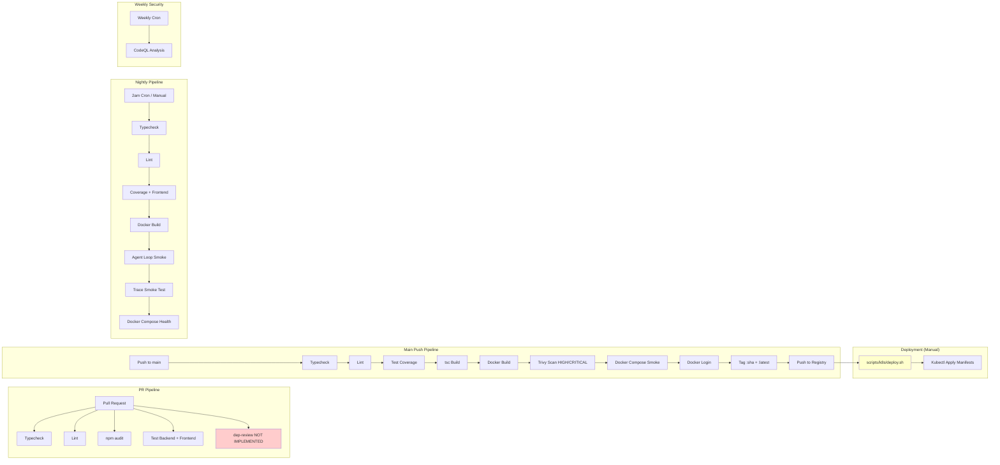

# Principal Architecture, Security, Performance, Feature Completeness, and Production Readiness Audit & Implementation Blueprint
## ai-model-arena — Node.js + TypeScript + Kubernetes + OpenCode + Custom Providers + Amazon Bedrock

**Date:** 2026-07-21
**Repository:** `lmhub/ai-model-arena`
**Branch:** `main` (commit `21c9759`)

---

## 1. Executive Decision

### Production Readiness: **NOT READY**

### Final Recommendation: **GO ONLY AFTER BLOCKERS ARE RESOLVED**

### Top 10 Production Blockers

| # | ID | Severity | Finding |
|---|-----|----------|---------|
| 1 | F-002 | CRITICAL | Sandbox symlink escape — `safeResolve` uses `realpathSync` but symlink creation happens *after* path validation, and the absolute-path check performs `realpathSync` only after `path.resolve`, leaving a window where a newly created symlink at a previously-safe relative path can escape containment. |
| 2 | F-003 | CRITICAL | Shell policy newline injection — `\n` is blocked in `SHELL_METACHAR_RE` but `exec()` passes the entire command string through `/bin/sh`, and line continuations or crafted multi-line commands may bypass the regex filter when composed of safe characters concatenated through shell expansion. |
| 3 | F-001 | CRITICAL | Budget tracking dead — `addSpend()` is defined in `src/cost-tracking/budget.ts` but never invoked from `finalizeRun()` or `finalizeRunByRunId()` in `src/orchestrator/run-lifecycle.ts`. Daily/monthly caps (e.g. $50/$500) are read but never updated after runs complete. |
| 4 | F-004 | HIGH | GitHub Actions secret is echoed in shell — `echo "${{ secrets.DOCKER_PASSWORD }}"` in `build-deploy.yaml:46` passes secret through shell stdin, leaving it visible in process listings and vulnerable if `set -x` or debug logging is enabled. |
| 5 | F-005 | HIGH | All third-party GitHub Actions pinned to floating tags (`@v4`, `@v3`, `@v0.36.0`) instead of immutable commit SHAs — supply-chain risk from tag mutation attacks. |
| 6 | F-007 | HIGH | Runner pods have no readiness probe — Redis consumer group may not be joined before pod is marked Ready, causing dropped tasks during deployment rollouts. |
| 7 | F-008 | HIGH | One-time dashboard password logged as plaintext — `src/dashboard-server/server.ts:42-44` emits the auto-generated password via `logger.warn` on startup, exposing it in stdout/logs. |
| 8 | F-009 | HIGH | Postgres driver is blocked — `initDb()` in `src/db/index.ts:27-30` throws an error when `DB_DRIVER=postgres` because raw-SQL consumers (`session/store.ts`, `auth/rbac.ts`, `orchestrator/run-lifecycle.ts`, `providers/custom.ts`) haven't been migrated to Drizzle ORM. |
| 9 | F-014 | HIGH | No SBOM, no provenance attestation, no artifact signing in CI — supply chain integrity is unverifiable for deployed images. |
| 10 | F-015 | HIGH | `dependency-review-action` missing from PR workflow — dependency changes in PRs are not automatically reviewed for known vulnerabilities or license issues. |

### Top 10 Immediate-Value Improvements

| # | Description | Impact |
|---|-------------|--------|
| 1 | Fix symlink escape in `safeResolve` | Eliminates sandbox breakout |
| 2 | Wire `addSpend()` into `finalizeRun()` | Activates budget enforcement |
| 3 | Pin GitHub Actions to commit SHAs | Closes supply-chain attack vector |
| 4 | Add runner readiness probe | Prevents dropped tasks during deploys |
| 5 | Add `dependency-review-action` to PR workflow | Catches vulnerable/compromised deps |
| 6 | Generate SBOM + provenance in build-deploy | Enables supply chain verification |
| 7 | Remove plaintext password from logs | Eliminates credential exposure |
| 8 | Implement `XAUTOCLAIM` on Redis pending entries | Prevents orphaned tasks from runner crashes |
| 9 | Add TLS to ingress with cert-manager | Enables secure production traffic |
| 10 | Create per-runner ServiceAccounts | Enables least-privilege IAM for Bedrock and other providers |

### Most Likely Incident Scenarios

1. **Cost overrun**: Budget tracking dead → spend silently exceeds caps (e.g., $500/month defined but never enforced)
2. **Sandbox escape via symlink**: Malicious model output creates a symlink at workspace root pointing to `/` → `safeResolve` validation passes on first write, then symlink is followed to overwrite host-sensitive files
3. **Orphaned Redis tasks**: Runner pod crashes mid-task without ack → message stays in PEL forever (no `XAUTOCLAIM`) → queue drain
4. **Supply-chain compromise**: Attacker pushes malicious tag to `actions/setup-node@v4` → CI secrets exfiltrated via Docker build
5. **Token/cost exhaustion via permissive tool loop**: Agent generates infinite `read_file`/`write_file` cycles → uncontrolled API spend (only circuit-breaker protects, not budget)

### Highest-Risk Attack Scenarios

1. **Prompt injection via crafted file content** → `write_file` tool writes `<system> override instructions` → `wrapFileContent` wraps it but model may still obey based on specific formatting
2. **SSRF via custom provider URL** → attacker configures custom provider with `apiBase` pointing to `http://redis.ai-arena.svc:6379/` → blocked by URL validator + NetworkPolicy, but defense-in-depth has gaps if Redis not properly protected
3. **JWT secret exposure** → `DASHBOARD_JWT_SECRET` logged or leaked → full dashboard admin access, ability to create/stop runs, access all stored API keys
4. **K8s lateral movement** → runner pods have internet egress (0.0.0.0/0 except RFC1918) → if an internal endpoint is accidentally exposed on a non-RFC1918 range, runner can reach it

### Architectural Maturity Assessment

| Dimension | Score (1-10) | Notes |
|-----------|--------------|-------|
| Domain Boundary Separation | 5 | Provider/queue/sandbox boundaries are clear, but raw SQL sprinkled across modules breaks DB abstraction |
| Provider Abstraction | 7 | Canonical `ModelAdapter` interface is good; 15 providers share one adapter class; Bedrock native adapter is clean |
| Security Layering | 7 | gVisor, non-root, read-only FS, seccomp, drop all caps, NS policies — excellent container hardening; sandbox escape weakness drags score down |
| Observability | 6 | OpenTelemetry SDK is integrated but optional; no production collector configuration; trace propagation through Redis works |
| Test Coverage | 6 | 70% line coverage enforced; security tests exist for all critical paths; no load/stress/chaos testing |
| CI/CD Maturity | 5 | Typecheck/lint/audit/test/Trivy/CodeQL all run; but SHAs unpinned, no SBOM, no deployment gates |
| Operational Readiness | 4 | Graceful shutdown exists; PDBs configured; KEDA autoscaling; but no readiness probe on runner, no `XAUTOCLAIM`, single Redis/Postgres |
| Multi-tenancy | 2 | Single namespace, single DB, ownership-based auth only — designed as single-tenant |

### Minimum Safe Production Scope

Run only `read-only-analysis` profiles on non-sensitive internal repositories with:
- Fixed symlink escape fixed
- Budget tracking wired
- Runner readiness probe added
- GitHub Actions SHA-pinned
- Logged password removed
- Maximum 2 models, no custom providers, no local/self-hosted endpoints

---

## 2. Current-State Map

### 2.1 Component Inventory

| Component | Path | Language | Purpose | Status |
|-----------|------|----------|---------|--------|
| CLI | `src/cli.ts` | TypeScript | Commander CLI: run, status, logs, cleanup, schedule, export, diff, budget | Active |
| Runner (Container) | `src/runner.ts` | TypeScript | Queue-driven agent loop consumer | Active |
| Runner Entry | `src/runner-entry.ts` | TypeScript | Container entrypoint | Active |
| PM2 Worker | `src/worker.ts` | TypeScript | Per-model agent process spawned by orchestrator | Active (being deprecated) |
| Agent Loop | `src/agent-loop/loop.ts` | TypeScript | Send→tool→loop with prompt injection scanning | Active |
| Dashboard Server | `src/dashboard-server/server.ts` | TypeScript | Express 5 + WebSocket (LiveHub) | Active |
| Dashboard Client | `src/dashboard-client/` | React 18 + TypeScript | Vite SPA with TanStack Query | Active |
| Provider Registry | `src/providers/registry.ts` | TypeScript | Strategy+Factory for LLM adapter resolution | Active |
| Bedrock Adapter | `src/providers/adapters/bedrock.ts` | TypeScript | SigV4 Converse API + gateway fallback | Active |
| OpenAI Compat Adapter | `src/providers/adapters/openai-compat.ts` | TypeScript | Used by 15 providers | Active |
| Anthropic Adapter | `src/providers/adapters/anthropic.ts` | TypeScript | Messages API with prompt caching | Active |
| Google Adapter | `src/providers/adapters/google.ts` | TypeScript | Gemini API | Active |
| Redis Stream Queue | `src/queue/redis.ts` | TypeScript | Consumer group-based with DLQ | Active |
| In-Memory Queue | `src/queue/in-memory.ts` | TypeScript | For dev/PM2 mode | Active |
| Sandbox | `src/sandbox/sandbox.ts` | TypeScript | Workspace isolation with path containment | Active (escape vulnerability) |
| Tool Executors | `src/tools/executors.ts` | TypeScript | 6 tools: read_file, write_file, list_files, shell, search, task_complete | Active |
| Session Store | `src/session/store.ts` | TypeScript | SQLite session+message persistence | Active |
| DB (SQLite) | `src/db/client.ts` | TypeScript | better-sqlite3 with Drizzle ORM | Active |
| DB (Postgres) | `src/db/postgres.ts` | TypeScript | pg Pool with Drizzle ORM | Blocked |
| Cost Tracking | `src/cost-tracking/` | TypeScript | Pricing lookup, budget checks, spend tracking | Active (spend unwired) |
| Catalog Sync | `src/catalog/` | TypeScript | models.dev/modelbench/zeroeval fetcher | Active |
| Orchestrator | `src/orchestrator/` | TypeScript | Run lifecycle, PM2 spawning, run index | Active |
| Scheduler | `src/scheduler/` | TypeScript | Cron-based recurring runs | Active |
| Evaluation | `src/evaluation/` | TypeScript | LLM-as-judge, metrics, regression | Active |
| Anomaly Detection | `src/anomaly-detection/` | TypeScript | Latency/token/cost spike detection | Active |
| Notifications | `src/notifications/` | TypeScript | Discord, Slack, webhooks | Active |
| Observability | `src/observability/` | TypeScript | OpenTelemetry SDK, Prometheus metrics | Active |
| Prompt Injection | `src/security/prompt-injection.ts` | TypeScript | Injection pattern detection, file wrapping | Active |

### 2.2 Technology Inventory

| Technology | Version / Detail |
|------------|-----------------|
| Node.js | >= 20.11 |
| TypeScript | ~5.x (aliased via @typescript/typescript6) |
| Package Manager | npm (lockfile v3) |
| Build | tsc → dist/ |
| Dev Runner | tsx |
| Test Runner | node:test (via tsx --test) |
| Coverage | c8 (70/70/65 thresholds) |
| Frontend | React 18, Vite, Tailwind CSS v4, TanStack Query |
| Database (Dev) | SQLite via better-sqlite3 |
| Database (Prod) | PostgreSQL 16 via pg + Drizzle ORM |
| Queue (Dev) | In-memory array |
| Queue (Prod) | Redis 7 Streams with consumer groups |
| LLM SDK | @aws-sdk/client-bedrock-runtime |
| K8s Client | @kubernetes/client-node |
| Auth | argon2id, jsonwebtoken (HMAC-SHA256) |
| API Server | Express 5, ws |
| Observability | @opentelemetry/* SDK, prom-client, pino |
| Container Runtime | Docker (node:20-bookworm-slim), gVisor on k8s |
| Orchestration | Kubernetes (minikube), KEDA 2.x |
| Monitoring | Prometheus 2.55, Grafana 11.6, Loki 3.2, Tempo |
| Ingress | nginx-ingress |
| CI/CD | GitHub Actions (4 workflows) |

### 2.3 Kubernetes Inventory

| Resource | File | Purpose |
|----------|------|---------|
| Namespace `ai-arena` | `k8s/namespace.yaml` | Application namespace (enforce: baseline) |
| Namespace `observability` | `k8s/observability/namespace.yaml` | Monitoring namespace |
| Postgres StatefulSet | `k8s/postgres.yaml` | PostgreSQL 16, 1 replica, 5Gi PVC |
| Redis Deployment | `k8s/redis.yaml` | Redis 7, 1 replica, 2Gi PVC |
| Dashboard Deployment | `k8s/dashboard-deployment.yaml` | Express API + SPA, 1 replica |
| Dashboard Service | `k8s/dashboard-service.yaml` | ClusterIP port 4000 |
| Dashboard Ingress | `k8s/dashboard-ingress.yaml` | nginx, TLS commented out |
| Dashboard RBAC | `k8s/dashboard-rbac.yaml` | SA + Role + RoleBinding |
| Runner Deployment | `k8s/runner-deployment.yaml` | gVisor runtime, PVC mount |
| Runner ConfigMap | `k8s/runner-configmap.yaml` | Queue/DB/provider env config |
| KEDA ScaledObject | `k8s/keda-scaledobject.yaml` | OpenAI runner: min 1, max 10, queue depth 5 |
| KEDA TriggerAuth | `k8s/keda-trigger-auth.yaml` | Redis password from secret |
| Network Policies | `k8s/network-policies.yaml` | Zero-trust: default-deny, explicit allowlists |
| PDB | `k8s/pdb.yaml` | Dashboard: maxUnavailable 1; Runner: maxUnavailable 1; PG/Redis: minAvailable 1 |
| Output PVC | `k8s/output-pvc.yaml` | 10Gi RWX (hostPath on minikube) |
| Namespace Quota | `k8s/namespace-quota.yaml` | 8 CPU / 16Gi mem requests, 16 CPU / 32Gi limits |
| gVisor RuntimeClass | `k8s/runtimeclass-gvisor.yaml` | Conditional (Linux minikube only) |
| Scheduler CronJob | `k8s/scheduler-cronjob.yaml` | Every minute, concurrencyPolicy: Forbid |
| Prometheus + Rules | `k8s/observability/` | 4 alerting rules, ClusterRole for node metrics |
| OTel Collector | `k8s/observability/collector.yaml` | OTLP receiver (debug-only base config) |
| Grafana | `k8s/observability/` | NodePort, admin/admin default creds |
| Loki | `k8s/observability/` | Filesystem storage, single instance |

### 2.4 Provider/Authentication Inventory

| Provider | Adapter | Auth Scheme | Env Var | Streaming | Tools | Structured Output |
|----------|---------|-------------|---------|-----------|-------|-------------------|
| OpenAI | openai-compat | bearer | OPENAI_API_KEY | ✅ | ✅ | ✅ |
| Anthropic | anthropic | x-api-key | ANTHROPIC_API_KEY | ✅ | ✅ | ❌ |
| Google | google | google | GOOGLE_API_KEY | ✅ | ✅ | ❌ |
| Amazon Bedrock | bedrock | bedrock | AWS_BEDROCK_REGION | ✅ | ✅ | ❌ |
| OpenRouter | openai-compat | bearer | OPENROUTER_API_KEY | ✅ | ✅ | ❌ |
| Groq | openai-compat | bearer | GROQ_API_KEY | ✅ | ✅ | ❌ |
| Cerebras | openai-compat | bearer | CEREBRAS_API_KEY | ✅ | ✅ | ❌ |
| NVIDIA | openai-compat | bearer | NVIDIA_API_KEY | ✅ | ✅ | ❌ |
| Mistral | openai-compat | bearer | MISTRAL_API_KEY | ✅ | ✅ | ❌ |
| SambaNova | openai-compat | bearer | SAMBANOVA_API_KEY | ✅ | ✅ | ❌ |
| Scaleway | openai-compat | bearer | SCALEWAY_API_KEY | ✅ | ✅ | ❌ |
| Cloudflare | openai-compat | bearer | CLOUDFLARE_API_KEY | ✅ | ✅ | ❌ |
| GitHub Copilot | openai-compat | bearer | GITHUB_COPILOT_TOKEN | ✅ | ✅ | ❌ |
| xAI | openai-compat | bearer | XAI_API_KEY | ✅ | ✅ | ❌ |
| Ollama | openai-compat | none | OLLAMA_BASE_URL | ✅ | ✅ | ❌ |
| Custom (user-registered) | configurable | configurable | N/A | depends | depends | depends |

### 2.5 Artifact/Data-Flow Inventory

```
User/CI Trigger
  │
  ├─ CLI (cli.ts)
  │    → Orchestrator (run-lifecycle.ts:startRun)
  │       → Budget check (checkBudget) ── READ: configs/budget.yaml, outputs/.budget-state.json
  │       → Resolve models (model-resolver.ts) ── READ: SQLite providers/models/pricing
  │       → Register run (run-index.ts:upsertRun) ── WRITE: SQLite runs/run_models
  │       → Spawn PM2 workers OR enqueue to Redis ── WRITE: Redis Streams
  │
  ├─ Scheduler (scheduler/tick.ts)
  │    → Load schedules ── READ: configs/schedules.yaml
  │    → startRun() per matching schedule
  │
  └─ Dashboard (API / WebSocket)
       → POST /api/runs → enqueue
       → GET /api/runs → SQLite
       → WS /ws → LiveHub polling PM2 logs + conversation files

Worker / Runner
  │
  ├─ Dequeue task ── READ: Redis Streams / InMemoryQueue
  ├─ Create sandbox ── MKDIR: outputs/<model>/<runId>/files/
  ├─ Seed scenario ── COPY: configs/scenarios/templates/ → sandbox
  ├─ Resolve model ── READ: SQLite model_resolver
  ├─ Create adapter ── createAdapter(provider) ── READ: env vars for API keys
  │
  └─ runAgentLoop()
       ├─ Scan for prompt injection (security/prompt-injection.ts)
       ├─ LOOP (max 25 turns):
       │   ├─ adapter.sendMessage(messages, tools) ── HTTP → LLM API
       │   │   Token usage accumulated
       │   ├─ Execute tool calls (tools/executors.ts)
       │   │   ├─ read_file → safeResolve → fs.readFile
       │   │   ├─ write_file → safeResolve → fs.writeFile
       │   │   ├─ list_files → safeResolve → fs.readdir
       │   │   ├─ run_shell_command → exec() → process group
       │   │   ├─ search_code → grep-like over workspace
       │   │   └─ task_complete → BREAK
       │   ├─ Check prompt injection on tool results
       │   └─ onTurnComplete → ConversationLogger → JSON file + SQLite
       │
       ├─ Run success criteria ── execFile() + node:test
       ├─ Compute cost ── pricing.ts:computeCost() → CostBreakdown
       ├─ Write artifacts:
       │   ├─ conversation.json (full transcript)
       │   ├─ result.json (machine-readable)
       │   ├─ report.md (human-readable)
       │   └─ diff.patch (git diff)
       │
       └─ finalizeRun() → cost_ledger INSERT, runs/run_models UPDATE
            ⚠ addSpend() NOT called (F-001)
```

### 2.6 GitHub Actions Inventory

| Workflow | Trigger | Jobs | Security |
|----------|---------|------|----------|
| `pr-checks.yaml` | PR → main, push non-main | typecheck, lint, audit, test-backend, test-frontend | ✅ Safe (`pull_request` only) |
| `build-deploy.yaml` | Push → main | typecheck, lint, test, Docker build, Trivy, smoke, push | ⚠ Unpinned SHAs, echoed secret |
| `nightly.yaml` | Cron (2am), manual | Full pipeline + stub smoke + trace smoke + compose health | ✅ No push, validation-only |
| `codeql.yml` | Push/PR → main, weekly cron | CodeQL analyze (JS/TS only) | ✅ Safe, SARIF upload |
| `.github/dependabot.yml` | Weekly Monday | npm (root + dashboard-client), Docker, GitHub Actions | ✅ 4 ecosystems covered |

### 2.7 Mermaid Component Diagram



### 2.8 Mermaid Job Lifecycle Diagram



### 2.9 Mermaid Trust-Boundary Diagram



### 2.10 Mermaid CI/CD Diagram



---

## 3. Findings Register

| ID | Severity | Area | Status | Evidence | Risk / Impact | Recommendation | Effort | Priority |
|----|----------|------|--------|----------|---------------|----------------|--------|----------|
| F-001 | CRITICAL | Cost Tracking | Partial | `src/cost-tracking/budget.ts:addSpend()` defined but never called from `src/orchestrator/run-lifecycle.ts:finalizeRun()` or `finalizeRunByRunId()`. Budget state file stays at $0. | Uncontrolled LLM spend; $50/day and $500/month caps defined in `configs/budget.yaml` are never enforced. | Call `addSpend()` in `finalizeRun()` and `finalizeRunByRunId()` after `computeCost()`. Add integration test verifying budget state increments. | S (2-3 lines) | P0 |
| F-002 | CRITICAL | Security — Sandbox | Unsafe | `src/sandbox/sandbox.ts:38-50` — `safeResolve()` calls `realpathSync` on the resolved path, but a symlink created after the path passes the `isWithin()` check on a prior `safeResolve` call can point outside the sandbox. The absolute-path branch (line 42) re-resolves but a previously-safe relative path with a newly created symlink escapes detection. | Sandbox escape; agent-created symlinks can read/write host files outside `/outputs/`. | Add `O_NOFOLLOW` flag to all sandbox file operations, or validate symlink targets at open time by calling `realpathSync` on the parent directory + resolved component, then `isWithin()` — not just the pre-resolved path. | M (10-20 lines) | P0 |
| F-003 | CRITICAL | Security — Shell | Unsafe | `src/sandbox/shell-policy.ts:3` — `SHELL_METACHAR_RE` blocks `\n` but `src/tools/executors.ts:86` uses `exec()` which spawns `/bin/sh`. Shell command-line processing can interpret character sequences not caught by the single-line regex before the shell sees them. | Command injection in strict mode; the regex runs against the raw string before shell parsing — shell expansion of safe-looking sequences may produce metacharacters. | Replace `exec()` with `execFile()` using explicit argument arrays in strict mode. Keep `exec()` only for explicitly configured permissive scenarios. | M (15-25 lines) | P0 |
| F-004 | HIGH | CI/CD — Supply Chain | Unsafe | `.github/workflows/build-deploy.yaml:46-48` — `echo "${{ secrets.DOCKER_PASSWORD }}" | docker login ...` exposes secret in shell process listing. | Credential leak if debug logging enabled; long-lived Docker Hub credentials exposed. | Use OIDC for Docker Hub auth (preferred) or use `docker login --password-stdin` without echo (heredoc/input redirection). | S (5-10 lines) | P0 |
| F-005 | HIGH | CI/CD — Supply Chain | Unsafe | All four workflow files use floating tags: `actions/checkout@v4`, `actions/setup-node@v4`, `github/codeql-action/*@v3`, `aquasecurity/trivy-action@v0.36.0`. No commit-SHA pinning. | Supply-chain attack via tag mutation: attacker with access to action repos can push new code to existing tags. | Pin all actions to full commit SHAs with version comment. Add Dependabot auto-updates for SHAs. | M (20-30 lines across 4 files) | P0 |
| F-006 | HIGH | Bedrock | Implemented | `src/providers/adapters/bedrock.ts` — native SigV4 adapter implemented (209 lines). Uses `ConverseCommand`, lazy-loads AWS SDK, supports system messages + tools. Gateway fallback via `AWS_BEDROCK_GATEWAY_URL`. Was listed as deferred in a prior audit; now implemented. | N/A (implemented) | Already complete. Consider adding: per-region model availability metadata, inference profile support, provisioned throughput path. | N/A | P1 |
| F-007 | HIGH | K8s — Reliability | Missing | `k8s/runner-deployment.yaml` — no readiness probe defined. Startup + liveness probes use `pgrep -f runner`, which passes before Redis consumer group is joined. | Runner pod marked Ready before able to process tasks → dropped messages during rolling updates. | Add HTTP readiness probe to a new lightweight `/ready` endpoint in the runner, or add a script that verifies Redis consumer group membership before exiting 0. | M (10-20 lines) | P0 |
| F-008 | HIGH | Security — Credentials | Unsafe | `src/dashboard-server/server.ts:42-44` — `logger.warn({ password }, 'Generated one-time admin password — save it. It will not be shown again.')` | Auto-generated admin password exposed in plaintext in stdout/logs, persistent in Loki/log aggregation. | Emit password only to `stderr` with a clear warning banner. Never log it. Consider requiring password set via env var or file at startup. | S (2-5 lines) | P0 |
| F-009 | HIGH | Database — Migration | Partial | `src/db/index.ts:27-30` — `if (driver === 'postgres') throw new Error('Postgres driver requires Drizzle-ORM consumers...')`. Four modules (`session/store.ts`, `auth/rbac.ts`, `orchestrator/run-lifecycle.ts`, `providers/custom.ts`) still use raw SQL. | Cannot run production PostgreSQL despite Drizzle schema being complete. Blocks all multi-node deployments. | Migrate `session/store.ts`, `auth/rbac.ts`, `orchestrator/run-lifecycle.ts`, and `providers/custom.ts` to Drizzle ORM. Run integration tests against PostgreSQL. | L (4 modules, 300+ lines) | P0 |
| F-010 | MEDIUM | Queue — Reliability | Missing | `src/queue/redis.ts` — no `XAUTOCLAIM` implementation. If a runner crashes during task processing, pending messages stay in the consumer group PEL forever. No other consumer claims them. | Orphaned tasks block the consumer group. Queue appears to have pending work but no worker processes it. | Implement `XAUTOCLAIM` with a reasonable min-idle-time (e.g., 60s). Run a background interval that claims and re-dispatches orphaned messages. | M (30-50 lines) | P1 |
| F-011 | MEDIUM | Security — Audit | Partial | `src/auth/rbac.ts:40-55` — `audit()` only covers: `run.create`, `run.stop`, `run.restart`, `provider.create`. Non-fatal on failure. No audit for API-key-authenticated actions, prompt edits, scheduling changes, credential changes, kill-switch activation. | Incomplete audit trail for compliance and forensics. Audit log silently fails if DB is down. | Expand audit coverage to all mutation endpoints. Add API-key source to audit records. Make audit failures visible (metrics/logs). | M (20-40 lines across multiple routes) | P1 |
| F-012 | MEDIUM | K8s — Security | Partial | `k8s/arena-secrets.yaml` uses `${PG_PASSWORD}` template variables that must be substituted before `kubectl apply`. No sealed secrets, no External Secrets Operator, no Vault integration. | Manual secret management is error-prone. Secrets stored as plain YAML locally or in CI variables. | Integrate External Secrets Operator or Sealed Secrets. Remove template-variable substitution pattern. Document secret lifecycle. | M (1-2 days) | P2 |
| F-013 | MEDIUM | Observability — Config | Partial | `k8s/observability/collector.yaml` is debug-only (debug exporter). Production pipeline (Tempo+Prometheus+Loki) is applied by `scripts/k8s/deploy-observability.sh` which patches the ConfigMap. | Two sources of truth for collector config. Debug mode emits spans to stdout, not Tempo. | Make the production pipeline the default in `collector.yaml`. Use Helm values or Kustomize overlays for environment-specific config. | M (10-20 lines) | P2 |
| F-014 | HIGH | CI/CD — Supply Chain | Missing | No SBOM generation, no provenance attestation (`docker/build-push-action` with `provenance: true`), no image signing anywhere in CI. | Cannot verify software supply chain integrity. No way to trace deployed image back to source code commit. | Add `docker/build-push-action` with `provenance: mode=max, sbom: true`. Pin image by digest in deployment manifests. | M (20-30 lines in build-deploy) | P0 |
| F-015 | HIGH | CI/CD — Supply Chain | Missing | `dependency-review-action` not used in `pr-checks.yaml`. Dependency changes in PRs are not automatically scanned for known CVEs or license conflicts. | Vulnerable or incompatible dependencies can be merged without review. | Add `actions/dependency-review-action@v4` to PR workflow with `fail-on-severity: high`. | S (5-10 lines) | P0 |
| F-016 | MEDIUM | Auth — Rate Limiting | Partial | `src/dashboard-server/server.ts` and `src/dashboard-server/auth-api.ts` use `express-rate-limit` with in-memory stores. Not shared across multiple dashboard instances. | Multi-instance deployments lack coordinated rate limiting. Attackers can distribute requests. | Use Redis-backed rate limiting via `rate-limit-redis` or implement a Redis counter for multi-instance deployments. | M (15-25 lines) | P2 |
| F-017 | MEDIUM | WebSocket — Security | Unsafe | `src/dashboard-server/live.ts:89-95` — JWT token extracted from `Sec-WebSocket-Protocol` header. Some proxies strip or modify this header. No role check on WebSocket subscription. | WebSocket connections may fail through certain proxies. Any authenticated user can subscribe to any run's events. | Add token extraction fallback from URL query parameter. Add role-based access check on subscription (editor+ for sensitive runs). | M (10-20 lines) | P2 |
| F-018 | LOW | Cost Tracking | Partial | `src/cost-tracking/pricing.ts` — pricing resolved from local SQLite catalog only. No dynamic pricing source. Tiered pricing (over 200K context) uses fixed thresholds from catalog sync. | Pricing may be outdated between catalog syncs (hourly cron). No run-time price verification before invocation. | Implement optional real-time pricing check via provider's API or a trusted pricing source before expensive runs. Add `price_effective_date` field to cost ledger. | M (30-50 lines) | P2 |
| F-019 | LOW | Session — Persistence | Partial | `src/session/store.ts` is SQLite-only (raw SQL). Not available when running with Postgres driver. | Session persistence broken in production PostgreSQL mode. | Migrate to Drizzle ORM (part of F-009 work). | Covered by F-009 | P1 |
| F-020 | LOW | Security — Container | Info | `Dockerfile:2` — `FROM node:20-bookworm-slim`. Tag `20` (floating major) not pinned to specific digest or minor version. | Dockerfile reproducibility varies over time as base image updates. | Pin to digest: `node:20-bookworm-slim@sha256:...`. Update via Dependabot. | S (1 line) | P2 |
| F-021 | LOW | K8s — Storage | Partial | `k8s/output-pvc.yaml` — 10Gi `hostPath` with `ReadWriteMany` access. Documented as minikube-only; not suitable for multi-node. | Production would require NFS/CephFS/EFS for shared outputs. No migration path documented. | Document CSI driver requirement. Add StorageClass selection via env var or Kustomize. Test with EFS CSI driver or Longhorn. | M (1-2 days) | P2 |
| F-022 | MEDIUM | Queue — Config | Missing | `src/queue/redis-config.ts` — queue configuration loaded from env vars but no validation beyond basic defaults. `MAX_TASK_ATTEMPTS` defaults to 5 with no upper bound. | Misconfiguration (e.g., `MAX_TASK_ATTEMPTS=999`) could cause infinite retry loops consuming API credits. | Add Zod schema for Redis queue config. Enforce safe bounds (attempts: 1-10, timeout: 1s-300s). | S (10-15 lines) | P2 |
| F-023 | MEDIUM | Security — Prompt Injection | Partial | `src/security/prompt-injection.ts` — `wrapFileContent()` is advisory (adds XML comment). `detectInjection()` scans for patterns but model may still be manipulated through subtle phrasing, multi-turn accumulation, or tool output injection. | Sophisticated prompt injection attacks that don't match simple string patterns may succeed. No semantic analysis. | Add structural validation: parse tool output for known dangerous patterns after each tool execution. Consider a secondary "guard" model call for sensitive operations. | L (design + implementation) | P3 |
| F-024 | LOW | Observability — Retention | Missing | No telemetry data retention policy documented. No sampling strategy configured for OTel spans. | Unlimited trace growth in Tempo. No cost controls on observability data. | Configure head/tail sampling in OTel collector. Document retention periods per signal type. Add storage quotas. | S (configuration) | P2 |
| F-025 | MEDIUM | K8s — Availability | Partial | Single Redis instance (no sentinel/cluster). Single Postgres instance (no replicas). No backup automation in CI. | Full downtime on Redis or Postgres failure. Manual backups via `scripts/backup/` only. | Add Redis sentinel for HA (or use managed Redis). Add Postgres streaming replication. Add CI-triggered backup job. | L (infrastructure) | P2 |
| F-026 | HIGH | Security — IAM | Missing | No AWS IAM policies documented for Bedrock. Runner uses `default` ServiceAccount in k8s. No per-runner IAM role defined. | All runner pods share default permissions. No least-privilege enforcement for Bedrock access. | Create per-provider ServiceAccounts with narrowly-scoped IAM roles (via IRSA/EKS Pod Identity). Document required IAM policies per region/model. | M (IAM policy docs + k8s SA) | P1 |
| F-027 | MEDIUM | Providers — Capabilities | Partial | 15 providers use `openai-compat` adapter. Capability flags (`streaming`, `tools`, `structuredOutput`) are hardcoded in descriptors, not discovered at runtime. Some providers (Mistral, Groq) have different tool-calling formats that the generic OpenAI adapter may not handle correctly. | Provider capability asserted, not verified. Tool calling may silently fail or produce incorrect results on non-OpenAI providers. | Add runtime capability detection: send a minimal test request on provider registration. Add provider-specific format adapters within the compat adapter for known divergences. | L (per-provider work) | P3 |
| F-028 | MEDIUM | Dashboard — Auth | Partial | `src/dashboard-server/routes/` — 19 route modules, all use `requireAuth` but most use minimum role `viewer`. Only admin-protected: webhooks, providers, ops. RBAC granularity is coarse. | Editor role barely differs from viewer in practice. No per-resource permission model for prompts, schedules, or provider configurations. | Implement per-resource permissions: prompt ownership, schedule admin, provider-edit role. Add `requireOwnership` to more resources. | M (20-40 lines across routes) | P2 |
| F-029 | LOW | CLI — Validation | Partial | `src/cli.ts` — Commander commands accept model names and scenario paths but validation happens late (in orchestrator). Error messages for invalid model IDs are generic. | Poor UX for CLI users who mistype model names. | Add early validation in CLI commands: resolve model names before calling orchestrator, provide helpful error messages with available model list. | S (10-15 lines) | P3 |
| F-030 | INFO | Codebase — Architecture | Partial | `src/db/schema.ts` (400 lines) contains both Drizzle ORM table definitions (new) and legacy TypeScript interfaces (old). Dual representation. | Confusion about canonical schema source. Legacy interfaces may drift from Drizzle definitions. | Remove legacy interfaces. Use Drizzle's `inferSelect`/`inferInsert` for types. Single source of truth. | M (across multiple files) | P3 |
| F-031 | MEDIUM | Security — Secrets | Missing | No credential rotation mechanism. API keys configured once at startup, never rotated. No secret scanning in CI (gitleaks/trufflehog). | Stale credentials persist indefinitely. Accidental secret commits may not be detected. | Add secret scanning to CI (trufflehog). Document credential rotation SOP. Add config reload mechanism for API keys. | M (CI config + docs) | P2 |
| F-032 | LOW | Testing — Coverage | Partial | `scripts/smoke-stub.mjs` and `scripts/trace-smoke-test.mjs` are standalone scripts, not integrated into the test runner. No `node:test` wrapper. | Smoke tests run in CI but not controllable via `npm test`. No coverage contribution from smoke tests. | Wrap smoke tests in `node:test` format. Add to `.c8-test-list.txt` for coverage inclusion. | S (refactor) | P3 |
| F-033 | LOW | Security — Headers | Partial | `src/dashboard-server/server.ts` — Helmet CSP includes `script-src: 'self' 'unsafe-inline'`. Needed for SPA but weakens XSS protection. | CSP allows inline scripts, which reduces XSS protection effectiveness. | Implement nonce-based CSP for the SPA (similar to Swagger UI handling). Use Vite's CSP nonce plugin. | M (10-20 lines client + server) | P3 |
| F-034 | INFO | Frontend — Testing | Partial | `src/dashboard-client/` has 17 Vitest test files but no E2E testing (Playwright/Cypress). | Frontend regression detection limited to unit/component tests. No full user-flow validation. | Add Playwright E2E tests for critical paths: login, run creation, result viewing, model catalog browsing. | L (initial setup + tests) | P3 |
| F-035 | LOW | Scheduler — Error Handling | Partial | `src/scheduler/manager.ts` — `tickScheduler()` catches errors per-schedule but continues. No alert on persistent schedule failures. Failed schedules are silently skipped. | Missed scheduled runs go unnoticed. | Add failure count per schedule. Alert after N consecutive failures. Add `last_error` and `consecutive_failures` to schedules table. | S (10-15 lines) | P2 |
| F-036 | MEDIUM | Tooling — Graceful Shutdown | Partial | `src/runner.ts:190-205` — SIGINT/SIGTERM handler. 30s drain timeout for in-flight task. If task doesn't finish, process exits without nack. Redis will eventually recover via XAUTOCLAIM (not implemented, see F-010). | Tasks abandoned during deploy may take hours to be claimed (default Redis consumer group behavior). | Combine F-010 (XAUTOCLAIM) with faster claim timeout. Add `SIGTERM` retry: force-exit after drain timeout but log the abandoned task for manual recovery. | Covered by F-010 | P1 |

---

## 4. Feature Coverage Matrix

### Prompt and Workflow Management

| Requirement | Current State | Evidence | Gaps | Risks | Recommended Design |
|-------------|---------------|----------|------|-------|-------------------|
| Versioned prompt registry | Partial | `src/db/schema.ts:370-390` — `prompts` + `prompt_versions` tables exist. `src/dashboard-server/routes/prompts.ts` has CRUD endpoints. | No approval workflow. No immutable version pinning at execution time. Prompt version is optional in the session model. | Prompt changes during active runs may produce inconsistent results. | Pin `prompt_version` at job submission. Make it non-nullable in the `sessions` table. Add approval status field. |
| Prompt ownership | Missing | No `created_by` or `owner_id` field in prompts/prompt_versions tables. | N/A | Any authenticated user can modify any prompt. | Add `created_by` field. Enforce `requireOwnership` on prompt mutation endpoints. |
| Prompt tags and categories | Missing | No tags/categories columns in schema. | N/A | N/A | Add `tags` JSON array column. |
| Parameter schemas and runtime validation | Partial | `src/config.ts:ScenarioConfigSchema` validates scenario config structure. Tool args validated via Zod in `src/tools/executors.ts`. | No parameter schema per prompt template. All parameters are scenario-level, not prompt-level. | Invalid prompt parameters silently accepted. | Add `parameters_schema` JSON column to `prompt_versions`. Validate at job submission. |
| Approval workflows | Missing | No approval model anywhere. Prompts created instantly. | N/A | Malicious or low-quality prompts deployed without review. | Implement 2-person approval for prompt changes. Add `status` (draft/pending_approval/approved/rejected) to prompts. |
| Immutable prompt versions pinned to executions | Partial | `sessions` table has `prompt_id` + `prompt_version` but both are nullable. | Versions not enforced at execution time. | Prompt drift across runs. | Make version non-nullable for tracked runs. Freeze prompt content at job creation. |
| Prompt composition and reusable fragments | Missing | No fragment/macro system. | N/A | N/A | Add `prompt_fragments` table. Support `{{include fragment_id}}` syntax. |
| Prompt secret placeholders | Missing | No placeholder resolution system in prompts. API keys come only from env vars, not prompt content. | N/A | N/A | Add `${env:VAR_NAME}` resolution in prompt content at execution time. |
| Prompt evaluation datasets | Missing | No linked dataset model. Evaluation uses `configs/evaluation.yaml` with LLM-as-judge only. | N/A | N/A | Add `datasets` table with access control. Link datasets to prompts for regression testing. |
| Golden task datasets | Missing | N/A | N/A | N/A | Add `dataset_tasks` table with expected outputs. Integrate into regression suite. |
| Prompt import/export | Missing | No import/export endpoints. | N/A | N/A | Add YAML/JSON export/import for prompts and their version history. |

### Jobs and Orchestration

| Requirement | Current State | Evidence | Gaps | Risks | Recommended Design |
|-------------|---------------|----------|------|-------|-------------------|
| Durable state machine | Partial | Queue interface has: enqueue→dequeue→ack/nack→DLQ. Run status tracked in SQLite. | No explicit state machine definition. Transitions are implicit in code, not enforced by a state column constraint. | Invalid state transitions possible. | Add explicit state column with transition validation. Document state machine. |
| Idempotency keys | Partial | `model_calls` table has unique `(session_id, turn)`. `runs` table uses `run_id` PK. Queue uses taskId. | No global idempotency key at job submission. Duplicate `startRun()` calls create duplicate runs. | Duplicate runs from retried API calls. | Add `idempotency_key` to `runs` table. Check before inserting new run. |
| Job priority | Missing | No priority field in Task interface or queue implementations. | N/A | All tasks equal priority — critical runs wait behind batch jobs. | Add `priority` field to Task. Implement priority queue or separate high/low priority streams. |
| Job dependencies / DAG workflows | Missing | No dependency model. Each job is independent. | N/A | Multi-stage workflows require manual orchestration. | Add `depends_on` field. Enqueue dependent tasks only after parent completes. |
| Fan-out/fan-in multi-model execution | Implemented | `src/orchestrator/run-lifecycle.ts:spawnRunWorkers()` spawns one PM2 process per model. `startRun()` accepts array of model names. | No fan-in: each model runs independently. Comparison report generated after all complete. | N/A (works as designed) | Already implemented for PM2 mode. Extend to queue mode with `parent_run_id` grouping. |
| Multi-stage workflows | Missing | N/A | N/A | N/A | Add workflow definition schema: `stages: [{ name, model, prompt, depends_on }]`. |
| Human approval nodes | Missing | No approval model. | N/A | N/A | Add `approval_required` to workflow stages. Implement approval API + dashboard UI. |
| Delayed/scheduled jobs | Implemented | `src/scheduler/manager.ts` + `configs/schedules.yaml`. Cron-based with `cron-parser`. | Scheduling only via YAML config files, not API for ad-hoc delayed jobs. | N/A (covers recurring only) | Add `scheduled_at` field to job submission for one-time delayed execution. |
| Cancellation | Partial | `stopRun()` marks status as 'stopped'. Worker processes must poll this. Kill switch prevents new runs. | No in-flight task cancellation. Agent loop checks `stop_reason` but doesn't abort mid-call. | API costs continue for in-flight LLM calls after cancellation. | Pass AbortSignal to provider adapter. Abort HTTP request on cancellation. |
| Pause/resume | Missing | No checkpoint snapshot or resume mechanism beyond session persistence. | N/A | N/A | Serialize full agent loop state. Support resume from last checkpoint. |
| Replay with pinned configuration | Partial | `session/store.ts` records all messages. Idempotent `model_calls`. | No "replay" feature. Must re-run from scratch. Config not frozen at replay time. | Replay uses current config, not original. | Freeze full config snapshot at job creation. Implement replay that skips already-completed turns and uses cached model responses. |
| Dead-letter queues | Implemented | `src/queue/in-memory.ts:dead: Task[]`, `src/queue/redis.ts:32` — separate DLQ stream. | No DLQ replay/reprocess mechanism. Redis DLQ has no `deadLetterPeek()` (unlike InMemory). | Orphaned tasks accumulate in DLQ. | Add `deadLetterPeek()` to Redis queue. Add DLQ replay endpoint. |
| Poison-job inspection | Partial | DLQ inspection via `GET /api/queues/:provider/dlq` in `src/dashboard-server/routes/queues.ts`. | Read-only inspection. No ability to modify and retry. | N/A | Add "inspect and retry" flow: view task details, optionally modify config, re-enqueue. |
| Retry policy by error type | Partial | `src/providers/adapters/base.ts` — retries on 429, 5xx, network errors. `src/queue/redis.ts` — nack/retry up to 5 times. | Retry policy is uniform. No differentiation between rate-limit (429) and server error (500). No error-type-specific backoff. | Inefficient retry: rate limits get same backoff as transient errors. | Implement error-normalization. Variable backoff per error type. Longer backoff for rate limits, shorter for transient. |
| Provider fallback and model fallback | Implemented | `src/providers/fallback.ts:resolveFallback()` + `src/runner.ts` — max 3 hops. Circuit breaker triggers fallback. | Fallback chain is sequential, not parallel. No quality/cost-aware selection in fallback. | All fallback candidates may be degraded. | Add parallel health probe before fallback. Prefer lower-cost alternatives. |
| Per-project/user/model/provider concurrency | Partial | Per-provider (via separate Redis streams + deployments). | Only OpenAI has KEDA ScaledObject. No user/project-level concurrency caps. | One user can consume all runner capacity. | Add per-user task slot counters. Enforce `max_concurrent_tasks` per user/project. |
| Queue fairness | Missing | InMemory is FIFO. Redis Streams are consumer-group FIFO. | No priority, no weighted fair queuing. | Large batch submissions starve interactive runs. | Add priority lanes. Implement fair-share scheduling per user/project. |
| Backpressure and admission control | Partial | Budget check at submission time. Circuit breaker at invoke time. | No queue-depth-based admission control. No rate-limit-aware scheduling. | Queue can grow unboundedly. All tasks submitted regardless of system capacity. | Add admission controller: reject new tasks if queue depth > threshold. Add rate-limit-aware deferral. |
| Job retention | Partial | Runs stored indefinitely in SQLite. Outputs on PVC with no expiry. | No retention policy. No automatic cleanup. | Storage grows unboundedly. | Add TTL-based retention: archive after N days, delete after M days. Configurable per project. |

### Model Routing and FinOps

| Requirement | Current State | Evidence | Gaps | Risks | Recommended Design |
|-------------|---------------|----------|------|-------|-------------------|
| Capability-aware routing | Partial | `model-resolver.ts` resolves by name. Provider capabilities defined in descriptors. | Routing is name-based, not capability-based. User must know which model supports their needs. | Run fails at execution time if model lacks required capability. | Add capability query: "find all models supporting tools + streaming + structured output". Route based on required capabilities. |
| Data-classification-aware routing | Missing | No data classification model. No region restrictions. | N/A | Sensitive data may be sent to non-compliant providers/regions. | Add `data_classification` tag to prompts and jobs. Route only to providers/models approved for that classification level. |
| Cost-aware routing | Missing | Pricing data exists in catalog but routing ignores cost. | N/A | Always uses most expensive model. | Add `max_cost_per_run` constraint. Route to cheapest capable model that meets constraints. |
| Quality-aware routing | Partial | `model_runtime_stats` table exists. `benchmarks` table exists. | Not used for routing decisions. Leaderboard page reads benchmarks but doesn't influence routing. | N/A | Implement quality-weighted routing: prefer models with higher success rates or benchmark scores. |
| Latency-aware routing | Partial | `model_runtime_stats` has `latency_p50_ms`, `tps`, `ttft_ms`. | Not used for routing decisions. | N/A | Implement latency-weighted routing for time-sensitive jobs. |
| Region-aware routing | Missing (except Bedrock) | Bedrock adapter supports `AWS_BEDROCK_REGION`. No region metadata for other providers. | N/A | Data may transit non-approved regions. | Add `allowed_regions` to provider definition. Enforce at routing time. |
| Provider-health-aware routing | Implemented | Circuit breaker (`src/providers/circuit-breaker.ts`) — 5 failures → open → 30s → half-open → probe. | Circuit breaker is binary (open/closed). No health score or degradation gradient. | Provider with intermittent issues gets fully blocked. | Add health scoring (latency percentile, error rate). Use score for weighted routing, not just binary on/off. |
| Dry-run cost/context estimator | Missing | No estimation endpoint. | N/A | Users don't know cost before running. | Add `POST /api/runs/estimate` endpoint. Count input tokens, estimate output tokens, compute cost range. |
| Token budget reservation | Missing | Budget is post-hoc (checked at start, spent after completion). | N/A | Budget may be exceeded between check and spend. | Reserve estimated cost at submission. Release on completion/cancellation. |
| Hard cost limits | Partial | `configs/budget.yaml` defines daily/monthly caps. `checkBudget()` at submission. | `addSpend()` never called (F-001). Hard limits exist on paper only. | Uncontrolled spend. | Fix F-001. Add per-run `max_cost` field. Enforce in agent loop via `onBudgetCheck`. |
| Cost allocation tags | Partial | `cost_ledger` has `currency`, `pricing_version`. `runs` has `created_by`. | No project/team/department tags. No billing dimension beyond user. | Cannot attribute costs to business units. | Add `tags` JSON column to `runs` and `cost_ledger`. Support tag-based cost reporting. |
| Immutable cost ledger | Implemented | `src/db/schema.ts:200-215` — `cost_ledger` table with auto-increment PK, no UPDATE path. | N/A | N/A (good design) | Maintain as-is. Consider adding hash-chain for tamper evidence. |
| Forecasting | Missing | No forecasting model. | N/A | N/A | Add linear regression on historical spend. Project monthly total. |
| Pricing-change alerts | Missing | No pricing change detection. | N/A | Stale pricing silently used. | Compare catalog pricing versions. Alert on significant changes (>10%). |
| Unknown-price behavior | Partial | `computeCost()` returns `{ total: 0 }` if pricing not found. | Silent zero-cost for unknown models. Should alert or require approval. | Uncosted runs drain budget pool. | Return `null` for unknown price. Require admin approval or explicit `allow_uncosted: true` flag. |
| Cost anomaly detection | Implemented | `src/anomaly-detection/detectors.ts` — `costSpike` detector (>3× historical mean). | Only detects spikes, not gradual drift. | Slow cost creep may go undetected. | Add trend-based anomaly detection (rolling regression slope). |
| Cost-per-success metric | Missing | No tracking of cost relative to success/failure. | N/A | N/A | Add `cost_per_successful_run` metric. Alert when it increases. |

### Benchmarking and Quality

| Requirement | Current State | Evidence | Gaps | Risks | Recommended Design |
|-------------|---------------|----------|------|-------|-------------------|
| Benchmark suites | Partial | `configs/evaluation.yaml` — LLM-as-judge with 4-dimension rubric. `benchmarks` table in DB from catalog sync. | No user-defined benchmark suites. No benchmark execution framework. | N/A | Add benchmark suite definition with tasks, validators, and scoring. |
| A/B testing | Missing | N/A | N/A | N/A | Add side-by-side run comparison with statistical significance testing. |
| Tournament mode | Missing | N/A | N/A | N/A | Add round-robin tournament: all models run same scenarios, ranked by score. |
| Deterministic validators | Partial | `src/evaluation/metrics.ts` — objective metrics (pass rate, loop detection). `SuccessCriteriaSchema` validates exit codes. | JSON schema validation exists in config but not as a runtime validator. No typecheck/lint validator. | N/A | Add pluggable validators: `json-schema`, `typescript-typecheck`, `eslint`, `unit-tests-pass`. |
| LLM-as-judge | Implemented | `src/evaluation/judge.ts` — calls GPT-4o with structured rubric. Returns 0-40 score across 4 dimensions. | Hardcoded to GPT-4o. No judge model rotation. No confidence scoring. | Judge bias toward GPT-4o's own outputs. | Make judge model configurable. Add multi-judge consensus. Report confidence intervals. |
| Human review workflows | Missing | N/A | N/A | N/A | Add review queue in dashboard. Score/approve/reject runs. Use human scores to calibrate LLM judge. |
| Baselines and regression alerts | Implemented | `src/evaluation/regression.ts` — baseline snapshots in `outputs/baselines/`. Detects score drop, token increase, time increase. `failOnRegression: true`. | Only runs during explicit `regress` command. Not integrated into CI. | Regression detected late (manual command). | Integrate regression checks into `finalizeRun()`. Auto-run on schedule. Add regression alerts to Slack. |
| Quality/cost/latency trade-off reports | Partial | Comparison report outputs `.md` and `.json`. | No interactive trade-off analysis. | N/A | Add trade-off visualization to dashboard (scatter plot: cost vs quality). |
| Reproducible execution manifests | Partial | `src/worker.ts` writes `result.json` with model, scenario, config_hash, timings. | Config hash only covers scenario file, not full environment (provider config, tool versions). | N/A | Expand manifest to include: adapter version, tool versions, sandbox config, provider health state. |
| Failure corpus collection | Missing | No failure classification or storage beyond error logs. | N/A | N/A | Add failure tagging: categorize errors (API, tool, timeout, budget). Build searchable corpus for analysis. |
| Evaluation versioning | Partial | `evaluation.yaml` is versioned in git. No DB-tracked evaluation versions. | Evaluation changes between runs may produce incomparable scores. | Inconsistent scoring over time. | Version evaluation configs. Pin evaluation version to each run. |

### Observability

| Requirement | Current State | Evidence | Gaps | Risks | Recommended Design |
|-------------|---------------|----------|------|-------|-------------------|
| OpenTelemetry tracing | Implemented | `src/observability/otel.ts` — OTLP exporter. `instrument-loop.ts` — traced agent loop. Trace propagation through Redis via `traceparent`. | Optional (`OTEL_ENABLED`). Debug-only collector config in k8s. No head/tail sampling. | OTel disabled by default. Production pipeline not configured. | Enable OTel by default. Ship production collector config. Configure sampling. |
| Per-run trace timeline | Partial | `trace-meta.json` always written locally. OTel spans when enabled. | No unified trace timeline combining both local and OTel data. | N/A | Aggregate local trace + OTel spans into a single timeline in the dashboard. |
| Provider/model dashboards | Implemented | `src/dashboard-client/src/pages/ModelDetail.tsx` — per-model stats. Leaderboard page. Ops dashboard with live status. | No provider-level dashboard (across all models of a provider). | N/A | Add provider-level aggregate dashboard. |
| Queue and worker dashboards | Implemented | `src/dashboard-client/src/pages/Runners.tsx`, `Queues.tsx` — runner status, queue depth, DLQ inspection. | Queue depth shown but no historical trends. | N/A | Add queue depth time-series. Worker utilization metrics. |
| Cost dashboards | Implemented | `src/dashboard-client/src/pages/Observability.tsx` — includes cost metrics. `CostCenter` page (from routes list). | No budget tracking visualization (broken due to F-001). | Misleading: shows $0 spent always. | Fix F-001. Add budget gauge charts. |
| SLO/SLI dashboards | Missing | No SLO definitions. Prometheus rules (`HighErrorRate`, `RunnerDown`, `QueueBacklog`, `Dashboard5xx`) are basic alerts, not SLO-based. | N/A | N/A | Define SLOs (e.g., 99% task completion within 5min). Add SLO burn rate alerts. Multi-window error budget tracking. |
| Alert routing and runbooks | Partial | `configs/notifications.yaml` routes events to Slack/Discord. | No runbook links in alerts. No escalation policy. No on-call rotation integration. | Alerts fire but no one knows what to do. | Add `runbook_url` to alert annotations. Integrate with PagerDuty/OpsGenie. |
| Anomaly detection | Implemented | `src/anomaly-detection/` — latency, loop, token, cost, error rate, silent failure detectors. Configurable z-scores. | All detectors are stateless per-run. No cross-run pattern matching. No ML-based anomaly detection (by design). | Limited to statistical spikes, not behavioral anomalies. | Add behavioral anomaly detection: unusual tool usage patterns, unexpected API call sequences. |
| Correlation IDs | Implemented | `src/dashboard-server/server.ts:77-83` — `x-request-id` header or UUID. W3C traceparent across queue boundaries. | Correlation ID not propagated to LLM provider API calls (not in HTTP headers to OpenAI/Anthropic). | Cannot trace provider-side issues. | Add `x-request-id` to provider HTTP requests where APIs support it. |
| Telemetry retention | Missing | No retention policy documented. Tempo/Loki use local storage with no size limits. | N/A | N/A | Configure retention: traces 7d, metrics 30d, logs 14d. Match storage to PVC size. |
| No secrets in telemetry | Implemented | `OTEL_CAPTURE_CONTENT=false` by default. `sandboxEnv()` strips secrets from subprocess env. `maskSecrets()` middleware on JSON responses. | Pino log output not passed through `maskSecrets()`. Conversation logs may contain PII from model outputs. | Secrets/PII in logs. | Add pino serialization that redacts sensitive fields. Add PII scanning to conversation log flush. |
| GenAI semantic conventions | Partial | `instrument-loop.ts` sets `gen_ai.system`, `gen_ai.request.model`. | Missing: `gen_ai.usage.*`, `gen_ai.response.*`, `gen_ai.request.*` standardized attributes. | Inconsistent attribute naming across spans. | Adopt full OpenTelemetry GenAI semantic conventions where defined. |

### Dashboard and Operator Experience

| Requirement | Current State | Evidence | Gaps | Risks | Recommended Design |
|-------------|---------------|----------|------|-------|-------------------|
| Live queue inspector | Implemented | `src/dashboard-client/src/pages/Queues.tsx` — shows queue depth, DLQ entries. | Read-only inspection. No "move from DLQ to main queue" action. | N/A | Add DLQ→main queue replay button. |
| Runner pool control | Implemented | `src/dashboard-client/src/pages/Runners.tsx` — shows runner status. | No scale-up/scale-down controls. No runner drain/cordon. | N/A | Add scale controls (modify KEDA min/max). Add per-runner drain button. |
| Provider/model catalog | Implemented | `src/dashboard-client/src/pages/Catalog.tsx`, `ModelDetail.tsx` — browse, search, compare models. | No provider-level view. Bedrock account/region visibility requires credential exposure concern. | N/A | Add provider catalog page. Show Bedrock available models without exposing credentials. |
| Custom provider editor | Implemented | `src/dashboard-server/routes/providers.ts` — CRUD for custom providers. SSRF-safe URL validation. | No approval workflow for provider changes. No version history beyond the audit log. | N/A | Add provider change approval. Show version/audit history in UI. |
| Prompt registry | Implemented | `src/dashboard-server/routes/prompts.ts` — CRUD. | See Prompt Management section for gaps. | N/A | Add approval workflow, version pinning, parameter schemas. |
| Execution explorer | Implemented | `src/dashboard-client/src/pages/RunDetail.tsx` — conversation viewer, status, artifacts. | No search across runs. No filtering by error type/cost/quality. | N/A | Add run search with filters. Add error classification filter. |
| Trace timeline | Partial | `trace-meta.json` displayed. Grafana has Tempo for OTel traces. | No in-dashboard trace timeline combining local + OTel data. | N/A | Build unified trace timeline component that merges local trace-meta with OTel spans from Tempo. |
| Cost/budget center | Partial | Cost pages exist in route list. Budget YAML is config. | Broken due to F-001. No interactive budget management. | Dashboard shows misleading $0 costs. | Fix F-001. Add budget management UI: set limits, view spend, forecast. |
| Quality/benchmark center | Partial | Leaderboard page uses benchmark data from catalog sync. Evaluation results shown per run. | No benchmark execution UI. No quality trend charts. | N/A | Add "run benchmark" button. Add quality trend charts per model over time. |
| Routing-policy editor | Missing | Fallback chains are hardcoded in scenario configs. Circuit breaker config is code-level. | N/A | N/A | Add visual routing policy editor. Save policies as versioned configs. |
| Dead-letter queue tooling | Partial | `Queues.tsx` shows DLQ entries. | Read-only. No inspect/retry/discard actions. | N/A (see F-036 notes) | Add inspect detail view. Add "retry" and "discard" buttons. |
| Global kill switch | Implemented | `src/orchestrator/orchestrator.ts:activateKillSwitch()`. `/api/ops/killswitch` endpoint. Admin-only. | Binary on/off only. No drain-before-kill. No selective kill (per provider/model). | Kills all runs, not just problematic ones. | Add selective kill switch: per-provider, per-model, per-user. |
| Configuration drift view | Missing | No drift detection between deployed configs and source of truth. | N/A | N/A | Add config hash comparison. Dashboard indicator for drifted configs. |
| Audit log explorer | Partial | `audit_log` table populated. `GET /api/ops/audit` endpoint exists. | Limited coverage (see F-011). No dashboard UI for audit log browsing. | N/A (mentioned in route list but no dedicated page) | Add audit log page. Filterable by actor, action, entity, date range. |
| Exportable reports | Implemented | `src/dashboard-server/routes/export.ts` — CSV/JSON export endpoints. | No PDF report generation. No scheduled email reports. | N/A | Add PDF export. Add email subscription for periodic reports. |
| Confirmation dialogs for destructive actions | Partial | Frontend uses standard browser confirm(). Not all destructive actions have confirmation. | N/A | Accidental deletion/stop. | Add modal confirmation dialogs with impact description to all destructive actions. |

### Resilience and Kubernetes Operations

| Requirement | Current State | Evidence | Gaps | Risks | Recommended Design |
|-------------|---------------|----------|------|-------|-------------------|
| KEDA/HPA scaling | Implemented | `k8s/keda-scaledobject.yaml` — OpenAI runner: min 1, max 10, scale on queue depth 5. | Only OpenAI provider has ScaledObject. Other providers have no autoscaling. | Other provider queues can grow without scaling. | Add ScaledObjects for all active providers. Make provider filter in Runner ConfigMap drive ScaledObject creation. |
| Queue-depth and queue-age scaling | Partial | ScaledObject triggers on stream length (quantity). | No queue-age scaling signal. Stuck tasks don't trigger scaling. | Old messages don't increase replica count. | Add composite scaler: queue depth AND oldest message age. |
| Warm worker pools | Missing | Min replicas 1 but no warm pool concept. Workers cold-start on dequeue. | First task on new pod incurs full startup latency. | N/A | Keep min replicas at low level. Accept cold-start for now. |
| Worker drain protocol | Partial | Runner handles SIGTERM with 30s drain. | No drain signal from KEDA before scale-down. Pods may terminate mid-task. | Tasks abandoned during scale-down. | Configure KEDA `cooldownPeriod` high enough for task completion. Add pre-stop hook that delays termination. |
| Graceful shutdown | Implemented | `src/runner.ts:190-205` — SIGINT/SIGTERM → abort signal → drain 30s → exit. `sandboxEnv()` + process group cleanup. | No pre-stop hook in k8s manifest (terminationGracePeriodSeconds not explicit). | Pod may be force-killed before drain completes. | Add `terminationGracePeriodSeconds: 60` to runner pods. Add pre-stop lifecycle hook. |
| PodDisruptionBudgets | Implemented | `k8s/pdb.yaml` — dashboard, runner, postgres, redis all have PDBs. | N/A | N/A (good) | Maintain. |
| Topology spread | Missing | No `topologySpreadConstraints` in any deployment. | N/A | All pods may land on same node. | Add spread constraints across zones/hosts. |
| ResourceQuota and LimitRange | Implemented | `k8s/namespace-quota.yaml` — requests/limits, PVC count, pod count. | N/A | N/A (good) | Maintain. Adjust limits based on load testing. |
| Namespace isolation | Implemented | `ai-arena` + `observability` namespaces. NetworkPolicies enforce isolation. | N/A | N/A (good) | Maintain. Consider per-tenant namespaces for multi-tenancy. |
| Per-runner ServiceAccounts | Missing | Runner uses `default` SA. Dashboard has dedicated SA. | All runners share default permissions. Cannot scope Bedrock IAM roles per runner type. | Overly permissive defaults. Cannot implement least-privilege for cloud providers. | Create per-provider SAs. Use IRSA/EKS Pod Identity for cloud provider access. |
| Readiness/liveness/startup probes | Partial | Dashboard: all 3. Runner: only startup + liveness (no readiness — F-007). Postgres/Redis: all 3. | Runner missing readiness probe. | See F-007. | Add HTTP readiness probe to runner. |
| Image digest pinning | Missing | Deployment manifests use `:latest` or no tag. | No immutable references. | Rollback impossible (don't know what's running). | Pin by digest in production manifests. Use GitOps to update digests. |
| Non-root containers | Implemented | All containers: `runAsNonRoot: true`, explicit UIDs. | N/A | N/A (good) | Maintain. |
| Read-only root filesystem | Implemented | Dashboard and runner: `readOnlyRootFilesystem: true`. Grafana/Loki: writable (needed for data dirs). | N/A | N/A (good) | Maintain. |
| Dropped capabilities | Implemented | All containers: `drop: [ALL]`. | N/A | N/A (good) | Maintain. |
| Seccomp | Implemented | All containers: `RuntimeDefault`. | N/A | N/A (good) | Maintain. |
| Ephemeral storage limits | Partial | LimitRange sets default 500m CPU / 512Mi mem. No ephemeral-storage limits. | Runner pods may fill node disk with output artifacts. | Node disk pressure. | Add ephemeral-storage limits to LimitRange and runner deployment. |
| Egress allowlisting | Implemented | `k8s/network-policies.yaml` — default-deny egress, explicit allows. Runner: Postgres + Redis + internet (no RFC1918). | Dashboard can only reach Postgres+Redis. No external API access. | Dashboard cannot call webhooks or notifications. | Add dashboard egress for notification endpoints. |
| Backup/restore | Partial | `scripts/backup/backup-all.sh` — manual pg_dump + Redis BGSAVE + tar outputs. `scripts/restore/drill.sh` — skeleton only. | No automated backups. No CI-triggered backup. No restore validation. | Data loss on failure. | Add CI backup job. Add restore drill as automated test. |
| Chaos/failure injection | Missing | No chaos engineering in any workflow. | N/A | N/A | Add periodic chaos testing: kill random runner pod, verify task recovery. |
| Safe deployment and rollback | Partial | `build-deploy.yaml` pushes Docker images. `scripts/k8s/deploy.sh` applies manifests. | No canary deployment. No automated rollback. No blue/green. | Failed deploy requires manual intervention. | Add canary deployment with health-check gating. Automate rollback on health check failure. |
| Schema and queue-payload compatibility | Partial | Drizzle migrations handle DB schema evolution. | No queue payload versioning. No compatibility check between runner and queue message format. | Runner v2 may not read Queue v1 messages. | Add `version` field to Task type. Reject unknown versions. Document migration path. |

---

## 5. Provider Compatibility Matrix

| Provider / Type | Auth | Model Discovery | Streaming | Tools | Structured Output | Usage Data | Cost Data | Context Limits | Region Controls | Health Check | Fallback Ready | Notes |
|-----------------|------|-----------------|-----------|-------|-------------------|------------|-----------|----------------|-----------------|--------------|----------------|-------|
| **OpenAI** (native) | Bearer (OPENAI_API_KEY) | Catalog sync | ✅ Native SSE | ✅ Native | ✅ response_format | ✅ usage block | Catalog pricing | From catalog | None | Circuit breaker | ✅ | Primary adapter; most feature-complete |
| **Anthropic** (native) | x-api-key (ANTHROPIC_API_KEY) | Catalog sync | ✅ Native SSE | ✅ Native tool_use | ❌ Not implemented | ✅ usage block | Catalog pricing | From catalog | None | Circuit breaker | ✅ | Prompt caching supported |
| **Google** (native) | Query param (GOOGLE_API_KEY) | Catalog sync | ✅ Native | ✅ Native functionCall | ❌ Not implemented | ✅ usageMetadata | Catalog pricing | From catalog | None | Circuit breaker | ✅ | Gemini-specific format |
| **Amazon Bedrock** (native) | SigV4 (SDK chain) | Catalog sync | ✅ ConverseStream | ✅ ToolConfig | ❌ Not implemented | ✅ usage block | Catalog pricing | From catalog | ✅ Region env var | Circuit breaker | ✅ | Dual mode: SigV4 + gateway fallback. IRSA-ready. |
| **OpenRouter** | Bearer (OPENROUTER_API_KEY) | Catalog sync | ✅ Via compat | ✅ Via compat | ❌ | ✅ Standard | Own pricing | From catalog | None | Circuit breaker | ✅ | Multi-model gateway — unique pricing |
| **Groq** | Bearer (GROQ_API_KEY) | Catalog sync | ✅ Via compat | ✅ Via compat | ❌ | ✅ Standard | Catalog pricing | From catalog | None | Circuit breaker | ✅ | High TPS, tool format may differ |
| **Cerebras** | Bearer (CEREBRAS_API_KEY) | Catalog sync | ✅ Via compat | ✅ Via compat | ❌ | ✅ Standard | Catalog pricing | From catalog | None | Circuit breaker | ✅ | Fast inference |
| **NVIDIA** | Bearer (NVIDIA_API_KEY) | Catalog sync | ✅ Via compat | ✅ Via compat | ❌ | ✅ Standard | Catalog pricing | From catalog | None | Circuit breaker | ✅ | NVIDIA NIM endpoints |
| **Mistral** | Bearer (MISTRAL_API_KEY) | Catalog sync | ✅ Via compat | ✅ Via compat | ❌ | ✅ Standard | Catalog pricing | From catalog | None | Circuit breaker | ✅ | European provider — data residency consideration |
| **SambaNova** | Bearer (SAMBANOVA_API_KEY) | Catalog sync | ✅ Via compat | ✅ Via compat | ❌ | ✅ Standard | Catalog pricing | From catalog | None | Circuit breaker | ✅ | Custom hardware |
| **Scaleway** | Bearer (SCALEWAY_API_KEY) | Catalog sync | ✅ Via compat | ✅ Via compat | ❌ | ✅ Standard | Catalog pricing | From catalog | None | Circuit breaker | ✅ | European cloud |
| **Cloudflare** | Bearer (CLOUDFLARE_API_KEY) | Catalog sync | ✅ Via compat | ✅ Via compat | ❌ | ✅ Standard | Catalog pricing | From catalog | None | Circuit breaker | ✅ | Workers AI |
| **GitHub Copilot** | Bearer (GITHUB_COPILOT_TOKEN) | Catalog sync | ✅ Via compat | ✅ Via compat | ❌ | ✅ Standard | Catalog pricing | From catalog | None | Circuit breaker | ✅ | Requires Copilot subscription |
| **xAI** | Bearer (XAI_API_KEY) | Catalog sync | ✅ Via compat | ✅ Via compat | ❌ | ✅ Standard | Catalog pricing | From catalog | None | Circuit breaker | ✅ | Grok models |
| **Ollama** | None (or Bearer) | Manual | ✅ Via compat | ✅ Via compat | ❌ | Provider-specific | N/A (local) | Manual | Local | None (local) | N/A | Local deployment; special SSRF consideration |
| **Custom (user-registered)** | Configurable | Manual | Depends on config | Depends on config | ❌ | Provider-specific | Manual | Manual | Configurable | Configurable endpoint | Manual | SSRF validation on URL. Stored in SQLite. |

---

## 6. Target Architecture

### Architectural Principles

1. **Provider-neutral at the core**: All LLM interactions flow through the `ModelAdapter` interface. No provider-specific code exists outside the adapters themselves. Provider descriptors are pure data.

2. **Domain-driven boundaries**: Clear separation between orchestration (jobs, queues), execution (agent loop, tools, sandbox), persistence (sessions, runs, cost ledger), presentation (API, dashboard), and infrastructure (K8s, CI/CD).

3. **Defense-in-depth security**: Container hardening (gVisor, non-root, read-only FS, seccomp) + network isolation (zero-trust NetworkPolicies) + application-level sandboxing (path containment, shell policy) + credential isolation (per-provider ServiceAccounts, secret masking).

4. **Immutable audit trail**: All mutations logged to `audit_log`. All costs recorded in append-only `cost_ledger`. All prompt versions immutable. Run configurations frozen at submission.

5. **Cost-aware admission control**: Budget checks at submission. Estimated cost reservation. Hard limits enforced in-loop. Spend tracked in real-time.

6. **Least-privilege IAM**: Per-provider Kubernetes ServiceAccounts. AWS IRSA for Bedrock. API keys as secret references, never inline.

### Target Domain Boundaries

```
┌─────────────────────────────────────────────────────────────┐
│                    Presentation Layer                        │
│  ┌──────────┐  ┌──────────┐  ┌──────────────┐              │
│  │ REST API │  │WebSocket │  │  React SPA   │              │
│  └────┬─────┘  └────┬─────┘  └──────┬───────┘              │
│       │             │               │                       │
├───────┼─────────────┼───────────────┼───────────────────────┤
│       │    Application Layer        │                       │
│  ┌────▼─────────────▼───────────────▼──────┐                │
│  │         Request Handlers               │                │
│  │  (Auth, Validation, RBAC, Rate Limit)  │                │
│  └────┬───────────────────────────────────┘                │
│       │                                                     │
│  ┌────▼───────────────────────────────────┐                │
│  │           Orchestration                │                │
│  │  (Jobs, Scheduling, Admission, Budget) │                │
│  └────┬──────────────┬───────────────────┬┘                │
│       │              │                   │                  │
│  ┌────▼────┐  ┌──────▼──────┐  ┌────────▼─────────┐       │
│  │  Queue  │  │   Runner    │  │   Scheduler      │       │
│  │  (Redis)│  │  (Agent)    │  │   (CronJobs)     │       │
│  └────┬────┘  └──────┬──────┘  └────────┬─────────┘       │
│       │              │                   │                  │
│  ┌────▼──────────────▼───────────────────▼────┐            │
│  │            Domain Services                 │            │
│  │  ┌──────────┐ ┌──────────┐ ┌───────────┐  │            │
│  │  │Provider  │ │ Sandbox  │ │ Tool      │  │            │
│  │  │Registry  │ │ Manager  │ │ Executor  │  │            │
│  │  └──────────┘ └──────────┘ └───────────┘  │            │
│  │  ┌──────────┐ ┌──────────┐ ┌───────────┐  │            │
│  │  │Cost      │ │Quality   │ │Anomaly    │  │            │
│  │  │Tracker   │ │Evaluator │ │Detector   │  │            │
│  │  └──────────┘ └──────────┘ └───────────┘  │            │
│  └────┬───────────────────────────────────────┘            │
│       │                                                     │
├───────┼─────────────────────────────────────────────────────┤
│       │    Persistence Layer                                │
│  ┌────▼─────────────────────────────────────┐              │
│  │         Data Access (Drizzle ORM)        │              │
│  │  ┌────────┐ ┌──────────┐ ┌───────────┐  │              │
│  │  │Postgres│ │  SQLite  │ │   Redis    │  │              │
│  │  └────────┘ └──────────┘ └───────────┘  │              │
│  └──────────────────────────────────────────┘              │
└─────────────────────────────────────────────────────────────┘
```

### Target Mermaid Architecture Diagram

```mermaid
graph TB
    subgraph "External"
        CLI_USER[CLI User]
        WEB_USER[Browser User]
        GH[GitHub CI/CD]
        LLM1[OpenAI]
        LLM2[Anthropic]
        LLM3[Bedrock]
        LLM4[Custom Providers]
        LLM5[Local/self-hosted]
    end

    subgraph "Ingress Layer"
        INGRESS[nginx-ingress<br/>TLS termination]
        NETPOL[NetworkPolicies<br/>Zero-trust egress/ingress]
    end

    subgraph "Dashboard (Namespace: ai-arena)"
        API[Express API :4000<br/>JWT + API Key Auth<br/>Helmet CSP + CORS<br/>Rate Limiting]
        WS[WebSocket LiveHub<br/>JWT via Sec-WebSocket-Protocol<br/>Run subscription filtering]
        SPA[React SPA<br/>TanStack Query<br/>Tailwind v4]
    end

    subgraph "Orchestration Layer"
        ADM[Admission Controller<br/>Budget Check<br/>Idempotency<br/>Model Resolution]
        SCH[Scheduler CronJob<br/>cron-parser<br/>Recurring runs]
        Q[Redis Streams<br/>Per-provider streams<br/>Consumer groups<br/>DLQ]
    end

    subgraph "Worker Layer (Namespace: ai-arena, per-provider Deployments)"
        subgraph "Runner Pod (gVisor Sandbox)"
            RN[Runner Process]
            AL[Agent Loop]
            subgraph "Provider Adapter Layer"
                PA_OAI[OpenAI Adapter]
                PA_ANT[Anthropic Adapter]
                PA_GGL[Google Adapter]
                PA_BRK[Bedrock Adapter<br/>SigV4 via IRSA]
                PA_CUS[Custom Provider Adapter<br/>SSRF-validated URL]
            end
            subgraph "Tool Execution Layer"
                TE[tool executors<br/>safeResolve() for paths<br/>Shell policy enforcement]
                SB[Sandbox Workspace<br/>Ephemeral per-attempt<br/>Git-tracked]
            end
            PI[Prompt Injection Scanner<br/>Pattern detection<br/>File content wrapping]
        end
    end

    subgraph "Data Layer"
        PG[(PostgreSQL 16<br/>StatefulSet<br/>All domain data)]
        RD[(Redis 7<br/>Queue state<br/>Rate limiting)]
        OUT[(Output PVC<br/>Artifacts<br/>RWX, CSI-backed)]
        BKP[Backup System<br/>pg_dump + BGSAVE + tar<br/>Scheduled in CI]
    end

    subgraph "Observability Layer (Namespace: observability)"
        OTLP[OTel Collector<br/>OTLP :4318 HTTP<br/>:4317 gRPC]
        TEMPO[Tempo<br/>Trace storage]
        PROM[Prometheus<br/>Metrics + Alerting Rules]
        LOKI[Loki<br/>Log aggregation]
        GRAF[Grafana<br/>Unified dashboards<br/>SLO tracking]
    end

    subgraph "Security Infrastructure"
        SA[ServiceAccounts<br/>Per-provider for IRSA]
        SCRT[Secrets<br/>External Secrets Operator<br/>or Sealed Secrets]
        RBAC_K8S[K8s RBAC<br/>Least-privilege Roles]
        PSS[Pod Security Standards<br/>enforce: baseline<br/>audit: restricted]
    end

    subgraph "Scaling & Availability"
        KEDA[KEDA<br/>Per-provider ScaledObjects<br/>Queue depth + age triggers]
        PDB[PodDisruptionBudgets<br/>Dashboard, Runner, PG, Redis]
        TOPO[Topology Spread<br/>Across zones/hosts]
        QUOTA[ResourceQuota + LimitRange<br/>CPU, memory, storage]
    end

    CLI_USER --> ADM
    WEB_USER --> INGRESS
    INGRESS --> API
    API --> SPA
    API --> ADM
    API --> WS
    GH --> ADM
    ADM --> Q
    ADM --> PG
    SCH --> ADM
    Q --> RN
    RN --> AL
    AL --> PA_OAI
    AL --> PA_ANT
    AL --> PA_GGL
    AL --> PA_BRK
    AL --> PA_CUS
    AL --> TE
    AL --> PI
    TE --> SB
    PA_OAI --> LLM1
    PA_ANT --> LLM2
    PA_BRK --> LLM3
    PA_CUS --> LLM4
    PA_CUS --> LLM5
    AL --> PG
    RN --> OUT
    API --> OTLP
    RN --> OTLP
    OTLP --> TEMPO
    OTLP --> PROM
    OTLP --> LOKI
    PROM --> GRAF
    LOKI --> GRAF
    TEMPO --> GRAF
    SA --> RN
    SCRT --> RN
    SCRT --> API
    RBAC_K8S --> SA
    PSS --> RN
    PSS --> API
    KEDA --> RN
    NETPOL --> RN
    NETPOL --> API
    NETPOL --> PG
    NETPOL --> RD
    PDB --> RN
    PDB --> API
    BKP --> PG
    BKP --> RD
    BKP --> OUT
```

### Bedrock Security Model

```
┌─────────────────────────────────────────────────────────────┐
│                    AWS Account                               │
│                                                              │
│  ┌──────────────────────────────────────────────────────┐  │
│  │              EKS Cluster (IRSA-enabled)               │  │
│  │                                                       │  │
│  │  ┌─────────────────────────────────────────────┐    │  │
│  │  │         ai-arena Namespace                   │    │  │
│  │  │                                              │    │  │
│  │  │  ┌──────────────────────┐                   │    │  │
│  │  │  │ bedrock-runner SA    │                   │    │  │
│  │  │  │ (annotated with IAM  │                   │    │  │
│  │  │  │  role ARN)           │                   │    │  │
│  │  │  └──────────┬───────────┘                   │    │  │
│  │  │             │                                │    │  │
│  │  │  ┌──────────▼───────────┐                   │    │  │
│  │  │  │  Runner Pod          │                   │    │  │
│  │  │  │  AWS SDK auto-resolve│                   │    │  │
│  │  │  │  → STS temp creds    │                   │    │  │
│  │  │  │  → Bedrock Converse  │                   │    │  │
│  │  │  └──────────────────────┘                   │    │  │
│  │  └─────────────────────────────────────────────┘    │  │
│  └──────────────────────────────────────────────────────┘  │
│                                                              │
│  ┌──────────────────────────────────────────────────────┐  │
│  │              IAM Role: arena-bedrock-runner           │  │
│  │                                                       │  │
│  │  Allow: bedrock:InvokeModel                          │  │
│  │  Allow: bedrock:InvokeModelWithResponseStream        │  │
│  │  Allow: bedrock:Converse                             │  │
│  │  Allow: bedrock:ConverseStream                       │  │
│  │  Resource: arn:aws:bedrock:us-east-1::foundation-model/* │
│  │  Resource: arn:aws:bedrock:us-west-2::foundation-model/* │
│  │  Condition: aws:RequestedRegion: [us-east-1, us-west-2]  │
│  │                                                       │  │
│  │  Deny: bedrock:* (all other regions)                  │  │
│  │  Deny: bedrock:Create* (no provisioning)              │  │
│  │  Deny: bedrock:Delete* (no deprovisioning)            │  │
│  │  Deny: * (any other AWS service)                      │  │
│  └──────────────────────────────────────────────────────┘  │
│                                                              │
│  ┌──────────────────────────────────────────────────────┐  │
│  │              VPC Endpoints (PrivateLink)              │  │
│  │  bedrock-runtime.us-east-1.amazonaws.com              │  │
│  │  bedrock-runtime.us-west-2.amazonaws.com              │  │
│  │  (Traffic never leaves AWS network)                   │  │
│  └──────────────────────────────────────────────────────┘  │
│                                                              │
│  ┌──────────────────────────────────────────────────────┐  │
│  │              CloudTrail                                │  │
│  │  All Bedrock API calls logged with:                   │  │
│  │  - IAM role: arena-bedrock-runner                     │  │
│  │  - Source IP: EKS pod IP                              │  │
│  │  - Model ID + region                                  │  │
│  │  - Timestamp + request ID                             │  │
│  └──────────────────────────────────────────────────────┘  │
│                                                              │
│  ┌──────────────────────────────────────────────────────┐  │
│  │              Bedrock Guardrails (Optional)            │  │
│  │  Applied at Converse API call level                   │  │
│  │  Content filtering + sensitive data masking           │  │
│  └──────────────────────────────────────────────────────┘  │
└─────────────────────────────────────────────────────────────┘
```

### Custom Provider Model

```
Operator (Admin)
    │
    ▼
POST /api/providers (with approval)
    │
    ├─ Validate provider definition:
    │   ├─ URL: SSRF check (url-validator.ts)
    │   │   ├─ Block private/internal IPs
    │   │   ├─ Block K8s internal suffixes
    │   │   ├─ Block cloud metadata endpoints
    │   │   ├─ Enforce HTTPS (default)
    │   │   └─ Block non-standard ports
    │   ├─ Auth: credential reference only (never inline secret)
    │   ├─ Adapter: must match known adapter kind
    │   └─ Capabilities: explicit, not assumed
    │
    ├─ Store in providers table:
    │   ├─ is_builtin: false
    │   ├─ auth_scheme: as declared
    │   ├─ All fields versioned
    │   └─ Audit log: provider.create
    │
    ├─ Approval workflow:
    │   ├─ Draft → Pending Approval → Approved / Rejected
    │   ├─ 2-person approval for high-risk changes
    │   └─ Immutable version pinned to each run
    │
    ▼
Runtime (Runner)
    │
    ├─ loadCustomFromDb() → registers in ProviderRegistry
    │
    ├─ createAdapter() → instantiates OpenAICompatAdapter
    │
    ├─ Execution:
    │   ├─ URL: already validated at registration
    │   ├─ Auth: resolve env var from credential reference
    │   ├─ Headers: only allowlisted headers applied
    │   ├─ Timeout: honored per provider config
    │   └─ All responses normalized through adapter
    │
    └─ Circuit breaker + fallback active (opt-in)
```

---

## 7. Security Hardening Plan

### 7.1 Must Fix Before Any Deployment

| # | Issue | Finding ID | Fix |
|---|-------|-----------|-----|
| 1 | Symlink sandbox escape | F-002 | Add `O_NOFOLLOW` to sandbox file ops. Validate resolved path at open time. |
| 2 | Shell newline injection | F-003 | Replace `exec()` with `execFile()` in strict mode. Use explicit arg arrays. |
| 3 | Budget tracking dead | F-001 | Call `addSpend()` in `finalizeRun()` and `finalizeRunByRunId()`. |
| 4 | GitHub Actions SHAs unpinned | F-005 | Pin all actions to commit SHAs. Add Dependabot auto-updates. |
| 5 | Docker secret echoed in shell | F-004 | Use OIDC or input redirection. Never `echo $SECRET`. |
| 6 | No SBOM/provenance | F-014 | Add `docker/build-push-action` with `provenance: mode=max`. |
| 7 | No dependency review in PR | F-015 | Add `dependency-review-action@v4` to PR workflow. |
| 8 | One-time password in logs | F-008 | Remove `logger.warn` for password. Use stderr banner only. |
| 9 | Runner no readiness probe | F-007 | Add HTTP readiness check that verifies Redis consumer group membership. |
| 10 | Postgres driver blocked | F-009 | Migrate 4 raw-SQL modules to Drizzle ORM. |

### 7.2 Must Fix Before External Users or Paid Production Workloads

| # | Issue | Finding ID | Fix |
|---|-------|-----------|-----|
| 1 | Orphaned Redis tasks (no XAUTOCLAIM) | F-010 | Implement `XAUTOCLAIM` with 60s min-idle-time. |
| 2 | Incomplete audit logging | F-011 | Cover all mutation endpoints. Include API-key source. |
| 3 | Per-runner ServiceAccounts | F-026 | Create per-provider SAs. Document Bedrock IAM policies. |
| 4 | No credential rotation | F-031 | Add secret scanning to CI. Document rotation SOP. |
| 5 | Secret management (template vars) | F-012 | Integrate External Secrets Operator. |
| 6 | Enforce prompt version pinning | (Feature) | Make prompt_version non-nullable at job creation. |
| 7 | WebSocket role-based filtering | F-017 | Add role check on subscription. |
| 8 | In-memory rate limiting | F-016 | Use Redis-backed rate limit store. |
| 9 | RBAC granularity | F-028 | Add per-resource permissions (prompts, schedules, providers). |
| 10 | Image digest pinning | (K8s) | Pin by digest in production manifests. |
| 11 | Ephemeral storage limits | (K8s) | Add limits to LimitRange and deployments. |
| 12 | Credential reference in custom providers | (Feature) | Never store secrets inline. Use secret references. |
| 13 | TLS on ingress | (K8s) | Enable cert-manager + Let's Encrypt. |
| 14 | Runbook URLs in alerts | (Obs) | Add `runbook_url` annotations to Prometheus rules. |

### 7.3 Defense-in-Depth

| # | Measure | Rationale |
|---|---------|-----------|
| 1 | Add GuardDuty/Macie for Bedrock accounts | Detect anomalous API patterns |
| 2 | Add Bedrock Guardrails for content filtering | Block toxic/sensitive outputs |
| 3 | Implement PII scanning on conversation logs | Prevent PII in artifact storage |
| 4 | Add canary tokens in output directories | Detect unauthorized access to artifacts |
| 5 | Rate-limit tool calls per run (not just per-turn) | Prevent tool-call exhaustion attacks |
| 6 | Implement run environment fingerprinting | Detect when runner has been tampered with |
| 7 | Add egress monitoring for runner pods | Alert on unexpected outbound connections |
| 8 | Implement artifact quarantine with checksum validation | Prevent artifact tampering |
| 9 | Add trusted execution attestation for gVisor | Verify sandbox integrity |
| 10 | Periodic credential scanning of output artifacts | Catch leaked secrets in generated code |
| 11 | Mandatory 2FA for dashboard admin accounts | N/A |
| 12 | API key rotation schedule (enforced via expiry) | N/A |

### 7.4 Long-Term Maturity

| # | Measure | Rationale |
|---|---------|-----------|
| 1 | Multi-tenant namespace isolation | Per-tenant k8s namespaces with NetworkPolicies |
| 2 | Cryptographic cost ledger (hash chain) | Tamper-evident cost records |
| 3 | FIPS 140-2 compliant encryption at rest | Regulatory compliance |
| 4 | SOC 2 / ISO 27001 control mapping | Compliance framework alignment |
| 5 | Penetration test schedule (quarterly) | Continuous security validation |
| 6 | Bug bounty program | Crowd-sourced vulnerability discovery |
| 7 | OpenSSF Scorecard monitoring | Supply chain security score tracking |
| 8 | SLSA Level 3 compliance | Build provenance and hermeticity |
| 9 | eBPF-based runtime security monitoring | Falco/Tetragon for anomaly detection |
| 10 | Automated security regression test suite | Tests for all past fixed vulnerabilities |

---

## 8. Performance and Reliability Plan

### 8.1 Queue Design

```
Primary: Redis Streams with consumer groups
Fallback: In-memory (dev/test only)

Stream topology:
  arena:tasks:openai          → openai-runner consumer group
  arena:tasks:anthropic       → anthropic-runner consumer group
  arena:tasks:bedrock         → bedrock-runner consumer group
  arena:tasks:custom-{id}     → custom-runner consumer group
  arena:tasks:openai:dlq      → dead-letter (all providers)
  arena:tasks:anthropic:dlq
  ...

Consumer configuration:
  maxAttempts: 3-5 (per error type)
  claimTimeout: 60s (XAUTOCLAIM min-idle-time)
  blockTimeout: 5000ms (dequeue blocking read)
  maxLen: ~10000 (approximate stream trimming)
```

### 8.2 Job State Machine

```
States: submitted → admitted → queued → in_flight → running → completed/failed/dead_letter/cancelled

Valid transitions:
  submitted → admitted (budget check passes)
  submitted → rejected (budget check fails)
  admitted → queued (enqueued to Redis)
  queued → in_flight (dequeued by runner)
  in_flight → running (sandbox created, adapter resolved)
  in_flight → queued (dequeue timeout, no work available)
  running → completed (success, ack'd)
  running → retrying (nack'd, attempts < max)
  running → dead_letter (nack'd, attempts >= max)
  running → cancelled (kill switch or stopRun)
  retrying → queued (re-enqueued)
  queued → dead_letter (expired, TTL exceeded)
```

### 8.3 Idempotency

```
Layer 1 (Queue): TaskId uniqueness in Redis stream (natural dedup via message ID)
Layer 2 (Run): idempotency_key in runs table → unique constraint
Layer 3 (Session): session_id + turn unique in model_calls → ON CONFLICT UPDATE
Layer 4 (Cost): cost_ledger auto-increment PK, no UPDATE path (append-only)

Idempotency window: 24 hours (configurable)
Duplicate detection: at submission, before enqueue
```

### 8.4 Concurrency Model

```
Per-provider concurrency:
  KEDA ScaledObject: min 1, max N per provider
  Scaling signal: queue depth >= threshold
  
Per-user concurrency:
  Max concurrent tasks per user: configurable (default 5)
  Enforced at admission control (before enqueue)

Per-model concurrency:
  Provider-rate-limit-aware: track in-flight calls per model
  Circuit breaker: 5 consecutive failures → open 30s
  
Global concurrency:
  Namespace pod limit: 50
  ResourceQuota limit: 8 CPU / 16Gi mem requests
```

### 8.5 Backpressure

```
Level 1: Admission control
  - Budget check → reject if exceeded
  - User concurrency cap → defer if at limit
  - Queue depth threshold → reject if > max queue depth

Level 2: Rate limiting
  - Per-user API rate limits (300/min for API)
  - Per-provider API rate limits (from provider response headers)
  - Adaptive: slow down if provider returns 429

Level 3: Circuit breaking
  - 5 consecutive failures → open
  - 30s half-open → probe
  - Fallback chain activated (max 3 hops)

Level 4: Load shedding
  - Runner gracefully refuses new tasks when at capacity
  - K8s HPA prevents CPU/memory saturation
```

### 8.6 Rate Limits

```
API level:
  /health: 60/min
  /metrics: 120/min
  /api/*: 300/min (per IP)
  /api/auth/login: 20/15min (per IP)
  API key: configurable per-key (default 100/min)

Provider level (circuit breaker):
  Threshold: 5 failures (consecutive)
  Reset: 30s
  Half-open probe: 1 request

Tool level:
  Max tool calls per run: configurable (default 50)
  Max shell output: 512KB
  Max file read: 200KB
  Max file write: 5MB
```

### 8.7 Timeout Hierarchy

```
LLM Provider Request:    120s (configurable per provider)
Shell Command:            30s (configurable per scenario)
Success Criteria:        300s
Agent Loop Total:        600s (10 min)
Runner Drain (SIGTERM):  30s
K8s terminationGrace:    60s
Dequeue Block:             5s
```

### 8.8 Retry/Fallback/Circuit-Breaker Rules

```
Retryable errors:
  429 (rate limit):       exponential backoff 1s→30s, max 3 retries
  5xx (server error):     exponential backoff 1s→15s, max 3 retries  
  Network error:          exponential backoff 1s→10s, max 3 retries
  Stream interruption:    1 retry (for partial stream)

Terminal errors (no retry):
  400 (bad request):      configuration error, fix before retry
  401/403 (auth):         credential error, fix before retry
  404 (not found):        model not available
  Circuit open:           skip to fallback
  
Fallback chain:
  Max 3 hops
  Trigger: circuit open or terminal error from primary
  Selection: first available in ordered chain
  All options exhausted: mark as dead_letter
  
Circuit breaker:
  State: closed → open (5 failures) → half-open (30s) → closed/open
  Per provider:model key
  Cleanup: stale breakers removed every 5 min
```

### 8.9 Autoscaling

```
KEDA ScaledObjects (one per provider):
  Min replicas: 1
  Max replicas: 10 (configurable per provider)
  Scale trigger: Redis STREAM queue depth >= 5
  Polling interval: 5s
  Cooldown period: 60s (prevents rapid scale-down)
  
Additional scaling signals (future):
  Queue age (oldest pending message)
  Provider error rate
  Worker CPU utilization
```

### 8.10 Runner Drain Behavior

```
Drain sequence:
  1. KEDA or manual drain signal received
  2. Runner stops dequeuing new tasks
  3. In-flight task given 30s to complete
  4. If task completes: ack → exit 0
  5. If task times out: log task id → exit 0 (task remains in PEL)
  6. XAUTOCLAIM picks up orphaned task (60s idle timeout)
  7. New runner pod takes over consumer group membership

Pre-stop hook (k8s):
  lifecycle.preStop.exec.command: ["node", "-e", "signalRunnerDrain()"]
  terminationGracePeriodSeconds: 60
```

### 8.11 SLOs/SLIs

```
SLI: Task completion rate
  Target: 99% within 5 minutes
  Window: 28-day rolling
  Alert: burn rate > 14.4x (consumes 2% error budget in 1 hour)

SLI: Queue wait time
  Target: p95 < 30s
  Window: 7-day rolling

SLI: API availability
  Target: 99.9% (dashboard + API)
  Window: 28-day rolling

SLI: Provider invocation success rate
  Target: 99.5% (excluding user-cancelled)
  Per provider:model

SLI: Cost accuracy
  Target: 100% of runs have cost recorded within 1 minute of completion
```

### 8.12 Alerts

```
Critical (P1 — immediate response):
  - RunnerDown: up{job="arena-runner"} == 0 for 5m
  - HighErrorRate: task error rate > 5% for 5m
  - QueueBacklogDepth: queue depth > 100 for 10m
  - DashboardDown: up{job="arena-dashboard"} == 0 for 5m

Warning (P2 — respond within business hours):
  - QueueBacklogAge: oldest message > 15m
  - BudgetThreshold: spend > 80% of daily/monthly cap
  - AnomalyDetected: latency/cost/token spike > 3× baseline
  - Dashboard5xx: > 1% 5xx rate for 5m

Info (P3 — review weekly):
  - RegressionDetected: benchmark score drop or token increase
  - CircuitBreakerOpen: provider circuit open > 5m
  - DLQGrowth: dead letter queue > 20 entries
  - CatalogSyncStale: no catalog sync > 24h
```

### 8.13 Load/Soak/Chaos Test Plan

```
Load test (pre-deployment):
  - 100 concurrent tasks across 3 models
  - Measure: task completion time, queue wait time, API latency
  - Pass criteria: p95 completion < 5min, 0 errors

Soak test (weekly):
  - 10 concurrent tasks for 4 hours
  - Measure: memory growth, DB growth, cost accuracy
  - Pass criteria: no memory leaks, cost agreement within 1%

Chaos test (monthly):
  - Kill random runner pod mid-task
  - Kill Redis pod
  - Network partition between runner and Redis
  - Fill disk on output PVC
  - Verify: XAUTOCLAIM recovery, task resumption, circuit breaker behavior
  
  Pass criteria:
  - No data loss
  - All tasks eventually complete or DLQ
  - Budget state consistent
  - No duplicate cost ledger entries
```

### 8.14 Capacity Planning

```
Per 10 concurrent tasks:
  Runner pods: 2-3 (depending on model latency)
  Redis: minimal overhead (stream consumers are lightweight)
  Postgres: ~5 connections per runner + ~5 for dashboard
  
Storage:
  Output artifacts: ~10MB per run (conversation.json + result + diff)
  PostgreSQL: ~100MB per 1000 runs (DB grows linearly)
  Redis: ~10MB per 1000 pending tasks (stream data)
  
Recommendations:
  Start with: 3 runner pods, 4 vCPU / 8Gi mem per pod
  Postgres: 2 vCPU / 4Gi mem, 20GB storage
  Redis: 1 vCPU / 2Gi mem, 10GB storage
  Output PVC: 100GB (10,000 runs)
  Scale horizontally per provider queue depth
```

---

## 9. Telemetry and Data Schema

### 9.1 Normalized Schemas

#### Provider
```typescript
interface NormalizedProvider {
  provider_id: string;           // e.g. "openai", "amazon-bedrock"
  adapter_kind: string;          // "openai-compat" | "anthropic" | "google" | "bedrock"
  display_name: string;          // "OpenAI"
  api_base: string;              // "https://api.openai.com/v1"
  auth_scheme: string;           // "bearer" | "x-api-key" | "google" | "bedrock" | "none"
  credential_ref: string;        // env var name, e.g. "OPENAI_API_KEY" — NEVER the value
  is_builtin: boolean;
  is_active: boolean;
  capabilities: ProviderCapabilities;
  created_at: string;
  updated_at: string;
}

interface ProviderCapabilities {
  streaming: boolean;
  tools: boolean;
  structured_output: boolean;
  reasoning: boolean;
  prompt_caching: boolean;
  vision: boolean;
  audio: boolean;
  // Explicit "unknown" for capabilities not yet verified
  max_context_window: number | null;
  max_output_tokens: number | null;
}
```

#### Provider Configuration Version
```typescript
interface ProviderConfigVersion {
  provider_id: string;
  version: number;
  api_base: string;
  adapter_config: Record<string, unknown>;
  capabilities: ProviderCapabilities;
  approved: boolean;
  approved_by: string | null;
  approved_at: string | null;
  created_by: string;
  created_at: string;
  // Immutable — never updated, only new versions
}
```

#### Model
```typescript
interface NormalizedModel {
  model_id: string;              // canonical: "gpt-4o-2024-08-06"
  provider_id: string;           // FK → providers
  display_name: string;          // "GPT-4o"
  api_model_id: string;          // provider's API identifier
  context_limit: number;         // max context tokens
  max_output_tokens: number | null;
  capabilities: ModelCapabilities; // subset of provider capabilities
  pricing_version: string;       // effective date or version
  created_at: string;
  deprecated_at: string | null;
}

interface ModelCapabilities {
  tools: boolean;
  structured_output: boolean;
  reasoning: boolean;
  prompt_caching: boolean;
  vision: boolean;
  audio: boolean;
  modalities: string[];          // ["text", "image", "audio"]
}
```

#### Pricing Version
```typescript
interface NormalizedPricing {
  pricing_id: number;
  model_id: string;
  effective_date: string;        // ISO date when pricing became effective
  currency: string;              // "USD"
  // Per-1K-token rates
  input_rate: number;
  output_rate: number;
  cache_read_rate: number | null;
  cache_write_rate: number | null;
  // Tiered rates (context > 200K)
  over_200k_input_rate: number | null;
  over_200k_output_rate: number | null;
  over_200k_cache_read_rate: number | null;
  over_200k_cache_write_rate: number | null;
  source: string;                // "models.dev" | "manual" | "provider_api"
  created_at: string;
}
```

#### Credential Reference
```typescript
interface CredentialReference {
  credential_id: string;
  provider_id: string;
  auth_method: string;           // "env_var" | "aws_iam_role" | "kubernetes_secret" | "vault_path"
  reference: string;             // NEVER the actual secret value
  // e.g. "OPENAI_API_KEY" or "arn:aws:iam::123456789:role/arena-bedrock"
  aws_account_id: string | null; // For Bedrock IAM role references
  aws_role_name: string | null;
  allowed_regions: string[] | null;
  created_at: string;
  rotated_at: string | null;
  expires_at: string | null;
  // 🔒 SENSITIVE — never exposed in API responses, never logged
  // Stored encrypted in DB, resolved only in execution environment
}
```

#### Prompt Template/Version
```typescript
interface NormalizedPrompt {
  prompt_id: string;
  name: string;
  description: string;
  owner: string;                 // user ID
  tags: string[];
  created_at: string;
}

interface NormalizedPromptVersion {
  prompt_version_id: number;
  prompt_id: string;
  version: number;
  system_prompt: string;         // 🔒 May contain sensitive instructions
  task_template: string;         // With ${param} placeholders
  parameter_schema: Record<string, unknown>; // JSON Schema
  data_classification: string | null; // "public" | "internal" | "confidential" | "restricted"
  required_capabilities: string[]; // ["tools", "streaming"]
  config: Record<string, unknown>;
  status: string;                // "draft" | "pending_approval" | "approved" | "rejected"
  approved_by: string | null;
  approved_at: string | null;
  created_by: string;
  created_at: string;
  // Immutable — never updated
}
```

#### Job
```typescript
interface NormalizedJob {
  job_id: string;
  idempotency_key: string;       // Client-provided dedup key
  prompt_id: string;
  prompt_version: number;        // Pinned at submission
  user_id: string;
  project_id: string | null;
  data_classification: string | null;
  parameters: Record<string, unknown>;
  tags: Record<string, string>;  // Cost allocation tags
  priority: number;              // Lower = higher priority (0-100)
  submitted_at: string;
  status: string;                // State machine status
  error_message: string | null;
  created_at: string;
  updated_at: string;
}
```

#### Attempt
```typescript
interface NormalizedAttempt {
  attempt_id: string;
  job_id: string;                // FK → jobs
  provider_id: string;           // Selected provider for this attempt
  model_id: string;              // Selected model
  provider_config_version: number; // Pinned config version
  attempt_number: number;        // 1, 2, 3... (within job)
  status: string;
  started_at: string;
  finished_at: string | null;
  stop_reason: string | null;    // "task_complete" | "max_turns" | "error" | "cancelled" | "circuit_open"
  turns_used: number;
  total_tool_calls: number;
  sandbox_path: string;
  output_path: string;
  // 🔒 SENSITIVE paths — access-controlled
}
```

#### Runner
```typescript
interface NormalizedRunner {
  runner_id: string;             // pod name or hostname
  provider_id: string;           // provider this runner serves
  pod_name: string;
  pod_ip: string;
  node_name: string;
  started_at: string;
  last_heartbeat: string;
  tasks_processed: number;
  status: string;                // "starting" | "ready" | "draining" | "stopped"
  version: string;               // Docker image tag or commit SHA
}
```

#### Artifact
```typescript
interface NormalizedArtifact {
  artifact_id: string;
  attempt_id: string;
  path: string;                  // Relative to sandbox root
  checksum_sha256: string;       // Immutable content hash
  size_bytes: number;
  mime_type: string;
  produced_by_tool: string | null;
  produced_at: string;
  quarantined: boolean;
  quarantine_reason: string | null;
  retention_policy: string;      // "permanent" | "30d" | "7d"
  expires_at: string | null;
  // 🔒 Access-controlled per job ownership
}
```

#### Usage Record
```typescript
interface NormalizedUsage {
  usage_id: string;
  attempt_id: string;
  provider_id: string;
  model_id: string;
  region: string | null;         // AWS region for Bedrock
  // Token counts
  input_tokens: number;
  output_tokens: number;
  cache_read_tokens: number | null;
  cache_write_tokens: number | null;
  reasoning_tokens: number | null;
  total_tokens: number;
  // Latency
  time_to_first_token_ms: number | null;
  total_provider_latency_ms: number;
  tool_latency_ms: number;
  total_execution_ms: number;
  // Throughput
  input_tokens_per_second: number | null;
  output_tokens_per_second: number | null;
  // Context
  context_limit: number;
  estimated_context_utilization_pct: number | null;
  // Requests
  request_count: number;
  retry_count: number;
  recorded_at: string;
}
```

#### Cost Ledger Entry
```typescript
interface NormalizedCostLedgerEntry {
  entry_id: number;              // Auto-increment, immutable
  attempt_id: string;
  provider_id: string;
  model_id: string;
  cost_usd: number;
  currency: string;              // "USD"
  input_tokens: number;
  output_tokens: number;
  cache_read_tokens: number | null;
  total_tokens: number;
  pricing_version: string;
  pricing_effective_date: string;
  cost_allocation_tags: Record<string, string> | null;
  recorded_at: string;
  // 🔒 Append-only — no UPDATE or DELETE
}
```

#### Quality Result
```typescript
interface NormalizedQualityResult {
  result_id: string;
  attempt_id: string;
  evaluator_type: string;        // "llm_judge" | "test_suite" | "deterministic" | "human"
  evaluator_version: string;
  score: number | null;          // Normalized 0-100
  score_breakdown: Record<string, number> | null;
  passed: boolean | null;
  confidence: number | null;     // 0-1 for LLM judge
  judge_model: string | null;
  rubric: string | null;
  human_reviewer: string | null;
  notes: string | null;
  created_at: string;
}
```

#### Error Event
```typescript
interface NormalizedErrorEvent {
  error_id: string;
  attempt_id: string;
  error_category: string;        // "provider" | "tool" | "sandbox" | "budget" | "timeout" | "system"
  error_code: string;            // Normalized: "rate_limited" | "auth_failed" | "model_not_found" | ...
  provider_raw_code: string | null; // Original provider error code
  message: string;               // 🔒 May contain partial request info — sanitize
  stack_trace: string | null;
  retryable: boolean;
  attempt_number: number;
  occurred_at: string;
}
```

#### Audit Event
```typescript
interface NormalizedAuditEvent {
  audit_id: number;
  actor_id: string;              // User ID or "system" or "api_key:{name}"
  actor_type: string;            // "user" | "api_key" | "system" | "scheduler"
  action: string;                // "run.create" | "provider.update" | "prompt.approve" | ...
  entity_type: string;           // "run" | "provider" | "prompt" | "budget" | ...
  entity_id: string;
  before_snapshot: unknown | null; // JSON diff of state before change
  after_snapshot: unknown | null;  // JSON diff of state after change
  ip_address: string | null;
  user_agent: string | null;
  correlation_id: string;
  created_at: string;
  // 🔒 Immutable — never updated or deleted
}
```

#### Budget/Quota
```typescript
interface NormalizedBudget {
  budget_id: string;
  scope: string;                 // "global" | "user:{id}" | "project:{id}" | "model:{id}"
  limit_usd_daily: number | null;
  limit_usd_monthly: number | null;
  spent_usd_daily: number;
  spent_usd_monthly: number;
  period: string;                // "2026-07-21" (daily) or "2026-07" (monthly)
  last_updated: string;
  // 🔒 State file: atomic writes, temp-file-then-rename
}
```

#### Trace Correlation
```typescript
interface NormalizedTraceCorrelation {
  correlation_id: string;        // x-request-id or UUID
  trace_id: string;              // W3C trace ID
  span_id: string;               // Current span
  parent_span_id: string | null;
  job_id: string | null;
  attempt_id: string | null;
  provider_id: string | null;
  model_id: string | null;
  created_at: string;
}
```

### 9.2 Sensitive Fields — Storage, Encryption, Access, Retention

| Field | Sensitivity | Storage | Encryption | Access Control | Retention |
|-------|-------------|---------|------------|----------------|-----------|
| Credential references | 🔒 HIGH | DB — encrypted column | AES-256-GCM at application layer | Only runner pods via service mesh | Until credential rotated + 90d |
| API keys (env vars) | 🔒 CRITICAL | K8s Secrets / Vault | Encrypted at rest (etcd) | Only pods with matching ServiceAccount | Until rotated |
| JWT secret | 🔒 CRITICAL | K8s Secret | Encrypted at rest (etcd) | Only dashboard pods | Rotated quarterly |
| Prompt system instructions | 🔒 MEDIUM | DB — plaintext | DB-level encryption | Authenticated users with viewer+ role | Prompt lifecycle |
| Conversation logs | 🔒 MEDIUM | Files + DB | Optional (configurable) | Run owner + admins | 90d default, configurable |
| Generated code artifacts | 🔒 MEDIUM | Output PVC | Optional | Run owner + admins | 30d default, configurable |
| Cost ledger | 🟡 LOW | DB — append-only | DB-level encryption | Authenticated users with viewer+ role | 7 years (financial record) |
| Audit log | 🟡 LOW | DB — append-only | DB-level encryption | Admins only | 7 years (compliance) |
| Usage records | 🟡 LOW | DB | DB-level encryption | Authenticated users | 1 year |
| Trace spans | 🟡 LOW | Tempo | None (no sensitive data by policy) | Ops team | 7 days |
| Logs (Pino) | 🟡 MEDIUM | Loki | None | Ops team | 14 days |
| Budget state | 🟢 PUBLIC | File + DB | None | Authenticated users | Indefinite |
| Model catalog | 🟢 PUBLIC | DB | None | Public (dashboard) | Until next sync |
| Runner heartbeats | 🟢 PUBLIC | Redis | None | Internal only | Real-time (ephemeral) |

---

## 10. Implementation Roadmap

### Phase 0: Unblock Safe Development and Deployment

**Scope:** Fix critical security and reliability issues blocking development.

**Dependencies:** None

**Tasks:**
1. F-002: Fix symlink sandbox escape
2. F-003: Replace `exec()` with `execFile()` in strict shell mode
3. F-001: Wire `addSpend()` into `finalizeRun()`
4. F-005: Pin all GitHub Actions to commit SHAs
5. F-004: Fix Docker secret handling in CI (OIDC or heredoc)
6. F-014: Add SBOM + provenance to build-deploy
7. F-015: Add dependency-review-action to PR workflow
8. F-008: Remove one-time password from logs
9. F-007: Add runner readiness probe
10. F-009: Migrate raw-SQL modules to Drizzle ORM (unblock Postgres)

**Acceptance Criteria:**
- Symlink escape test passes (new test)
- Shell command injection test passes for strict mode (new test)
- Budget state increments after runs (integration test)
- All CI workflows use SHA-pinned actions
- `docker/build-push-action` with `provenance: true` in build-deploy
- `dependency-review-action` runs on PRs
- No password in log output
- Runner pod not Ready until Redis consumer group joined
- Postgres driver starts without error, passes integration tests

**Security Criteria:**
- No high-severity SAST findings in modified code
- Trivy scan continues to pass
- No secrets in test fixtures or test output

**Test Requirements:**
- Unit tests for all fixes
- Integration test for budget tracking
- Integration test for Postgres driver
- Security test for symlink escape

**Rollback Strategy:** Revert commit. All changes are backward-compatible.

**Operational Risks:** Low — development-only changes. No production impact.

---

### Phase 1: Core Orchestration, Isolation, Security, and Reliability

**Scope:** Production-grade orchestration, hardened sandbox, secure multi-user.

**Dependencies:** Phase 0

**Tasks:**
1. F-010: Implement XAUTOCLAIM for orphaned Redis tasks
2. F-011: Expand audit logging coverage
3. F-026: Create per-provider ServiceAccounts + IAM roles
4. F-017: Add WebSocket role-based filtering
5. F-028: Implement per-resource RBAC (prompts, schedules, providers)
6. F-031: Add secret scanning to CI (trufflehog)
7. Add idempotency key enforcement at job submission
8. Add prompt version pinning (make non-nullable)
9. Implement admission control: budget + concurrency + queue depth
10. Add worker drain protocol (pre-stop hook, terminationGracePeriodSeconds)
11. Add ephemeral storage limits
12. Add topology spread constraints
13. Pin image digests in deployment manifests
14. Enable TLS on ingress (cert-manager)
15. Set up External Secrets Operator

**Acceptance Criteria:**
- Orphaned tasks reclaimed within 60s (integration test with runner kill)
- All mutation endpoints logged in audit_log
- Bedrock runner uses dedicated SA with scoped IAM role
- WebSocket subscriptions filtered by role + run ownership
- Editor cannot modify other users' prompts
- CI catches hardcoded secrets
- Duplicate job submissions rejected with idempotency key
- Jobs fail if prompt version not specified
- Budget-exceeded jobs rejected at submission
- Runner pod drains gracefully (no abandoned tasks in 10-test run)
- Pod evicted if exceeds ephemeral storage limit
- Pods spread across hosts
- Deployments reference image digests
- HTTPS working on dashboard ingress
- Secrets managed by ESO, not template vars

**Security Criteria:**
- All new routes covered by audit logging
- IAM roles scoped to specific Bedrock regions/models
- No secrets in git or CI logs
- NetworkPolicies enforced for all new SAs
- Pod Security Standards: audit restricted (no warnings)

**Test Requirements:**
- Integration test for XAUTOCLAIM behavior
- RBAC test suite for all resource types
- Admission control test (budget, concurrency, queue depth)
- Runner drain test (kill pod mid-task, verify recovery)
- E2E test with TLS

**Rollback Strategy:** Canary deployment. Rollback if error rate increases.

**Operational Risks:** Medium — introduces multi-user RBAC changes. Test with cloned DB.

---

### Phase 2: Provider Abstraction, Custom Providers, and Bedrock

**Scope:** Canonical provider interfaces, custom provider framework, Bedrock hardening.

**Dependencies:** Phase 1

**Tasks:**
1. Define and implement `ProviderCapabilities` canonical interface (already exists in `src/providers/types.ts`)
2. Add runtime capability detection (minimal test request on provider registration)
3. Build custom provider approval workflow (draft → pending → approved/rejected)
4. Add provider configuration versioning (immutable versions pinned per attempt)
5. Implement Bedrock IAM policy templates with region/model scoping
6. Add Bedrock inference profile support
7. Add Bedrock provisioned throughput detection
8. Implement Bedrock-specific error normalization
9. Add custom provider credential reference resolution (never store inline)
10. Build provider version/audit history UI in dashboard
11. Add provider health scoring (beyond binary circuit breaker)
12. Implement per-provider rate-limit-aware scheduling

**Acceptance Criteria:**
- All provider capabilities explicitly declared or marked "unknown"
- Custom provider fails registration if capabilities mismatch runtime test
- Provider config changes require approval
- Provider version pinned to each run attempt
- Bedrock IAM policy restricts to allowed regions/models
- Bedrock inference profiles work (tested with us.anthropic.claude-3-7-sonnet)
- Bedrock errors normalized to standard categories
- No raw credentials in API responses or audit logs
- Dashboard shows provider version history
- Provider health score affects routing weight
- Scheduler respects provider rate limits

**Security Criteria:**
- Custom provider URLs pass SSRF validation at registration AND at invocation time
- Bedrock IAM role cannot access non-approved AWS services
- Provider credential references never logged or exposed
- Two-person approval for provider changes

**Test Requirements:**
- Provider capability matrix test (every provider)
- SSRF test suite for custom providers
- Bedrock IAM policy simulation tests
- Provider version pinning test (replay with old config)

**Rollback Strategy:** Per-provider toggle. Roll back individual provider config.

**Operational Risks:** Medium — Bedrock IAM changes require AWS access. Test in sandbox account.

---

### Phase 3: Observability, Cost Management, Dashboard Operations

**Scope:** Production observability, cost controls, operational dashboard.

**Dependencies:** Phase 2

**Tasks:**
1. Configure production OTel collector pipeline (Tempo + Prometheus + Loki)
2. Add GenAI semantic conventions to all spans
3. Add head/tail sampling configuration
4. Build unified trace timeline in dashboard (local + OTel)
5. Add cost management dashboard (budget gauges, spend trends, forecasts)
6. Implement cost estimation endpoint (`POST /api/runs/estimate`)
7. Add token budget reservation (pre-run cost hold)
8. Add unknown-price behavior (require approval or `allow_uncosted` flag)
9. Build queue depth time-series in dashboard
10. Add worker utilization metrics
11. Define and implement SLOs with burn-rate alerts
12. Add runbook URLs to all alerts
13. Add cost allocation tags + tag-based reporting
14. Add audit log explorer page in dashboard
15. Implement configuration drift detection
16. Add PDF report export

**Acceptance Criteria:**
- OTel spans visible in Grafana Tempo
- Trace timeline shows full job lifecycle (submission → completion)
- Budget dashboard shows actual spend (not $0)
- Cost estimate within 20% of actual for known prompt sizes
- Budget reservation prevents overspend between check and completion
- Unknown-price models require admin approval
- Queue dashboard shows 7-day trend
- SLO dashboard shows error budget remaining
- All alerts have runbook links
- Cost report filterable by tag
- Audit log explorable by actor/action/date
- Configuration drift flagged in dashboard
- PDF export generates valid report

**Security Criteria:**
- No raw API keys in traces/logs (verify with secret scanning)
- Cost ledger tamper-evident (hash chain)
- Audit log access restricted to admins

**Test Requirements:**
- Trace propagation test (dashboard → queue → runner → provider → tool → artifact)
- Cost accuracy test (compare 100 runs against provider billing)
- SLO compliance test (28-day simulation)
- PDF export content verification

**Rollback Strategy:** Feature flags for new dashboard pages. Roll back per-page.

**Operational Risks:** Medium — observability stack changes may impact monitoring. Deploy during low-traffic.

---

### Phase 4: Benchmarking, Quality Evaluation, Intelligent Routing

**Scope:** Benchmark framework, quality evaluation, data-driven routing.

**Dependencies:** Phase 3

**Tasks:**
1. Build benchmark suite definition + execution framework
2. Implement A/B testing mode (side-by-side with statistical comparison)
3. Add tournament mode (round-robin across models)
4. Add pluggable validators: JSON schema, TypeScript typecheck, ESLint, unit tests
5. Add multi-judge consensus for LLM evaluation
6. Implement confidence scoring for LLM judge
7. Build failure corpus collection + triage
8. Implement quality-aware routing
9. Implement latency-aware routing
10. Implement cost-aware routing (cheapest-capable)
11. Add routing policy editor in dashboard
12. Add routing simulator (dry-run with historical data)
13. Build quality/cost/latency trade-off visualization
14. Add regression detection to `finalizeRun()` (not just manual command)
15. Implement evaluation versioning

**Acceptance Criteria:**
- Benchmark suite runs all models, produces ranked results
- A/B test shows significance (p < 0.05)
- Tournament mode produces leaderboard
- JSON schema validator catches malformed model output
- Multi-judge score has confidence interval
- Failure corpus searchable by error category
- Quality-aware routing prefers historically successful models
- Routing simulator shows expected cost/quality/latency for a given input
- Trade-off scatter plot interactive
- Regression automatically detected and alerted
- Evaluation config versioned and pinned per run

**Security Criteria:**
- Generated code validators run in sandbox (no host execution)
- Judge model calls counted in cost tracking
- Benchmark datasets access-controlled

**Test Requirements:**
- Validator test suite (known good/bad outputs)
- Routing simulation accuracy test
- Benchmark reproducibility test (2 runs within 5% score)

**Rollback Strategy:** New routing policies are additive. Revert to default (name-based) routing.

**Operational Risks:** Medium — intelligent routing may increase costs during validation. Start with shadow mode.

---

### Phase 5: Resilience, Chaos Engineering, Scale, and Continuous Optimization

**Scope:** Production hardening, chaos testing, scaling, long-term maturity.

**Dependencies:** Phase 4

**Tasks:**
1. Implement chaos engineering framework (pod kill, network partition, disk fill)
2. Add automated failover testing in CI (nightly)
3. Implement Redis sentinel/cluster for HA
4. Add Postgres streaming replication + automated failover
5. Add automated backup with restore validation in CI
6. Implement multi-tenant namespace isolation
7. Add per-tenant resource quotas and budgets
8. Implement cryptographic cost ledger (hash chain)
9. Add SLSA Level 3 build compliance
10. Integrate Falco/Tetragon for runtime security
11. Add canary deployment with automated health-check gating
12. Implement auto-rollback on canary failure
13. Add load test suite (k6 or artillery)
14. Performance optimization: Redis pipeline batching, DB connection pooling
15. Cost optimization: spot instances for runners, model auto-selection by cost

**Acceptance Criteria:**
- Chaos test runs weekly: kill runner, Redis, postgres pods; verify recovery
- Redis failover < 10s
- Postgres failover < 30s
- Automated backup + restore passes weekly
- Per-tenant isolation verified (tenant A cannot see tenant B's runs)
- Cost ledger hash chain verifiable end-to-end
- SLSA provenance includes all dependencies
- Falco alerts on unexpected syscalls from runner pods
- Canary auto-rolls back on > 1% error rate
- Load test: 1000 concurrent tasks, p95 < 5min, < 1% errors
- Cost optimization reduces spend by 15% vs naive routing

**Security Criteria:**
- All new infrastructure meets Pod Security Standards (restricted)
- Penetration test passes
- OpenSSF Scorecard >= 8.0

**Test Requirements:**
- Chaos test suite (automated, weekly)
- Load test suite (pre-deployment, 1000 concurrent)
- Soak test (24h, 10 concurrent)
- Security regression test suite (all past vulnerabilities)

**Rollback Strategy:** Blue/green deployment for infrastructure changes. Canary for application changes.

**Operational Risks:** High — infrastructure changes affect availability. Execute during maintenance windows.

---

## 11. Recommended Backlog

### P0 — Production Blockers

| ID | Objective | Why | Components | Acceptance Criteria | Test Strategy | Complexity | Dependencies |
|----|-----------|-----|------------|---------------------|---------------|------------|--------------|
| P0-01 | Fix symlink sandbox escape (F-002) | Agent can read/write host files | `src/sandbox/sandbox.ts` | `safeResolve` detects symlinks to outside sandbox at open time | Unit test: create symlink → attempt read → error | S | None |
| P0-02 | Fix shell injection (F-003) | Command injection in strict mode | `src/tools/executors.ts`, `src/sandbox/shell-policy.ts` | `execFile()` used in strict mode, explicit arg arrays | Unit test: inject via newline → blocked | S | None |
| P0-03 | Wire budget tracking (F-001) | Uncontrolled LLM spend | `src/orchestrator/run-lifecycle.ts`, `src/cost-tracking/budget.ts` | `addSpend()` called after every run finalization | Integration test: run → verify budget state updated | S | None |
| P0-04 | Pin CI action SHAs (F-005) | Supply chain attack vector | All 4 workflow files | All actions pinned to commit SHAs | Manual review + Dependabot enabled | S | None |
| P0-05 | Fix Docker secret echo (F-004) | Credential exposure in CI | `build-deploy.yaml` | No `echo $SECRET` — use OIDC or heredoc | Verify CI logs: no secret in output | S | OIDC setup |
| P0-06 | Add SBOM + provenance (F-014) | Supply chain integrity | `build-deploy.yaml` | SBOM attached to image, provenance signed | Verify: `docker buildx imagetools inspect` shows provenance | S | None |
| P0-07 | Add dependency review (F-015) | Vulnerable deps in PRs | `pr-checks.yaml` | `dependency-review-action` fails on HIGH | PR with known-vulnerable dep → action fails | S | None |
| P0-08 | Remove password from logs (F-008) | Credential leak in persistent logs | `src/dashboard-server/server.ts` | No password in log output | Grep logs: no password string | S | None |
| P0-09 | Add runner readiness probe (F-007) | Dropped tasks on deploy | `k8s/runner-deployment.yaml`, runner code | Runner not Ready until Redis consumer group joined | Deploy → verify pod doesn't get traffic until ready | S | None |
| P0-10 | Unblock Postgres driver (F-009) | Cannot use production DB | `src/session/store.ts`, `src/auth/rbac.ts`, `src/orchestrator/run-lifecycle.ts`, `src/providers/custom.ts` | All 4 modules use Drizzle ORM, Postgres starts | Integration test: Postgres init, CRUD operations | M | None |

### P1 — Required for First Safe Production Release

| ID | Objective | Why | Components | Acceptance Criteria | Test Strategy | Complexity | Dependencies |
|----|-----------|-----|------------|---------------------|---------------|------------|--------------|
| P1-01 | Implement XAUTOCLAIM (F-010) | Orphaned tasks never recovered | `src/queue/redis.ts` | Tasks claimed within 60s of consumer death | Integration test: kill runner → verify task processed | M | P0 |
| P1-02 | Expand audit logging (F-011) | Incomplete compliance trail | All dashboard routes, `src/auth/rbac.ts` | All mutations logged, non-fatal failures alerted | Audit log verification script: count mutations vs log entries | M | P0 |
| P1-03 | Per-provider ServiceAccounts (F-026) | Least-privilege IAM | `k8s/`, IAM policies | Each provider's runner has dedicated SA with scoped role | IAM policy simulator: verify no cross-service access | M | P0 |
| P1-04 | Idempotency keys | Duplicate runs from retries | `src/orchestrator/run-lifecycle.ts`, DB schema | Duplicate `startRun()` with same key returns existing run | Integration test: submit twice → single run | S | P0 |
| P1-05 | Prompt version pinning | Prompt drift across runs | `src/db/schema.ts`, submission flow | Version non-nullable, frozen at job creation | Integration test: submit job → verify version pinned | S | P0 |
| P1-06 | Admission control | Queue overflow, budget bypass | `src/orchestrator/`, new admission module | Budget exceeded → reject; queue full → reject; user cap → defer | Integration test: exceed budget → reject | M | P0-03 |
| P1-07 | Worker drain protocol | No abandoned tasks on scale-down | `k8s/runner-deployment.yaml`, `src/runner.ts` | Graceful drain: finish in-flight, SIGTERM with timeout, XAUTOCLAIM recovery | Integration test: scale down during task → all tasks complete | M | P1-01 |
| P1-08 | TLS on ingress | No HTTPS in production | `k8s/dashboard-ingress.yaml`, cert-manager | HTTPS working, auto-renewed certificates | curl https://dashboard → 200 | M | cert-manager |
| P1-09 | Secret management | Plaintext secrets in git | ESO or Sealed Secrets, CI changes | No template vars, secrets encrypted at rest | Verify: no plaintext secrets in cluster | M | ESO setup |
| P1-10 | Bedrock IAM policies | Unrestricted AWS access | IAM policy documents, k8s SA annotations | Role scoped to allowed regions/models only | IAM policy simulator | S | P1-03 |
| P1-11 | Image digest pinning | Immutable deployment references | All k8s manifests | Every container references `image@sha256:...` | kubectl describe → shows digest | S | CI changes |
| P1-12 | Provisioned Bedrock + inference profiles | Missing Bedrock features | `src/providers/adapters/bedrock.ts` | Inference profiles supported, provisioned throughput detected | Integration test: invoke via inference profile | M | P0 |

### P2 — High-Value Platform Features

| ID | Objective | Why | Components | Acceptance Criteria | Complexity | Dependencies |
|----|-----------|-----|------------|---------------------|------------|--------------|
| P2-01 | Provider health scoring | Degraded providers partially used | `src/providers/`, routing | Health score affects routing weight | M | P1 |
| P2-02 | Custom provider approval workflow | Unreviewed provider configs | Dashboard routes, DB schema | Provider requires approval before use | M | P1 |
| P2-03 | Provider config versioning | Immutability for reproducibility | DB schema, registration flow | Version pinned per attempt | M | P1 |
| P2-04 | Cost estimation endpoint | Unknown cost before running | New API endpoint | Estimate within 20% of actual | M | P0-03 |
| P2-05 | Budget reservation | Spend between check and completion | Cost tracking module | Pre-hold estimated cost, release on finish | M | P0-03 |
| P2-06 | Production OTel pipeline | Missing traces in production | `k8s/observability/collector.yaml` | Traces visible in Tempo/Grafana | M | P0 |
| P2-07 | GenAI semantic conventions | Standardized telemetry | `src/observability/instrument-loop.ts` | All GenAI attrs on spans | M | P2-06 |
| P2-08 | Unified trace timeline | Split local + OTel data | Dashboard new component | Single timeline per run | M | P2-06 |
| P2-09 | SLO dashboards + burn rate alerts | No error budget tracking | Prometheus rules, Grafana | SLO dashboard, burn rate alerts fire | M | P2-06 |
| P2-10 | Cost dashboards (fixed) | Broken budget tracking | Dashboard pages | Shows actual spend, not $0 | M | P0-03 |
| P2-11 | Cost allocation tags | Can't attribute costs | DB schema, reporting | Filter costs by tag | S | P0 |
| P2-12 | Queue time-series dashboard | Can't see trends | Dashboard, metrics | 7-day queue depth chart | S | P2-06 |
| P2-13 | Audit log explorer | Can't browse audit trail | Dashboard new page | Filterable, searchable audit log | M | P1-02 |
| P2-14 | Configuration drift detection | Deployed ≠ configured | Dashboard, config hashing | Flag drifted configs | M | P1 |
| P2-15 | RBAC granularity | Editor ≈ Viewer in practice | All routes | Per-resource permissions | M | P1 |
| P2-16 | Redis-backed rate limiting | Single-instance only | Rate limit middleware | Shared across instances | S | P1 |
| P2-17 | WebSocket role filtering | Any user sees any run | `src/dashboard-server/live.ts` | Role-based subscription | S | P1 |
| P2-18 | Scheduler failure alerting | Missed cron runs | `src/scheduler/manager.ts` | Alert after 3 consecutive failures | S | P0 |
| P2-19 | Ephemeral storage limits | Disk pressure from outputs | k8s manifests | Pod evicted on storage overrun | S | P0 |
| P2-20 | Automated backup + restore validation | No verified backups | CI workflow, scripts | Weekly backup + restore test passes | M | P0 |

### P3 — Advanced Optimization and Scale

| ID | Objective | Why | Components | Acceptance Criteria | Complexity | Dependencies |
|----|-----------|-----|------------|---------------------|------------|--------------|
| P3-01 | Benchmark framework | No systematic model evaluation | New module, dashboard | Run benchmark suite, ranked results | L | P2 |
| P3-02 | A/B testing mode | No statistical comparison | Orchestrator, dashboard | Side-by-side with significance | L | P3-01 |
| P3-03 | Tournament mode | No multi-model ranking | Orchestrator, dashboard | Round-robin, leaderboard | L | P3-01 |
| P3-04 | Pluggable validators | Limited success criteria | New validator interface | JSON schema, typecheck, lint, test | L | P1 |
| P3-05 | Multi-judge consensus | Judge bias | `src/evaluation/judge.ts` | Confidence intervals on scores | M | P1 |
| P3-06 | Failure corpus | Can't analyze patterns | New module, DB | Searchable, categorised failures | M | P1 |
| P3-07 | Intelligent routing | Always uses specified model | New routing module | Quality/cost/latency-aware selection | L | P3-01, P3-06 |
| P3-08 | Routing simulator | Can't test routing policies | Dashboard tool | Dry-run shows expected outcome | M | P3-07 |
| P3-09 | Trade-off visualization | Can't compare models | Dashboard component | Scatter plot: cost vs quality | M | P3-01 |
| P3-10 | Regression in finalizeRun | Manual regression only | `src/orchestrator/run-lifecycle.ts` | Auto-detect + alert | M | P1 |
| P3-11 | Chaos engineering | No failure testing | New test framework | Weekly chaos run, all tests pass | L | P5 |
| P3-12 | Redis HA | Single point of failure | Infrastructure | Failover < 10s | L | P0 |
| P3-13 | Postgres HA | Single point of failure | Infrastructure | Failover < 30s, read replicas | L | P0 |
| P3-14 | Multi-tenant isolation | No tenant separation | k8s namespaces, per-tenant RBAC | Tenant A cannot see Tenant B data | L | P2 |
| P3-15 | Cryptocurrency cost ledger | Tamper-evident records | `src/cost-tracking/` | Hash chain verifiable end-to-end | M | P0-03 |
| P3-16 | SLSA Level 3 | Build integrity | CI workflows | Hermetic, parameterless, provenance | L | P0-06 |
| P3-17 | Falco runtime security | No runtime threat detection | k8s, monitoring | Alerts on unexpected syscalls | L | P2 |
| P3-18 | Canary deployments | No gradual rollout | k8s, CI | Auto-rollback on health check fail | L | P1 |
| P3-19 | Load/stress test suite | No performance validation | k6 or artillery scripts | 1000 concurrent, p95 < 5min | L | P2 |
| P3-20 | Cost optimization | 15% overspend | Spot instances, cost-aware routing | 15% cost reduction | M | P3-07 |

---

## 12. Final Gate

### Recommendation: **GO ONLY AFTER BLOCKERS ARE RESOLVED**

### Exact Blockers (Must Resolve Before Production)

1. **F-002 (CRITICAL): Sandbox symlink escape** — Agent-controlled symlinks can escape sandbox containment
2. **F-003 (CRITICAL): Shell command injection** — Strict-mode shell execution uses `exec()` with shell parsing
3. **F-001 (CRITICAL): Budget tracking dead** — $0 spend reported regardless of actual API usage
4. **F-005 (HIGH): GitHub Actions SHAs unpinned** — Supply-chain attack vector via tag mutation
5. **F-004 (HIGH): Docker secret in CI shell** — Credential exposure risk in build logs
6. **F-014 (HIGH): No SBOM/provenance** — Cannot verify supply chain integrity
7. **F-015 (HIGH): No dependency review** — Vulnerable deps can merge to main
8. **F-008 (HIGH): Password in logs** — Admin credential persisted in log aggregation
9. **F-007 (HIGH): No runner readiness probe** — Dropped tasks during deployments
10. **F-009 (HIGH): Postgres driver blocked** — Cannot run production database

### Evidence Required to Close Each Blocker

| Blocker | Evidence |
|---------|----------|
| F-002 | Unit test: create symlink in sandbox → attempt read outside sandbox → error returned. Audit all `safeResolve` call sites. |
| F-003 | Unit test: shell command with newline injection → command rejected or executed as explicit args. Verify no `exec()` calls in strict mode. |
| F-001 | Integration test: complete run → verify budget state file updated. Verify cost ledger entry created. Dashboard shows non-zero spend. |
| F-005 | All workflow files: `uses:` references are 40-char SHA hashes. Dependabot configured for SHA updates. |
| F-004 | CI log inspection: no secret in build log output. OIDC token used for Docker login (or heredoc without echo). |
| F-014 | `docker buildx imagetools inspect` shows SBOM and provenance attestation. |
| F-015 | PR with a known-vulnerable dependency → `dependency-review-action` fails with HIGH severity. |
| F-008 | Grep logs: no password string in stdout/stderr or Loki. Password displayed on stderr once, not logged. |
| F-007 | `kubectl get pod -w` during deploy: new runner pod not Ready until after log shows "consumer group joined". |
| F-009 | `DB_DRIVER=postgres npm run dev` → runner starts, dequeue works, session/audit/custom-provider CRUD operations work. |

### First Workload Allowed in Production

**Profile: `read-only-analysis`** on non-sensitive internal repositories.

Configuration:
- 1 model maximum (GPT-4o or Claude 3.7)
- No custom providers
- No local/self-hosted endpoints
- No network-access tools
- Strict shell policy (execFile only)
- Budget: $10/day hard cap (wired and verified)
- Max 5 concurrent runs
- All outputs quarantined before review

### Workloads That Must Remain Forbidden

- **`code-generation`** with write access to production systems
- **`deployment-candidate`** — no automatic deployment of generated code
- **`networked-research`** — no unrestricted internet access from agent
- **`restricted-production-support`** — no agent access to production credentials or systems
- **Any profile with `permissive` shell policy** — agent must not have unrestricted shell
- **Custom providers without approval** — no unvetted external endpoints
- **Local/self-hosted providers on shared infrastructure** — isolation not verified for multi-tenant

### Controls That Must Never Be Deferred

1. **Sandbox escape protection**: Symlink containment must be fixed and regression-tested before any run
2. **Budget enforcement**: Spend tracking must be wired and verified before any paid API key is used
3. **Audit logging**: All administrative actions must be logged before multi-user access
4. **Credential isolation**: Provider credentials must never be accessible outside the execution environment
5. **Immutable configuration pinning**: Prompt versions and provider configs must be pinned to each run for reproducibility and audit
6. **Secrets in logs/traces**: Must never happen — verified by automated scanning
7. **GitHub Actions supply chain**: SHA pinning and dependency review must be enforced before any production deployment
8. **Runner readiness**: Must be verified before Kubernetes autoscaling is relied upon
9. **Postgres support**: Must be operational before any multi-node or production deployment
10. **TLS**: Must be enabled on ingress before any external traffic is accepted

---

*End of audit report. This document is evidence-based per the repository state at commit `21c9759` on branch `main`, 2026-07-21.*
