# AI Model Arena — Principal Architecture, Security, Performance, and Production Readiness Audit

**Date:** 2026-07-21
**Repository:** `main` branch, commit `51f2a8e`
**Auditor:** Principal Architect / Staff Engineer / Platform Engineer / DevSecOps / FinOps

---

## 1. Executive Decision

### Production Readiness: **Not Ready**

### Final Recommendation: **GO ONLY AFTER BLOCKERS ARE RESOLVED**

### Top 10 Production Blockers

| # | Finding | Severity | Area |
|---|---------|----------|------|
| 1 | `addSpend()` never called — budget tracking dead. Pre-run check always sees $0. | CRITICAL | FinOps |
| 2 | Symlink escape from sandbox — `safeResolve` string-only, no `realpath`. LLM-created symlinks bypass containment. | CRITICAL | Sandbox |
| 3 | Newline command injection — `\n` not in shell metacharacter regex. `/bin/sh` interprets newlines as separators. | CRITICAL | Sandbox |
| 4 | No resource-level authorization (IDOR/BOLA) — any viewer can delete/modify any resource. | CRITICAL | Security |
| 5 | Default passwords in `arena-secrets.yaml` — `${PG_PASSWORD:-arena}` hardcoded fallbacks. | CRITICAL | K8s |
| 6 | Bedrock adapter is OpenAI-compat gateway proxy, not native SigV4 — no region-aware model access. | CRITICAL | Providers |
| 7 | Prompt injection defenses defined but not wired — `detectInjection()`/`wrapFileContent()` never called. | HIGH | Security |
| 8 | Grafana anonymous auth + default password + NodePort exposure. | CRITICAL | Observability |
| 9 | No tool argument Zod validation at runtime — schemas defined but never enforced. | HIGH | Tools |
| 10 | RBAC under-utilized — all routes use `requireRole('viewer')`, `editor` role unused. | HIGH | Security |

### Top 10 Immediate-Value Improvements

| # | Improvement | Effort | Area |
|---|-------------|--------|------|
| 1 | Wire `addSpend()` into `finalizeRun()` | Small | FinOps |
| 2 | Add `realpath` symlink resolution to `safeResolve()` | Small | Sandbox |
| 3 | Add `\n` to `SHELL_METACHAR_RE` | Trivial | Sandbox |
| 4 | Add `createdBy` ownership to resources + enforce in route handlers | Medium | Security |
| 5 | Enable gVisor RuntimeClass in runner deployment | Trivial | K8s |
| 6 | Remove hardcoded fallbacks from K8s secrets, enforce required env vars | Small | K8s |
| 7 | Wire `wrapFileContent()` into `readFile` executor and `detectInjection()` into agent loop | Small | Security |
| 8 | Implement native AWS SigV4 Bedrock adapter via `@aws-sdk/client-bedrock-runtime` | Large | Providers |
| 9 | Add Zod validation to all 6 tool executors | Medium | Tools |
| 10 | Add explicit `permissions:` blocks to all 3 GitHub Actions workflows | Trivial | CI/CD |

### Most Likely Incident Scenarios

1. **Runaway agent exhausts provider budget** — `addSpend()` unwired, no mid-run enforcement. Agent runs 10,000 turns costing thousands.
2. **Symlink escape reads secrets** — LLM creates symlink to `/etc` or service account token, reads via `read_file`/`search_code`.
3. **Shell command injection via newline** — Newline passes metacharacter check, `/bin/sh` executes two commands.
4. **IDOR deletes all scenarios** — Any authenticated user can `DELETE /api/scenarios/:name`.
5. **KEDA scaling fails silently** — No `authenticationRef` for Redis password in ScaledObject.

### Highest-Risk Attack Scenarios

1. **Multi-stage sandbox escape → K8s SA token theft → cloud credential access** — symlink escape reads SA token, `run_shell_command` (permissive policy) uses it to access K8s API.
2. **Custom provider SSRF to internal services** — base URL set to `http://redis.ai-arena.svc:6379` exploiting lack of egress allowlisting.
3. **Indirect prompt injection via file content** — `read_file` returns LLM-generated content from prior run containing system-level instructions for next model.
4. **Budget ledger corruption** — no locking on `outputs/.budget-state.json`, concurrent writes cause data loss.
5. **OOM via tool abuse** — `read_file` reads entire file into buffer before 200KB truncation; 10GB file = OOM.

### Architectural Maturity Assessment

| Dimension | Rating | Evidence |
|-----------|--------|----------|
| Component separation | Good | Clear module boundaries |
| Domain model purity | Adequate | Provider payloads normalized but not fully typed |
| Test coverage | Good | 24 test files, 70/70/65/70 thresholds |
| Code quality | Good | ESLint, TypeScript strict, ESM |
| Documentation | Adequate | AGENTS.md, OpenAPI spec; no ADRs |
| Observability | Partial | OTel optional, no alerting pipeline |
| Security posture | Below standard | Multiple CRITICAL gaps |
| Operational maturity | Below standard | No backup/DR, manual deploys |

### Minimum Safe Production Scope

Must include: (1) Wire budget tracking, (2) Fix sandbox symlink escape, (3) Fix shell newline injection, (4) Implement resource-level authorization, (5) Remove hardcoded K8s secrets, (6) Enable gVisor, (7) Add CI/CD permissions, (8) Add Zod tool arg validation, (9) Fix KEDA Redis auth, (10) Fix Grafana security.

---

## 2. Current-State Map

### 2.1 Component Inventory

| Component | Files | Primary Tech | Status |
|-----------|-------|-------------|--------|
| CLI | `src/cli.ts` | Commander v15 | ✅ |
| Worker (legacy) | `src/worker.ts` | PM2-managed process | ✅ |
| Runner (queue consumer) | `src/runner.ts` `src/runner-entry.ts` | Long-lived, circuit breaker + fallback | ✅ |
| Agent Loop | `src/agent-loop/loop.ts` `src/agent-loop/index.ts` | Async iterative send→tool→loop | ✅ |
| Provider Registry | `src/providers/registry.ts` `src/providers/types.ts` `src/providers/index.ts` | Strategy + Factory pattern | ✅ |
| Provider Adapters | `src/providers/adapters/openai-compat.ts` `src/providers/adapters/anthropic.ts` `src/providers/adapters/google.ts` `src/providers/adapters/bedrock.ts` | 4 adapters (OpenAI-compat, Anthropic, Google, Bedrock) | ⚠️ Partial |
| Provider Descriptors | `src/providers/descriptors/*.ts` (15 files) | Data objects per provider | ✅ |
| Circuit Breaker | `src/providers/circuit-breaker.ts` | 3-state, per-model singleton, 5-failure threshold | ✅ |
| Fallback Chain | `src/providers/fallback.ts` | Max 3 hops | ✅ |
| Custom Providers | `src/providers/custom.ts` | SQLite-backed CRUD | ⚠️ Partial |
| Catalog Sync | `src/catalog/sync.ts` `src/catalog/benchmarks.ts` `src/catalog/types.ts` `src/catalog/match.ts` `src/catalog/cache.ts` `src/catalog/cron.ts` | models.dev API, 30-day refresh | ✅ |
| Queue (In-Memory) | `src/queue/in-memory.ts` `src/queue/types.ts` | Promise-based waiter pattern, 5-retry DLQ | ✅ |
| Queue (Redis Streams) | `src/queue/redis.ts` `src/queue/redis-config.ts` `src/queue/router.ts` | ioredis v5, consumer groups, traceparent propagation | ✅ |
| Database (SQLite) | `src/db/client.ts` `src/db/schema.ts` | better-sqlite3, Drizzle ORM, WAL mode, 22 tables | ✅ |
| Database (Postgres) | `src/db/postgres.ts` `src/db/schema-pg.ts` | pg, Drizzle ORM, 22 tables | ⚠️ Runtime blocked |
| Dashboard Server | `src/dashboard-server/server.ts` `src/dashboard-server/live.ts` | Express 5, WebSocket (ws), JWT + API key dual auth | ✅ |
| API Routes | `src/dashboard-server/routes/*.ts` (19 files) | Express Router | ✅ |
| JWT Auth | `src/dashboard-server/auth.ts` | jsonwebtoken, HMAC timing-safe, argon2id | ✅ |
| API Key Auth | `src/dashboard-server/auth-api.ts` | Timing-safe, per-key rate limiting | ✅ |
| RBAC | `src/auth/rbac.ts` | viewer < editor < admin hierarchy | ⚠️ Under-utilized |
| Password Hashing | `src/auth/password.ts` | argon2id | ✅ (unused) |
| Dashboard Client | `src/dashboard-client/` | React 19, Vite 8, TanStack Query 5, Tailwind 4, ECharts | ✅ |
| Sandbox | `src/sandbox/sandbox.ts` | FS-scoped directory, `safeResolve` path containment | ⚠️ Symlink gap |
| Shell Policy | `src/sandbox/shell-policy.ts` | Metacharacter regex, strict/permissive modes | ⚠️ Newline gap |
| Git Integration | `src/sandbox/git.ts` | execFile-based git ops | ✅ |
| Tools | `src/tools/schema.ts` `src/tools/executors.ts` `src/tools/index.ts` | 6 tools (read_file, write_file, list_files, run_shell_command, search_code, task_complete) | ⚠️ No arg validation |
| Session Store | `src/session/store.ts` | DB-backed session persistence | ✅ |
| Cost Tracking | `src/cost-tracking/pricing.ts` `src/cost-tracking/budget.ts` `src/cost-tracking/types.ts` | SQLite pricing, YAML budget config | ❌ Broken |
| Evaluation (Judge) | `src/evaluation/judge.ts` `src/evaluation/types.ts` | LLM-as-judge, rubric scoring | ✅ |
| Evaluation (Metrics) | `src/evaluation/metrics.ts` | 8 core + 5 tool-call sub-metrics | ✅ (not wired) |
| Evaluation (Regression) | `src/evaluation/regression.ts` `src/evaluation/regression-config.ts` | Baseline comparison, score/token/time thresholds | ✅ |
| Anomaly Detection | `src/anomaly-detection/` | 6 detectors, sliding window baselines | ✅ |
| Scheduler | `src/scheduler/` | setTimeout + cron-parser dual approach | ✅ |
| Prompt Injection Defense | `src/security/prompt-injection.ts` | Pattern detection, XML file wrapping | ⚠️ Not wired |
| OTel SDK | `src/observability/otel.ts` | OTLP HTTP exporter, optional | ⚠️ Optional |
| Local Trace Recording | `src/observability/trace-meta.ts` `src/observability/instrument-loop.ts` `src/observability/span-helpers.ts` `src/observability/span-context.ts` | AsyncLocalStorage, always-on | ✅ |
| Prometheus Metrics | `src/observability/metrics.ts` | prom-client v15, /metrics endpoint (unauthenticated) | ✅ |
| Logging | `src/logger/pino-logger.ts` | Pino structured JSON | ✅ |
| Notifications | `src/notifications/` | Discord, Slack, Webhooks with HMAC signatures | ✅ |
| K8s Manifests | `k8s/*.yaml` (18+ files) | Deployment, StatefulSet, NetworkPolicy, PDB, KEDA | ⚠️ Gaps |
| GitHub Actions | `.github/workflows/` (3 files) | build-deploy, pr-checks, nightly | ⚠️ Missing perms |
| Docker | `Dockerfile` (38 lines), `docker-compose.yml` (73 lines) | Multi-stage, non-root, hardcoded creds in compose | ⚠️ |

### 2.2 Technology Inventory

| Category | Technology | Version/Detail |
|----------|-----------|----------------|
| Runtime | Node.js | ≥20.11 (Docker: `node:20-bookworm-slim`) |
| Language | TypeScript | Root: 6.x, Client: 5.6.x |
| Module System | ESM | `"type": "module"` |
| Package Manager | npm | Lockfile: `package-lock.json` |
| Build (Backend) | tsc | ES2022, NodeNext |
| Build (Frontend) | Vite | v8.x |
| Web Framework | Express | v5 |
| Frontend | React | v19 |
| State Management | TanStack Query | v5 |
| CSS | Tailwind CSS | v4 |
| Charts | ECharts | via `echarts-for-react` |
| Database (Dev) | SQLite | `better-sqlite3` |
| Database (Prod) | PostgreSQL | 16, via `pg` + Drizzle ORM |
| Queue (Prod) | Redis Streams | Redis 7, `ioredis` v5 |
| Queue (Dev) | In-Memory | Array + Map |
| Auth | JWT | `jsonwebtoken`, argon2id |
| Observability | OpenTelemetry | `@opentelemetry/sdk-node` v0.220 |
| Logging | Pino | Structured JSON |
| Metrics | Prometheus | `prom-client` v15 |
| Container | Docker | Multi-stage, non-root user `arena:10001` |
| Orchestration | Kubernetes | minikube, KEDA |
| Autoscaling | KEDA | Redis Streams ScaledObject |
| Linting | ESLint | v10 flat config |
| Testing | Node.js native test | `tsx --test`, `c8` coverage |
| Migrations | Drizzle Kit | SQLite + Postgres dialects |

### 2.3 Kubernetes Inventory

| Resource | File | Key Gaps |
|----------|------|----------|
| Namespace | `k8s/namespace.yaml` | No PSS labels, no ResourceQuota |
| Secrets | `k8s/arena-secrets.yaml` | **CRITICAL**: Hardcoded fallback passwords (`${PG_PASSWORD:-arena}`) |
| Runner Deployment | `k8s/runner-deployment.yaml` | **Good** securityContext; gVisor commented out; no ServiceAccount |
| Dashboard Deployment | `k8s/dashboard-deployment.yaml` | **Good** securityContext; **CRITICAL**: `DASHBOARD_USERNAME: admin` hardcoded |
| Dashboard Service | `k8s/dashboard-service.yaml` | ClusterIP |
| Dashboard Ingress | `k8s/dashboard-ingress.yaml` | **CRITICAL**: TLS commented out; no host specified |
| Postgres StatefulSet | `k8s/postgres.yaml` | **No** securityContext; single replica; no backup |
| Redis Deployment | `k8s/redis.yaml` | **No** securityContext; password in `cmdline` |
| Runner ConfigMap | `k8s/runner-configmap.yaml` | Shared with dashboard unnecessarily |
| Network Policies (7) | `k8s/network-policies.yaml` | **Excellent** default-deny; observability namespace labels may not match |
| PDBs (4) | `k8s/pdb.yaml` | Runner PDB provider-specific (only `openai`) |
| Output PVC | `k8s/output-pvc.yaml` | **HIGH**: `hostPath` on `/tmp/arena-outputs` |
| KEDA ScaledObject | `k8s/keda-scaledobject.yaml` | **CRITICAL**: No `authenticationRef` for Redis |
| Scheduler CronJob | `k8s/scheduler-cronjob.yaml` | **No** securityContext at all; uses `default` SA |
| gVisor RuntimeClass | `k8s/runtimeclass-gvisor.yaml` | Defined but unused (commented out in runner) |
| Dashboard RBAC | `k8s/dashboard-rbac.yaml` | Namespace-scoped; no runner SA |
| Observability Stack | `k8s/observability/*.yaml` | **CRITICAL**: Grafana anon auth + default password + NodePort; Loki no auth; Prometheus no SA |
| Runner Secret Example | `k8s/runner-secret.yaml.example` | API keys co-located in single secret |

### 2.4 GitHub Actions Inventory

| Workflow | Triggers | Jobs | Key Gaps |
|----------|----------|------|----------|
| `build-deploy.yaml` | push to main | Sequential: typecheck, lint, test, build, Trivy scan, smoke, push | No `permissions:`; no signing; no provenance |
| `pr-checks.yaml` | PR → main, branch push | 5 parallel: typecheck, lint, audit, test-backend, test-frontend | No `permissions:`; devDeps excluded from audit |
| `nightly.yaml` | cron 2am UTC, manual | Sequential: all checks + e2e smoke + agent-loop + trace smoke | No `permissions:`; image built but not pushed |

**Missing:** Dependabot, CodeQL/SAST, container signing, SBOM, environment protection rules, deployment concurrency, automated rollback.

### 2.5 Provider/Authentication Inventory

| Provider | Adapter | Auth | Env Var | Streaming | Tools | Structured Output |
|----------|---------|------|---------|-----------|-------|-------------------|
| `openai` | openai-compat | bearer | OPENAI_API_KEY | ✅ | ✅ | ❌ |
| `anthropic` | anthropic | x-api-key | ANTHROPIC_API_KEY | ✅ | ✅ | ❌ |
| `google` | google | query param | GOOGLE_API_KEY | ✅ | ✅ | ❌ |
| `amazon-bedrock` | bedrock (gateway proxy) | bearer | AWS_BEDROCK_GATEWAY_KEY | ✅ | ✅ | ❌ |
| `openrouter` | openai-compat | bearer | OPENROUTER_API_KEY | via proxy | via proxy | ❌ |
| `groq` | openai-compat | bearer | GROQ_API_KEY | via proxy | via proxy | ❌ |
| `cerebras` | openai-compat | bearer | CEREBRAS_API_KEY | via proxy | via proxy | ❌ |
| `nvidia` | openai-compat | bearer | NVIDIA_API_KEY | via proxy | via proxy | ❌ |
| `mistral` | openai-compat | bearer | MISTRAL_API_KEY | via proxy | via proxy | ❌ |
| `sambanova` | openai-compat | bearer | SAMBANOVA_API_KEY | via proxy | via proxy | ❌ |
| `scaleway` | openai-compat | bearer | SCALEWAY_API_KEY | via proxy | via proxy | ❌ |
| `cloudflare` | openai-compat | bearer | CLOUDFLARE_API_TOKEN | via proxy | via proxy | ❌ |
| `github-copilot` | openai-compat | bearer | GITHUB_TOKEN | via proxy | via proxy | ❌ |
| `xai` | openai-compat | bearer | XAI_API_KEY | via proxy | via proxy | ❌ |
| `ollama` | openai-compat | none | _(none)_ | via proxy | via proxy | ❌ |
| Custom | any kind | any scheme | user-defined | depends | depends | ❌ |

### 2.6 Mermaid Component Diagram

```mermaid
graph TB
    subgraph "User Interfaces"
        CLI[CLI - Commander]
        Dashboard[React SPA - port 5173 dev]
        API_Clients[API Clients]
    end

    subgraph "Dashboard Server :4000"
        Express[Express 5]
        WS[WebSocket - ws]
        AuthJWT[JWT Auth]
        AuthAPI[API Key Auth]
        Routes[19 Route Modules]
        LiveHub[LiveHub - Polling]
    end

    subgraph "Orchestration"
        Orchestrator[Orchestrator]
        Runner[Queue Runner]
        Scheduler[Cron Scheduler]
    end

    subgraph "Agent Execution"
        AgentLoop[Agent Loop]
        ToolExec[6 Tool Executors]
        Sandbox[Sandbox - FS Isolation]
        ShellPolicy[Shell Policy]
        SandboxGit[Git Tracking]
    end

    subgraph "Provider Layer"
        Registry[Provider Registry]
        Adapters[4 Adapters]
        Descriptors[15 Descriptors]
        CircuitBreaker[Circuit Breaker]
        Fallback[Fallback Chain]
        CustomProviders[Custom Providers SQLite]
    end

    subgraph "Queue Layer"
        QueueFactory[Queue Factory]
        InMemory[In-Memory Queue]
        RedisStreams[Redis Streams]
        DLQ[Dead Letter Queue]
    end

    subgraph "Data Layer"
        SQLite[(SQLite WAL)]
        Postgres[(PostgreSQL 16)]
        Drizzle[Drizzle ORM]
        Outputs[Outputs FS]
    end

    subgraph "Evaluation & Quality"
        Judge[LLM-as-Judge]
        Metrics[Objective Metrics]
        Regression[Regression Suite]
        Anomaly[6 Anomaly Detectors]
    end

    subgraph "Observability"
        OTel[OpenTelemetry SDK]
        LocalTrace[Local Trace Recorder]
        Pino[Pino Logger]
        Prometheus[Prometheus Metrics]
        Notifications[Slack/Discord/Webhooks]
    end

    subgraph "Cost & FinOps"
        Pricing[Pricing Engine]
        Budget[Budget Enforcer]
        CostLedger[Cost Ledger]
    end

    CLI --> Orchestrator
    Dashboard --> Express
    Express --> Routes
    Express --> WS

    Orchestrator --> AgentLoop
    Orchestrator --> QueueFactory
    Runner --> QueueFactory
    Scheduler --> QueueFactory

    AgentLoop --> Registry
    AgentLoop --> ToolExec
    ToolExec --> Sandbox
    ToolExec --> ShellPolicy
    Sandbox --> SandboxGit

    Registry --> Adapters
    Registry --> CustomProviders

    QueueFactory --> InMemory
    QueueFactory --> RedisStreams
    RedisStreams --> DLQ

    Drizzle --> SQLite
    Drizzle --> Postgres

    Orchestrator --> Judge
    Orchestrator --> Metrics
    Orchestrator --> Anomaly
    Anomaly --> Notifications

    AgentLoop --> OTel
    AgentLoop --> LocalTrace
    AgentLoop --> Pino

    AgentLoop --> Pricing
    Pricing --> Budget
    Budget --> CostLedger
```



### 2.7 Mermaid Trust-Boundary Diagram

```mermaid
graph TB
    subgraph "Untrusted Zone"
        User[User Browser]
        ProviderAPI[LLM Provider APIs]
        ModelsDev[models.dev API]
        ExtBenchmarks[External Benchmarks]
    end

    subgraph "Cluster Ingress - Trust Boundary"
        Ingress[Ingress Controller]
    end

    subgraph "Semi-Trusted - ai-arena namespace"
        subgraph "Dashboard Pod"
            DashApp[Dashboard Server]
        end
        
        subgraph "Runner Pod(s) - UNTRUSTED workload"
            RunnerProc[Runner Process]
            SandboxFS[Sandbox FS]
            Shell[/bin/sh subprocess]
        end
        
        subgraph "Infrastructure Pods"
            PG[PostgreSQL]
            Redis[Redis]
        end
    end

    subgraph "Observability Namespace"
        Grafana[Grafana]
        Prom[Prometheus]
        Loki[Loki]
    end

    User --> Ingress
    Ingress --> DashApp
    DashApp --> PG
    DashApp --> Redis
    RunnerProc --> PG
    RunnerProc --> Redis
    RunnerProc --> SandboxFS
    SandboxFS --> Shell
    RunnerProc --> ProviderAPI
    DashApp --> Grafana
    Grafana --> Prom
    Grafana --> Loki
```

---

## 3. Findings Register

### CRITICAL

| ID | Severity | Area | Status | Evidence | Risk / Impact | Recommendation | Effort | Priority |
|----|----------|------|--------|----------|---------------|----------------|--------|----------|
| F-001 | CRITICAL | FinOps | Missing | `src/cost-tracking/budget.ts` — `addSpend()` exported but has zero call sites in entire codebase. `finalizeRun()` in `src/orchestrator/run-lifecycle.ts` never calls it. Budget state file stays at $0 forever. | Unlimited spend, no budget enforcement after pre-run gate | Call `addSpend()` from `finalizeRun()` and `finalizeRunByRunId()` | Small | P0 |
| F-002 | CRITICAL | Sandbox | Unsafe | `src/sandbox/sandbox.ts:41-63` — `safeResolve()` uses string-only `path.resolve` + `isWithin()` check. No `fs.realpathSync()` call. `src/tools/executors.ts:51` — `fs.statSync` follows symlinks. | LLM creates sandbox symlink → all file tools escape containment → read/write outside sandbox | Add `realpathSync` resolution in `safeResolve()` before `isWithin()` check | Small | P0 |
| F-003 | CRITICAL | Sandbox | Unsafe | `src/sandbox/shell-policy.ts:6` — `SHELL_METACHAR_RE = /[\`$(){}|;&<>\\]/`. `\n` not in class. `src/tools/executors.ts:109` — `execAsync(command, {shell: '/bin/sh'})`. | Newline passes metacharacter check, `/bin/sh` interprets as command separator | Add `\n` to `SHELL_METACHAR_RE` | Trivial | P0 |
| F-004 | CRITICAL | Security | Missing | `src/dashboard-server/routes/scenarios.ts:143-155` — `DELETE /api/scenarios/:name` uses only `requireRole('viewer')`, no ownership check. Same issue across runs, models, webhooks routes. | Any authenticated user can delete/modify/stop any resource regardless of ownership | Add `createdBy` field to resources, check `req.user.sub` against owner in all mutating routes | Medium | P0 |
| F-005 | CRITICAL | K8s | Unsafe | `k8s/arena-secrets.yaml:4-5` — `PG_PASSWORD: "${PG_PASSWORD:-arena}"`, `PG_USER: "${PG_USER:-arena}"`. Hardcoded fallback values committed to repo. | If env vars unset at apply time, literal "arena" is written into the Secret | Remove all fallback defaults; use `stringData` with env-var-only references or enforce required vars | Small | P0 |
| F-006 | CRITICAL | Providers | Missing | `src/providers/adapters/bedrock.ts` — entire adapter delegates to `POST {gatewayUrl}/chat/completions` with Bearer token. No native SigV4, no `@aws-sdk/client-bedrock-runtime`. Requires separate gateway with its own auth. | No region-aware model availability, no Bedrock-native error handling, no IAM/IRSA integration, no provisioned throughput support. Gateway adds latency, cost, and security surface. | Implement native Bedrock adapter using `@aws-sdk/client-bedrock-runtime` with SigV4 signing, IRSA/EKS Pod Identity support | Large | P1 |
| F-007 | CRITICAL | Observability | Unsafe | `k8s/observability/grafana.yaml` — `GF_AUTH_ANONYMOUS_ENABLED: "true"`, `GF_SECURITY_ADMIN_PASSWORD: admin`, service `type: NodePort` on port 30300. | Anyone with cluster node IP access can view/modify Grafana dashboards with admin privileges | Disable anon auth, use secret for admin password, switch to ClusterIP + Ingress | Small | P0 |

### HIGH

| ID | Severity | Area | Status | Evidence | Risk / Impact | Recommendation | Effort | Priority |
|----|----------|------|--------|----------|---------------|----------------|--------|----------|
| F-008 | HIGH | Security | Missing | `src/security/prompt-injection.ts:14-19` — `detectInjection()` defined. `src/security/prompt-injection.ts:11-12` — `wrapFileContent()` defined. Neither called from `src/agent-loop/loop.ts` nor `src/tools/executors.ts`. | Indirect prompt injection via file content or user messages goes undetected | Call `wrapFileContent()` in `readFile` executor; call `detectInjection()` on every user/system message in agent loop | Small | P1 |
| F-009 | HIGH | Tools | Missing | `src/tools/schema.ts` — JSON Schema tool parameter definitions. `src/tools/executors.ts` — args cast with `String(args.path ?? '')`, no Zod validation. `additionalProperties: false`, `required`, type constraints never enforced. | Malformed tool args silently coerced; injection via unexpected arg properties | Add Zod schemas for all 6 tools, validate in executor dispatch before executing | Medium | P1 |
| F-010 | HIGH | Security | Partial | `src/auth/rbac.ts` — 3 roles defined but `requireRole('viewer')` used on all JWT routes including write operations. `editor` role never assigned. | All authenticated users have write access to all resources | Change write routes to `requireRole('editor')` or `requireRole('admin')`; implement `editor` role assignment | Small | P1 |
| F-011 | HIGH | K8s | Missing | `k8s/keda-scaledobject.yaml` — no `authenticationRef` for Redis. `k8s/redis.yaml` — `--requirepass $(REDIS_PASSWORD)` set. | KEDA cannot authenticate to Redis when password is enabled — autoscaling silently non-functional | Add `TriggerAuthentication` resource referencing Redis password secret | Small | P1 |
| F-012 | HIGH | K8s | Missing | `k8s/runner-deployment.yaml:26` — `# runtimeClassName: gvisor` commented out. `k8s/runtimeclass-gvisor.yaml` already defined. | No userspace kernel isolation; kernel exploit or seccomp-allowed syscall could escape container | Uncomment `runtimeClassName: gvisor` in runner deployment | Trivial | P1 |
| F-013 | HIGH | Sandbox | Unsafe | `src/sandbox/sandbox.ts:87-94` — `BLOCKED_ENV_PREFIXES` blacklists only 6 prefixes. Missing: `AWS_*`, `AZURE_*`, `COHERE_*`, `DEEPSEEK_*`, `HUGGINGFACE_*`, `DATABASE_URL`, `REDIS_URL`, `PG*`. | Credentials under non-blacklisted names pass through to sandboxed shell subprocess | Switch to env var whitelist or add comprehensive prefix list; audit process.env for all secret keys | Medium | P1 |
| F-014 | HIGH | Security | Missing | `src/dashboard-server/routes/scenarios.ts:143-155` — IDOR on scenario deletion; `src/dashboard-server/routes/runs.ts:178-196` — IDOR on stop/restart; `src/dashboard-server/routes/models.ts:48-51` — IDOR on model deletion. | Cross-user/tenant resource manipulation | Add resource ownership model + ownership checks in all mutating route handlers | Medium | P1 |
| F-015 | HIGH | K8s | Missing | `k8s/scheduler-cronjob.yaml` — no `securityContext` at pod or container level. No `runAsNonRoot`, `readOnlyRootFilesystem`, `capabilities.drop`, `seccompProfile`. | Weakest workload from security standpoint; root execution, writable FS, full capabilities | Add pod and container securityContext matching runner/dashboard | Small | P1 |

### MEDIUM

| ID | Severity | Area | Status | Evidence | Risk / Impact | Recommendation | Effort | Priority |
|----|----------|------|--------|----------|---------------|----------------|--------|----------|
| F-016 | MEDIUM | CI/CD | Missing | `.github/workflows/build-deploy.yaml`, `pr-checks.yaml`, `nightly.yaml` — no `permissions:` block on any workflow. Default `GITHUB_TOKEN` has `contents: write`, `packages: write`. | Token compromise grants broad repository access beyond what workflows need | Add explicit `permissions: contents: read` (and `packages: write` only for build-deploy) | Trivial | P1 |
| F-017 | MEDIUM | Security | Unsafe | `src/dashboard-server/auth.ts:72` — JWT accepted via `?token=` query param for WebSocket auth. Referer headers, proxy logs, browser history expose tokens. | JWT leakage via URL exposure | Remove query param support; use only `Sec-WebSocket-Protocol` header for WebSocket auth | Small | P2 |
| F-018 | MEDIUM | Dashboard | Unsafe | `src/dashboard-server/server.ts:95` — `express.json({ limit: '20mb' })`. 20MB body limit on all JSON endpoints. | DoS via memory exhaustion from large JSON payloads | Reduce to 1-5MB default; add per-route higher limits only where needed (e.g., scenario import) | Small | P1 |
| F-019 | MEDIUM | Tools | Unsafe | `src/tools/executors.ts:50-52` — `readFile` calls `readFileSync` without size limit check first. Reads entire file into Buffer then slices to 200KB. | OOM if agent creates 10GB file then reads it | Check `statSync.size` before `readFileSync`, reject files over threshold | Small | P1 |
| F-020 | MEDIUM | Tools | Unsafe | `src/tools/executors.ts:57-64` — `writeFile` has no size limit, no file count limit, no rate limit. | DoS via disk exhaustion; unlimited file writes | Add max file size (e.g., 5MB), max files per turn, max total sandbox size | Small | P2 |
| F-021 | MEDIUM | Tools | Unsafe | `src/tools/executors.ts:158-164` — `searchCode` applies LLM-provided regex to every line of every file. | ReDoS via evil regex like `(a+)+b` | Add regex timeout or complexity check before execution | Small | P2 |
| F-022 | MEDIUM | FinOps | Missing | `src/cost-tracking/budget.ts` — no locking on `outputs/.budget-state.json`. Concurrent runs read/write same file. | Race condition: spend partially recorded or overwritten | Add file locking (e.g., `proper-lockfile`) or move budget state to SQLite with transactions | Small | P1 |
| F-023 | MEDIUM | FinOps | Missing | `src/cost-tracking/pricing.ts` — `computeCost()` queries `WHERE tier_size IS NULL`. `over_200k_*` columns exist in `pricing` table, populated by catalog sync, but never used. | Models with context-dependent pricing always billed at base rate; cost underestimation | Implement tier-aware pricing lookup based on context window utilization | Medium | P2 |
| F-024 | MEDIUM | K8s | Missing | `k8s/postgres.yaml`, `k8s/redis.yaml`, `k8s/scheduler-cronjob.yaml`, `k8s/observability/*.yaml` — no `securityContext` on 7 workloads. | Containers run as root with full capabilities, writable root FS | Add pod and container securityContext (runAsNonRoot, readOnlyRootFilesystem, drop ALL caps, seccomp RuntimeDefault) | Medium | P1 |
| F-025 | MEDIUM | K8s | Unsafe | `k8s/redis.yaml` — Redis password interpolated into `command:` args via `$(REDIS_PASSWORD)`. | Password visible in `/proc/<pid>/cmdline` and `ps aux` | Use `REDISCLI_AUTH` env var or config file instead of CLI args | Small | P2 |
| F-026 | MEDIUM | K8s | Missing | `k8s/output-pvc.yaml` — `hostPath` on `/tmp/arena-outputs`. Works on single-node minikube only. | No multi-node support; container escape could access node filesystem | Replace with RWX storage class (NFS, CephFS, EFS) for production | Large | P2 |
| F-027 | MEDIUM | CI/CD | Missing | `Dockerfile:21` — runtime stage copies entire `node_modules` from build stage. `npm ci --include=dev` was used in build stage. | Dev dependencies included in production image | Add `npm prune --production` in build stage before COPY | Small | P2 |
| F-028 | MEDIUM | Observability | Missing | `k8s/observability/prometheus.yaml` — no ServiceAccount or RBAC. Data on `emptyDir`. Only scrapes OTel collector (port 8889). | Prometheus cannot discover pod/service scrape targets; all metrics lost on restart | Add SA with pod/service discovery RBAC; use PVC for data; configure pod scraping | Medium | P2 |

### LOW

| ID | Severity | Area | Status | Evidence | Risk / Impact | Recommendation | Effort | Priority |
|----|----------|------|--------|----------|---------------|----------------|--------|----------|
| F-029 | LOW | Security | Unsafe | `src/dashboard-server/server.ts:96-107` — `/health` endpoint unauthenticated, exposes DB status/uptime/timestamp. `/metrics` endpoint (L110-116) unauthenticated. | Information disclosure about infrastructure state | Rate-limit health endpoint; restrict metrics to authenticated users or collector IP | Small | P3 |
| F-030 | LOW | Providers | Missing | `src/providers/custom.ts` — custom provider CRUD has no SSRF protection. Base URL can be set to `http://localhost:6379` or `http://169.254.169.254`. | SSRF to internal services, K8s API, cloud metadata | Add URL validation: deny loopback, link-local, private, cluster, metadata IPs; require HTTPS by default | Small | P2 |
| F-031 | LOW | CI/CD | Missing | No Dependabot or Renovate configuration. No automated dependency update PRs. | Stale dependencies accumulate CVEs; `node:20-bookworm-slim` goes EOL 2026-04-30 | Add `.github/dependabot.yml` for GitHub Actions, npm, Docker | Small | P2 |
| F-032 | LOW | CI/CD | Missing | No CodeQL, SAST, or secret scanning workflow. No SBOM generation. No container image signing. | Undetected vulnerabilities in TypeScript/JS code; no provenance for deployed images | Add CodeQL workflow, cosign signing, SLSA provenance via `slsa-github-generator` | Medium | P2 |
| F-033 | LOW | Dashboard | Partial | `src/dashboard-server/openapi.ts:60-82` — Swagger UI loaded from `unpkg.com` CDN with inline script. `helmet` CSP `scriptSrc: ["'self'"]` likely blocks it. | Broken Swagger UI page (non-functional); CDN supply chain risk if CSP were relaxed | Host Swagger UI bundle locally or use CSP nonce for inline script | Small | P3 |
| F-034 | LOW | K8s | Missing | `k8s/namespace.yaml`, `k8s/observability/namespace.yaml` — no Pod Security Standards labels (`pod-security.kubernetes.io/enforce: restricted`). | No enforcement of pod security at namespace level | Add PSS labels to both namespaces | Trivial | P2 |
| F-035 | LOW | K8s | Missing | No `ResourceQuota` or `LimitRange` in either namespace. | No bounds on aggregate resource consumption; one runaway workload can starve others | Add ResourceQuota and LimitRange to both namespaces | Small | P2 |
| F-036 | LOW | Sandbox | Unsafe | `src/tools/executors.ts:106-110` — `execAsync` timeout kills only direct child shell process. `disown`/`nohup` subprocesses survive. | Orphan processes consume resources indefinitely | Use process group killing (`kill(process.pid, 'SIGKILL')` on timeout) or cgroups | Medium | P3 |

---

## 4. Feature Coverage Matrix

| Requirement | Current State | Evidence | Gaps | Risks | Recommended Design |
|-------------|--------------|----------|------|-------|-------------------|
| **Prompt & Workflow Management** | | | | | |
| Versioned prompt registry | Partial | `src/db/schema.ts` — `prompts`, `prompt_versions` tables defined | No API routes for prompt CRUD; `src/dashboard-server/routes/prompts.ts` exists as file but minimal | Prompt drift between runs | Implement full prompt CRUD API with version pinning |
| Prompt templates by execution profile | Missing | No execution profile concept in codebase | All prompts use same sandbox/tool config | Profiles not enforced | Define `ExecutionProfile` type, constrain tools/sandbox per profile |
| Prompt approval workflows | Missing | No approval system | Unauthorized prompt changes used in production runs | Malicious prompts | Add approval status field, require admin approval for production prompts |
| Prompt secret placeholders | Missing | No placeholder concept | Secrets hardcoded in prompt templates | Secret leakage | Implement `${SECRET:name}` placeholder syntax resolved at runtime |
| Prompt evaluation datasets | Missing | No dataset abstraction | Cannot systematically evaluate prompt changes | Prompt regression | Add dataset registry with versioned test cases |
| Golden task datasets | Missing | No golden task concept | No baseline for quality regression | Degraded outputs undetected | Add golden task set with expected output constraints |
| Prompt policy scanning | Missing | `src/security/prompt-injection.ts` has pattern detection but not applied to prompts | Dangerous tool instructions in prompts undetected | Tool abuse | Apply `detectInjection()` to all submitted prompts |
| **Jobs and Orchestration** | | | | | |
| Durable state machine | Partial | `src/db/schema.ts` — `runs` table with status field | No explicit state machine definition; status transitions unvalidated | Invalid state transitions | Define state machine with allowed transitions, persist state changes atomically |
| Idempotency keys | Partial | `src/runner/idempotency.ts` — module exists | Implementation details unclear; not visible in main runner flow | Duplicate execution | Enforce unique idempotency key per submission |
| Job priority | Missing | No priority field in task or queue | FIFO only | Low-priority work blocks critical tasks | Add priority field; implement priority queue sorting |
| Job dependencies/DAG | Missing | No dependency concept | Cannot model multi-step workflows | Workflow gaps | Add `dependsOn` field for DAG-based workflow orchestration |
| Fan-out/fan-in | Partial | Each run fans out to multiple models | No fan-in aggregation beyond basic success/failure counting | Incomplete aggregation | Add explicit fan-in barrier with configurable quorum |
| Multi-stage workflows | Missing | No workflow stage concept | All runs are single-stage | Cannot model classify→plan→execute→validate pipelines | Add stage definitions with output-to-input chaining |
| Human approval nodes | Missing | No approval system | No human-in-the-loop | Unreviewed dangerous operations | Add approval step type requiring dashboard interaction |
| Cancellation | Partial | `POST /api/runs/:runId/stop` exists | No graceful cancellation; just process kill | Incomplete cleanup | Add cancellation tokens propagated through agent loop, adapter calls |
| Dead-letter queues | Partial | `src/queue/redis.ts` — DLQ implemented for Redis | In-memory queue DLQ is array only, no persistence | Poison tasks lost on restart | Persist DLQ to DB; add DLQ inspection dashboard |
| Poison-job inspection | Missing | No inspection UI | Cannot analyze failed tasks | Recurring failures unresolved | Add DLQ browser in dashboard with task detail view |
| **Model Routing and FinOps** | | | | | |
| Capability-aware routing | Missing | No capability matching during model selection | Manual model selection only | Wrong model for task | Add capability tags to models, filter by required capabilities |
| Data-classification-aware routing | Missing | No data classification concept | Any model can process any data | Data sovereignty violation | Add classification field; restrict models to allowed classifications |
| Cost-aware routing | Missing | No cost-based routing | Same-cost routing only | Cost-inefficient model selection | Add cost estimate comparison in model selection |
| Quality-aware routing | Missing | No quality-score routing | Historical quality not used for routing | Low-quality model selected | Add quality score weighting in routing decisions |
| Region-aware routing | Missing | No region concept except Bedrock placeholder | Cross-region calls possible | Data residency violation | Add region constraints; prefer same-region providers |
| Provider-health-aware routing | Partial | `src/providers/circuit-breaker.ts` — per-model circuit breaker | Health not used pre-emptively for routing, only circuit-open skip | Slow provider continues receiving traffic | Add health scoring; route away from degraded providers |
| Dry-run cost estimator | Missing | No estimation endpoint | Cannot preview cost before run | Budget surprises | Add estimate endpoint that computes cost from model pricing + expected tokens |
| Token budget reservation | Missing | No reservation system | Concurrent runs race for budget | Budget overrun | Add reservation system: reserve budget at start, release on completion/expiry |
| Hard cost limits | Partial | `src/cost-tracking/budget.ts` — pre-run check | No mid-run enforcement; `addSpend()` unwired | Unlimited spend per run | Add mid-run cost checkpoint in agent loop |
| Cost allocation tags | Missing | No tagging system | Cannot attribute cost to project/team/user | Cost attribution | Add `costTags` field to run config; propagate to cost ledger |
| Immutable cost ledger | Missing | `outputs/.budget-state.json` — mutable JSON file | No immutable audit trail | Cost tampering | Move to DB with append-only ledger table |
| Historical price-version tracking | Partial | `pricing` table has `updated_at` but no version | Price history not preserved | Cannot audit historical costs | Add `pricing_versions` table with effective dates |
| Cost anomaly detection | Implemented | `src/anomaly-detection/detectors.ts` — `costSpikeDetector` | Only detects per-model spikes | Works for known models | Good foundation; add cross-model and budget-level anomalies |
| **Benchmarking and Quality** | | | | | |
| Benchmark suites | Implemented | `src/evaluation/regression.ts` — suite runner | CLI-only, no dashboard | Manual benchmarking only | Add dashboard UI for regression suite management |
| A/B testing | Missing | No A/B concept | Cannot compare two model configs systematically | Feature regressions undetected | Add A/B test mode with statistical significance calculation |
| Tournament mode | Missing | No round-robin or bracket concept | Cannot rank models head-to-head | No competitive ranking | Add tournament configuration with elimination brackets |
| Deterministic validators | Partial | `src/evaluation/metrics.ts` — objective metrics | Not wired into run pipeline | Validation gaps | Wire metrics into run finalization |
| JSON-schema validation | Missing | No schema-based output validation | Structured output not validated | Malformed outputs | Add JSON Schema validator to success criteria |
| Typecheck/lint/test validation | Missing | No code-quality validator | Generated code not checked | Syntax errors in output | Add TypeScript/ESLint/Jest validators for code-generation tasks |
| Security scanning of generated code | Missing | No security validator | Generated code unchecked | Vulnerable code deployed | Add Semgrep/bandit-like scanning of generated artifacts |
| Secret scanning of artifacts | Missing | No secret detection | Generated artifacts may contain secrets | Credential leakage | Add Gitleaks/truffleHog scanning of artifacts |
| LLM-as-judge | Implemented | `src/evaluation/judge.ts` — full implementation | Not auto-invoked in finalizeRun | Manual judging only | Auto-invoke judge if `judge.enabled: true` in config |
| Human review workflows | Missing | No review system | No human quality gate | Unreviewed outputs | Add review status to runs; require review for production artifacts |
| Baselines and regression alerts | Implemented | `src/evaluation/regression.ts` — baseline comparison | CLI-only, no dashboard alerts | Silent regressions | Add dashboard alerts; scheduled automated regression runs |
| **Observability** | | | | | |
| OpenTelemetry tracing | Partial | `src/observability/otel.ts` — OTLP exporter | Optional; requires external endpoint | No tracing in default deployment | Make OTel mandatory in production; add Jaeger/Tempo backend |
| Trace propagation to provider | Partial | `src/queue/redis.ts` — traceparent in stream fields | Only Redis; not in-memory queue | Trace gaps in dev | Add trace context to in-memory queue tasks |
| Standardized GenAI semantic conventions | Missing | No GenAI-specific span attributes | Cannot correlate model calls across systems | Observability gaps | Add `gen_ai.*` span attributes per OpenTelemetry semantic conventions |
| Per-run trace timeline | Implemented | `src/observability/trace-meta.ts` — always-on local traces | Writes to local JSON only | No remote access | Good foundation; add OTLP export of local traces |
| Provider/model dashboards | Implemented | `src/dashboard-client/src/pages/Catalog.tsx` `ModelDetail.tsx` `Observability.tsx` | Good coverage | Works within dashboard | Extend with cost-over-time and quality-over-time charts |
| Queue and worker dashboards | Partial | `src/dashboard-client/src/pages/Queues.tsx` `Runners.tsx` | Good for current state | Needs DLQ view | Add DLQ and task history views |
| Alerting rules | Partial | `k8s/observability/prometheus-rules.yaml` — 4 rules | Requires prometheus-operator CRD; not compatible with vanilla Prometheus deploy | Alerts never fire | Migrate to vanilla Prometheus rule format or install prometheus-operator |
| Correlation IDs | Implemented | `src/dashboard-server/server.ts:80-83` — `x-request-id` injection | Header-based only | Good for HTTP | Propagate to agent loop and adapter calls |
| No raw secrets in telemetry | Implemented | `src/dashboard-server/secrets.ts` — `maskSecrets()` on all JSON responses | `OTEL_CAPTURE_CONTENT=false` default | Good defense | Maintain content capture disabled by default |
| **Dashboard and Operator Experience** | | | | | |
| Live queue inspector | Implemented | `src/dashboard-client/src/pages/Queues.tsx` | 5s polling | Works | Add DLQ inspection tab |
| Runner pool control plane | Implemented | `src/dashboard-client/src/pages/Runners.tsx` | Scale/drain via K8s API | Works | Add provider-level pause/resume |
| Custom provider editor | Missing | No UI for custom providers | Custom providers only via DB direct | Operator error | Build custom provider editor with validation, approval workflow |
| Budget center | Missing | No budget dashboard | Budget status only via CLI | No budget visibility | Build budget dashboard with per-model spend, projections, alerts |
| Global kill switch | Missing | No emergency stop | Cannot halt all operations instantly | Cascading failure | Add global kill switch that drains queues and stops all runners |
| Per-provider pause/drain | Missing | No per-provider control | Cannot isolate problematic provider | Single provider blocks all | Add provider pause/drain in runner routes |
| Worker drain/cordon | Implemented | `src/dashboard-server/routes/runners.ts` — scale/drain endpoints | K8s API integration | Works | Add confirmation dialog in dashboard |
| Configuration drift view | Missing | No drift detection | Config changes unmonitored | Silent misconfiguration | Add config hash comparison with alerting |
| Audit log explorer | Partial | `src/db/schema.ts` — `audit_log` table populated | No dashboard UI for audit log | No audit visibility | Build audit log explorer in dashboard |
| Pagination, filtering, retention | Partial | Some API endpoints have pagination | Inconsistent across routes | Performance issues | Standardize pagination middleware; add retention policy config |
| Strong admin authorization | Partial | `src/auth/rbac.ts` — admin role exists | Only webhooks/providers admin-protected | Insufficient separation | Apply admin role to all destructive operations |
| **Resilience and Kubernetes** | | | | | |
| KEDA/HPA scaling | Partial | `k8s/keda-scaledobject.yaml` — defined | No auth for Redis; no idleReplicaCount | Non-functional autoscaling | Fix Redis auth; add scale-to-zero config |
| Queue-depth scaling | Partial | ScaledObject uses `listLength` | Only one scaling metric | Insufficient signals | Add queue-age, consumer-lag metrics |
| Warm worker pools | Missing | No warm pool concept | Cold start latency on scale-up | P99 latency spikes | Add `minReplicaCount` > 0; consider pre-warmed standby pods |
| Graceful shutdown | Implemented | `src/runner.ts` — 30s drain window, SIGINT/SIGTERM handlers | Good | Works | Verify with chaos testing |
| PodDisruptionBudgets | Implemented | `k8s/pdb.yaml` — 4 PDBs | Runner PDB provider-specific | Missing PDBs for other providers | Add PDBs for all runner deployments |
| Topology spread | Missing | No topology constraints | All pods may land on same node | Single-node failure | Add `topologySpreadConstraints` for zone/node distribution |
| Image digest pinning | Missing | Docker images use `:latest` and `:sha` tags | No digest verification | Tag mutation attacks | Pin images by SHA256 digest in deployment manifests |
| Non-root containers | Partial | Runner and dashboard have `runAsNonRoot` | Postgres, Redis, Scheduler, Observability do not | Root compromise | Apply securityContext to all workloads |
| Read-only root filesystem | Partial | Runner and dashboard have `readOnlyRootFilesystem` | Same workloads missing | Writable FS enables persistence | Apply to all workloads |
| Dropped capabilities | Partial | Runner and dashboard drop ALL | All other workloads keep full capabilities | Capability-based escape | Drop ALL capabilities on every container, add back only if needed |
| Seccomp | Partial | Runner and dashboard use `RuntimeDefault` | All other workloads missing | Syscall-based escape | Apply RuntimeDefault seccomp to all workloads |
| Egress allowlisting | Implemented | `k8s/network-policies.yaml` — default-deny, explicit allows | Public internet allowed for runner | Data exfiltration over public internet | Add egress allowlist for allowed LLM API IPs/CIDRs only |
| Backup/restore | Missing | No backup CronJob or strategy | Data loss on failure | Permanent data loss | Add pg_dump CronJob; test restore procedure |
| Disaster recovery plan | Missing | No DR documentation | No recovery procedure | Extended downtime | Document DR runbook; test annually |
| Chaos/failure injection | Missing | No chaos testing | Unknown failure modes | Surprise failures | Add chaos-mesh or litmus chaos experiments |

---

## 5. Provider Compatibility Matrix

| Provider Type | Auth | Model Discovery | Streaming | Tools | Structured Output | Usage Data | Cost Data | Context Limits | Region Controls | Health Check | Fallback Ready | Notes |
|---------------|------|-----------------|-----------|-------|-------------------|------------|-----------|----------------|-----------------|--------------|----------------|-------|
| **OpenAI (native)** | ✅ Bearer | ✅ models.dev | ✅ SSE | ✅ | ❌ | ✅ | ✅ SQLite | ✅ from catalog | ❌ | ❌ | ✅ via circuit breaker | Full adapter, 15 built-in providers use openai-compat |
| **Anthropic (native)** | ✅ x-api-key | ✅ models.dev | ✅ SSE | ✅ | ❌ | ✅ (cache read/write) | ✅ SQLite | ✅ from catalog | ❌ | ❌ | ✅ via circuit breaker | Prompt caching, budget_tokens reasoning |
| **Google (native)** | ✅ query param | ✅ models.dev | ✅ SSE | ✅ | ❌ | ✅ | ✅ SQLite | ✅ from catalog | ❌ | ❌ | ✅ via circuit breaker | Auto-generated tool call IDs |
| **Amazon Bedrock** | ⚠️ Bearer via gateway | ✅ models.dev | ✅ via gateway | ✅ via gateway | ❌ | ✅ via gateway | ✅ SQLite | ✅ from catalog | ❌ (gateway proxy) | ❌ | ✅ via circuit breaker | **Not native SigV4** — proxy to OpenAI-compat gateway. No IRSA, no IAM roles, no region-aware model availability, no provisioned throughput. Requires separate gateway. |
| **OpenRouter** | ✅ Bearer | via models.dev | via proxy | via proxy | ❌ | via proxy | ✅ SQLite | from catalog | ❌ | ❌ | ✅ | openai-compat adapter |
| **Groq** | ✅ Bearer | via models.dev | via proxy | via proxy | ❌ | via proxy | ✅ SQLite | from catalog | ❌ | ❌ | ✅ | openai-compat adapter |
| **Cerebras** | ✅ Bearer | via models.dev | via proxy | via proxy | ❌ | via proxy | ✅ SQLite | from catalog | ❌ | ❌ | ✅ | openai-compat adapter |
| **NVIDIA NIM** | ✅ Bearer | via models.dev | via proxy | via proxy | ❌ | via proxy | ✅ SQLite | from catalog | ❌ | ❌ | ✅ | openai-compat adapter |
| **Mistral** | ✅ Bearer | via models.dev | via proxy | via proxy | ❌ | via proxy | ✅ SQLite | from catalog | ❌ | ❌ | ✅ | openai-compat adapter |
| **SambaNova** | ✅ Bearer | via models.dev | via proxy | via proxy | ❌ | via proxy | ✅ SQLite | from catalog | ❌ | ❌ | ✅ | openai-compat adapter |
| **Scaleway** | ✅ Bearer | via models.dev | via proxy | via proxy | ❌ | via proxy | ✅ SQLite | from catalog | ❌ | ❌ | ✅ | openai-compat adapter |
| **Cloudflare** | ✅ Bearer | via models.dev | via proxy | via proxy | ❌ | via proxy | ✅ SQLite | from catalog | ❌ | ❌ | ✅ | openai-compat adapter |
| **GitHub Copilot** | ✅ Bearer | via models.dev | via proxy | via proxy | ❌ | via proxy | ✅ SQLite | from catalog | ❌ | ❌ | ✅ | openai-compat adapter |
| **xAI** | ✅ Bearer | via models.dev | via proxy | via proxy | ❌ | via proxy | ✅ SQLite | from catalog | ❌ | ❌ | ✅ | openai-compat adapter |
| **Ollama (local)** | ✅ None | via models.dev | via proxy | via proxy | ❌ | via proxy | ✅ SQLite (if in catalog) | from catalog | N/A | ❌ | N/A | HTTP to localhost:11434; no HTTPS |
| **Custom (SQLite)** | ✅ Configurable | Manual | Depends on adapter | Depends | ❌ | Depends | ❌ No pricing sync | Manual entry | ❌ No SSRF protection | ❌ | ❌ | **No SSRF protection** — arbitrary base URLs allowed including localhost/internal IPs |
| **Gateway/Aggregator** | Unsupported | N/A | N/A | N/A | N/A | N/A | N/A | N/A | N/A | N/A | N/A | No dedicated gateway provider type |
| **Local/Self-Hosted (except Ollama)** | Unsupported | N/A | N/A | N/A | N/A | N/A | N/A | N/A | N/A | N/A | N/A | Only Ollama has a descriptor; vLLM, TGI, LM Studio not predefined |

---

## 6. Target Architecture

### 6.1 Architecture Principles

1. **Domain-Driven Boundaries**: Each domain (providers, queue, sandbox, evaluation, cost) has its own types, state, and interfaces. No cross-domain `any` types or raw provider payloads in domain logic.

2. **Canonical Provider Abstraction**: Every provider — native, custom, gateway, or local — normalizes to canonical `ModelResponse`, `TokenUsage`, and `ProviderError` types. No provider-specific conditionals in orchestration logic.

3. **Zero-Trust Sandbox Execution**: Agent code runs in gVisor-sandboxed pods with read-only root FS, no capabilities, seccomp, network egress restrictions, and realpath-verified filesystem containment.

4. **Immutable Audit Trail**: Every run, prompt version, provider configuration version, cost ledger entry, and artifact is versioned, checksummed, and immutable once finalized.

5. **Cost-Aware Admission Control**: Budget is reserved before execution, checked mid-run at configurable intervals, and finalized on completion. No run starts without verified budget capacity.

6. **Least-Privilege IAM**: Every K8s ServiceAccount scoped to its exact needs. Bedrock roles limited to specific regions and models. No wildcard IAM actions.

7. **Observability by Default**: OTel enabled in production. GenAI semantic conventions on all spans. Structured logs with redaction. Prometheus metrics with SLO alerting.

### 6.2 Target Domain Boundaries

```
┌──────────────────────────────────────────────────────────────┐
│                    PRESENTATION LAYER                         │
│  React SPA (dashboard)  │  CLI (commander)  │  Public API     │
└──────────────┬────────────────────────────────┬───────────────┘
               │                                │
┌──────────────▼────────────────────────────────▼───────────────┐
│                    API & AUTHENTICATION LAYER                  │
│  Express 5 Server  │  JWT + API Key Auth  │  RBAC (strict)    │
│  Rate Limiting     │  Audit Logging       │  Resource Owner   │
└──────────────┬────────────────────────────────┬───────────────┘
               │                                │
┌──────────────▼────────────────────────────────▼───────────────┐
│                    ORCHESTRATION LAYER                         │
│  Run Lifecycle  │  Scheduler  │  Admission Control            │
│  Budget Gate    │  Policy Eval│  Idempotency Registry         │
└──────────────┬────────────────────────────────┬───────────────┘
               │                                │
┌──────────────▼──────────┐  ┌──────────────────▼───────────────┐
│      QUEUE LAYER         │  │      EXECUTION LAYER             │
│  Redis Streams           │  │  Agent Loop (per attempt)        │
│  Consumer Groups         │  │  Tool Executors (6+)             │
│  DLQ                     │  │  Sandbox (gVisor + realpath)     │
│  Priority Queues         │  │  Shell Policy (comprehensive)    │
└──────────────┬──────────┘  └──────────────┬───────────────────┘
               │                             │
┌──────────────▼─────────────────────────────▼──────────────────┐
│                    PROVIDER ABSTRACTION LAYER                  │
│  Provider Registry  │  Model Router  │  Credential Resolver    │
│  Circuit Breaker    │  Fallback Engine│  Health Scorer         │
│  ┌──────────────────────────────────────────────────────────┐ │
│  │  Canonical Adapter Interface                              │ │
│  │  • sendMessage()  • sendMessageStream()                   │ │
│  │  • supportsStreaming()  • supportsTools()                 │ │
│  │  • supportsStructuredOutput()  • supportsReasoning()      │ │
│  │  • getCapabilities()  • getPricing()                      │ │
│  │  • healthCheck()  • normalizeError()                      │ │
│  └──────────────────────────────────────────────────────────┘ │
│  ┌──────────┬───────────┬──────────┬──────────┬─────────────┐ │
│  │OpenAI    │Anthropic  │Google    │Bedrock   │Custom       │ │
│  │Compat    │Native     │Native    │SigV4     │Sandboxed    │ │
│  └──────────┴───────────┴──────────┴──────────┴─────────────┘ │
└──────────────┬────────────────────────────────────────────────┘
               │
┌──────────────▼────────────────────────────────────────────────┐
│                    DATA & STORAGE LAYER                        │
│  SQLite (dev) / Postgres (prod)  │  Object Store (artifacts)   │
│  Drizzle ORM  │  Migrations      │  Encryption at Rest         │
│  Append-Only Ledger (cost)       │  Retention Policies         │
└────────────────────────────────────────────────────────────────┘
               │
┌──────────────▼────────────────────────────────────────────────┐
│                    OBSERVABILITY & FINOPS                      │
│  OTel Tracing  │  Pino Logging  │  Prometheus Metrics          │
│  Grafana Dashboards  │  AlertManager  │  PagerDuty/Opsgenie   │
│  Cost Dashboard  │  Budget Alerts  │  Anomaly Detection        │
└────────────────────────────────────────────────────────────────┘
```

### 6.3 Bedrock Security Model (Target)

```
┌─────────────────────────────────────────────────────────────┐
│  EKS Cluster (ai-arena namespace)                            │
│                                                              │
│  Runner Pod                                                  │
│  ┌────────────────────────────────────────────────────────┐ │
│  │ ServiceAccount: bedrock-invoke (annotated with IRSA)    │ │
│  │                                                         │ │
│  │ AWS IAM Role: arn:aws:iam::ACCOUNT:role/arena-bedrock   │ │
│  │   Policy:                                               │ │
│  │     Effect: Allow                                       │ │
│  │     Action: bedrock:InvokeModel                         │ │
│  │            bedrock:InvokeModelWithResponseStream         │ │
│  │     Resource:                                           │ │
│  │       arn:aws:bedrock:us-east-1::foundation-model/*     │ │
│  │       arn:aws:bedrock:us-west-2::foundation-model/*     │ │
│  │     Condition:                                          │ │
│  │       StringEquals:                                     │ │
│  │         aws:RequestedRegion: [us-east-1, us-west-2]     │ │
│  │                                                         │ │
│  │ Trust Policy:                                           │ │
│  │   Principal:                                            │ │
│  │     Federated: arn:aws:iam::ACCOUNT:oidc-provider/...   │ │
│  │   Condition:                                            │ │
│  │     StringEquals:                                       │ │
│  │       system:service-account:ai-arena:bedrock-invoke    │ │
│  └────────────────────────────────────────────────────────┘ │
│                                                              │
│  NetworkPolicy:                                              │
│    Egress:                                                   │
│      - To: 0.0.0.0/0 (DNS only, port 53)                   │
│      - To: bedrock.us-east-1.amazonaws.com:443              │
│      - To: bedrock.us-west-2.amazonaws.com:443              │
│      - Deny ALL other egress                                │
│                                                              │
│  VPC Endpoints (recommended):                                │
│    - com.amazonaws.us-east-1.bedrock-runtime                │
│    - com.amazonaws.us-east-1.bedrock                        │
└─────────────────────────────────────────────────────────────┘
```

### 6.4 Custom Provider Security Model

Custom providers must pass through an SSRF-safe network egress layer:

```
Custom Provider Definition
  ├── URL validation:
  │   ├── Parse and normalize URL
  │   ├── Block schemes other than https (http only with explicit allow flag)
  │   ├── Resolve DNS → get IP addresses
  │   ├── Classify each IP:
  │   │   ├── loopback (127.0.0.0/8, ::1) → BLOCK
  │   │   ├── link-local (169.254.0.0/16, fe80::/10) → BLOCK
  │   │   ├── private (10.0.0.0/8, 172.16.0.0/12, 192.168.0.0/16) → BLOCK unless approved
  │   │   ├── cluster (service CIDR, pod CIDR) → BLOCK
  │   │   ├── metadata (169.254.169.254) → BLOCK
  │   │   └── public → ALLOW if egress list permits
  │   └── Validate on every connection (DNS rebinding protection)
  ├── Redirect validation:
  │   └── Follow redirects, re-validate target on every hop
  ├── Header allowlist:
  │   └── Only allowlisted headers; block Authorization override
  ├── TLS verification:
  │   └── Require valid TLS cert; custom CA only with admin approval
  ├── Timeout limits:
  │   └── Max 60s connect + 300s response total
  └── Approval workflow:
      ├── Draft → Review → Approved → Active
      └── All changes require admin approval; audit logged
```

---

## 7. Security Hardening Plan

### 7.1 Must Fix Before Deployment

| # | Action | Finding Ref | Effort |
|---|--------|-------------|--------|
| 1 | Add `realpathSync` resolution in `safeResolve()` | F-002 | Small |
| 2 | Add `\n` to `SHELL_METACHAR_RE` | F-003 | Trivial |
| 3 | Wire `addSpend()` into `finalizeRun()` | F-001 | Small |
| 4 | Remove hardcoded fallback values from `arena-secrets.yaml` | F-005 | Small |
| 5 | Fix Grafana authentication: disable anon, use secret for password, ClusterIP only | F-007 | Small |
| 6 | Add `authenticationRef` for Redis to KEDA ScaledObject | F-011 | Small |
| 7 | Add explicit `permissions:` to all GitHub Actions workflows | F-016 | Trivial |
| 8 | Fix dashboard `DASHBOARD_USERNAME` hardcoded in deployment manifest | F-005 | Small |
| 9 | Enable TLS on dashboard Ingress | F-005 | Small |
| 10 | Add securityContext to Scheduler CronJob | F-015 | Small |

### 7.2 Must Fix Before External Users or Paid Production Workloads

| # | Action | Finding Ref | Effort |
|---|--------|-------------|--------|
| 1 | Implement resource ownership + enforce in all mutating routes | F-004, F-014 | Medium |
| 2 | Change write routes to `requireRole('editor')` or higher | F-010 | Small |
| 3 | Wire `wrapFileContent()` and `detectInjection()` into agent loop/tools | F-008 | Small |
| 4 | Add Zod validation to all tool executors | F-009 | Medium |
| 5 | Enable gVisor RuntimeClass in runner deployment | F-012 | Trivial |
| 6 | Expand `BLOCKED_ENV_PREFIXES` or switch to env whitelist | F-013 | Medium |
| 7 | Add SSRF protection to custom provider URLs | F-030 | Small |
| 8 | Add per-file size check before `readFileSync` | F-019 | Small |
| 9 | Add file write size limits and count limits | F-020 | Small |
| 10 | Add budget state file locking or DB-backed ledger | F-022 | Small |
| 11 | Implement native Bedrock SigV4 adapter | F-006 | Large |
| 12 | Reduce JSON body limit to 1-5MB | F-018 | Small |
| 13 | Add securityContext to Postgres, Redis, Prometheus, Grafana, Loki, OTel Collector | F-024 | Medium |
| 14 | Replace `hostPath` PVC with RWX storage class | F-026 | Large |

### 7.3 Defense-in-Depth

| # | Action | Finding Ref | Effort |
|---|--------|-------------|--------|
| 1 | Remove JWT `?token=` query param auth for WebSocket | F-017 | Small |
| 2 | Add regex timeout/complexity check in `searchCode` executor | F-021 | Small |
| 3 | Move Redis password from CLI args to env var or config file | F-025 | Small |
| 4 | Add Pod Security Standards labels to namespaces | F-034 | Trivial |
| 5 | Add ResourceQuota and LimitRange to both namespaces | F-035 | Small |
| 6 | Add process group killing for shell timeouts | F-036 | Medium |
| 7 | Add Dependabot configuration | F-031 | Small |
| 8 | Add CodeQL SAST workflow | F-032 | Medium |
| 9 | Add container image signing with cosign | F-032 | Medium |
| 10 | Add SLSA provenance generation | F-032 | Medium |
| 11 | Add `npm prune --production` in Dockerfile | F-027 | Small |
| 12 | Pin container images by SHA256 digest | F-004 (K8s) | Small |

### 7.4 Long-Term Maturity

| # | Action | Effort |
|---|--------|--------|
| 1 | Implement full prompt injection defense pipeline: scan on submit, wrap on read, detect on message | Medium |
| 2 | Add Open Policy Agent (OPA) or Kyverno for policy-as-code on K8s resources | Large |
| 3 | Implement external secrets operator (ESO) for secret management | Medium |
| 4 | Add network policy for egress allowlisting by LLM provider CIDR | Small |
| 5 | Implement mutating admission webhook for automatic securityContext injection | Medium |
| 6 | Add Falco runtime threat detection | Medium |
| 7 | Implement periodic credential rotation automation | Large |
| 8 | Add SBOM generation and vulnerability tracking pipeline | Medium |
| 9 | Implement multi-tenancy with namespace-per-tenant isolation | Large |
| 10 | Add workload identity federation for all cloud providers | Large |

---

## 8. Performance and Reliability Plan

### 8.1 Queue Design

| Component | Current | Target |
|-----------|---------|--------|
| Queue backend | Redis Streams or In-Memory | Redis Streams (production) |
| Consumer model | Single consumer group | Multi-group: high-priority, normal, batch |
| Task visibility | Immediate after enqueue | Configurable visibility timeout |
| Dead-letter | Redis Streams DLQ, array for in-memory | Persistent DLQ with inspection dashboard |
| Message TTL | Not configured | 7-day default, configurable per queue |
| Payload size | No limit enforced | Max 1MB per task |

### 8.2 Job State Machine

```
States:  PENDING → QUEUED → DISPATCHED → RUNNING → COMPLETING → COMPLETED
                                                         ↓
                                                    COMPLETING → FAILED
                                                         ↓
                              QUEUED → CANCELLING → CANCELLED
                              DISPATCHED → CANCELLING → CANCELLED
                              RUNNING → CANCELLING → CANCELLED

Transitions validated at each step. Timestamp recorded on every transition.
```

### 8.3 Idempotency

| Mechanism | Implementation |
|-----------|---------------|
| Key format | `{projectId}:{scenarioId}:{idempotencyKey}` |
| Storage | Database with unique constraint |
| TTL | 24 hours after completion |
| Behavior | Return existing run ID if duplicate; reject if run still active |

### 8.4 Concurrency Model

| Resource | Default Limit | Overridable |
|----------|---------------|-------------|
| Per-user concurrent runs | 5 | ✅ per user |
| Per-project concurrent runs | 20 | ✅ per project |
| Per-model concurrent invocations | 50 | ✅ per model config |
| Per-provider concurrent connections | 100 | ✅ per provider |
| Global concurrent runs | 500 | ✅ env var |
| Per-runner-pod concurrent agent loops | 1 | Fixed |

### 8.5 Backpressure

1. **Queue depth threshold**: When queue depth exceeds 1000 tasks for a provider, reject new submissions for that provider
2. **Worker saturation**: When all runner pods are at capacity (CPU > 80%), scale up before accepting new tasks
3. **Provider rate-limit backoff**: When provider returns 429, pause submissions for that provider (exponential backoff)
4. **Budget exhaustion**: Reject all submissions when global budget exhausted

### 8.6 Rate Limits

| Scope | Limit | Window |
|-------|-------|--------|
| Dashboard API (global) | 300 req/min | 60s |
| Login endpoint | 20 req/15min | 900s |
| API Key (per key) | 100 req/min | 60s |
| Run submissions (per user) | 10/min | 60s |
| WebSocket connections (per IP) | 5 | Concurrent |
| Health endpoint | 60 req/min | 60s |

### 8.7 Timeout Hierarchy

| Layer | Timeout | Behavior on Expiry |
|-------|---------|-------------------|
| HTTP request to provider | 60s | Retry (if retryable) or error |
| Agent loop turn | 120s per turn | Tool execution timeout |
| Shell command | 30s (configurable) | SIGTERM → SIGKILL process group |
| Agent loop total | 30 min (configurable) | Stop loop, finalize run |
| Runner task total | 35 min | Stop agent loop, report timeout |
| Queue task visibility | 10 min | Re-queue if not acknowledged |

### 8.8 Retry / Fallback / Circuit Breaker Rules

| Error Type | Retryable | Max Retries | Backoff | Fallback |
|------------|-----------|-------------|---------|----------|
| HTTP 429 (rate limit) | ✅ | 5 | Exponential + jitter, respect Retry-After | Yes, next in chain |
| HTTP 5xx | ✅ | 3 | 1s→2s→4s + jitter | Yes, next in chain |
| Network error (ECONNRESET, etc.) | ✅ | 3 | 1s→2s→4s + jitter | Yes, next in chain |
| HTTP 4xx (except 429) | ❌ | 0 | N/A | Yes, skip to next |
| Circuit open | N/A | N/A | N/A | Yes, resolve fallback chain |
| Max fallback hops | N/A | 3 | N/A | Stop, fail run |
| Circuit breaker threshold | 5 failures in window | N/A | 30s reset timeout | N/A |

### 8.9 Autoscaling

| Signal | Target | Min | Max |
|--------|--------|-----|-----|
| Redis stream length per consumer | 10 tasks per pod | 1 | 10 |
| CPU utilization | 70% | 1 | 20 |
| Queue age (oldest pending) | < 60s | 1 | 20 |
| Cooldown period | 60s | — | — |

### 8.10 SLOs / SLIs

| SLO | SLI | Target |
|-----|-----|--------|
| Task submission availability | Successful submissions / total | 99.9% |
| Task queue latency | P95 time from enqueue to dispatch | < 30s |
| Task execution success rate | Successful completions / total completions | > 95% |
| Dashboard API latency | P95 response time | < 500ms |
| Dashboard availability | Successful requests / total | 99.5% |
| Cost accuracy | (Estimated - Actual) / Actual | < 5% error |

### 8.11 Alerts

| Alert | Condition | Severity | Channel |
|-------|-----------|----------|---------|
| Queue backlog | depth > 500 for > 5min | Warning | Slack |
| Queue backlog critical | depth > 2000 for > 5min | Critical | PagerDuty |
| Runner down | 0 replicas for > 2min | Critical | PagerDuty |
| High error rate | > 10% 5xx for > 5min | Warning | Slack |
| Budget 80% | Any budget > 80% | Warning | Slack |
| Budget 100% | Any budget exhausted | Critical | PagerDuty |
| Provider circuit open | Any circuit open > 1min | Warning | Slack |
| Database connection failure | Health check failed > 1min | Critical | PagerDuty |
| Cost anomaly | Cost spike > 3× baseline | Warning | Slack |

---

## 9. Telemetry and Data Schema

### 9.1 Normalized Schemas

**Provider**
| Field | Type | Sensitive | Storage | Retention |
|-------|------|-----------|---------|-----------|
| `id` | string | No | DB | Permanent |
| `name` | string | No | DB | Permanent |
| `adapter_kind` | enum | No | DB | Permanent |
| `base_url` | string | No | DB | Permanent |
| `auth_scheme` | enum | No | DB | Permanent |
| `capabilities` | JSON | No | DB | Permanent |
| `status` | enum (active/inactive/deprecated) | No | DB | Permanent |
| `created_at` | ISO 8601 | No | DB | Permanent |
| `updated_at` | ISO 8601 | No | DB | Permanent |

**CredentialReference** (never stores raw credentials)
| Field | Type | Sensitive | Storage | Retention |
|-------|------|-----------|---------|-----------|
| `provider_id` | string (FK) | No | DB | Permanent |
| `reference_type` | enum (env_var/k8s_secret/vault_path) | No | DB | Permanent |
| `reference_value` | string (path/key name only) | No | DB | Permanent |
| `rotation_schedule` | string | No | DB | Permanent |
| `last_rotated` | ISO 8601 | No | DB | Permanent |

**Job**
| Field | Type | Sensitive | Storage | Retention |
|-------|------|-----------|---------|-----------|
| `job_id` | UUID | No | DB | 90 days |
| `project_id` | string | No | DB | 90 days |
| `user_id` | string | No | DB | 90 days |
| `scenario_id` | string | No | DB | 90 days |
| `prompt_version_id` | string | No | DB | 90 days |
| `status` | enum | No | DB | 90 days |
| `priority` | int | No | DB | 90 days |
| `idempotency_key` | string | No | DB | 24h after completion |
| `tags` | JSON | No | DB | 90 days |
| `created_at` | ISO 8601 | No | DB | 90 days |
| `completed_at` | ISO 8601 | No | DB | 90 days |

**Attempt**
| Field | Type | Sensitive | Storage | Retention |
|-------|------|-----------|---------|-----------|
| `attempt_id` | UUID | No | DB | 90 days |
| `job_id` | UUID (FK) | No | DB | 90 days |
| `provider_id` | string | No | DB | 90 days |
| `model_id` | string | No | DB | 90 days |
| `adapter_version` | string | No | DB | 90 days |
| `provider_config_version` | string | No | DB | 90 days |
| `status` | enum | No | DB | 90 days |
| `attempt_number` | int | No | DB | 90 days |
| `started_at` | ISO 8601 | No | DB | 90 days |
| `ended_at` | ISO 8601 | No | DB | 90 days |

**UsageRecord**
| Field | Type | Sensitive | Storage | Retention |
|-------|------|-----------|---------|-----------|
| `attempt_id` | UUID (FK) | No | DB | 365 days |
| `input_tokens` | int | No | DB | 365 days |
| `output_tokens` | int | No | DB | 365 days |
| `cache_read_tokens` | int | No | DB | 365 days |
| `cache_write_tokens` | int | No | DB | 365 days |
| `reasoning_tokens` | int | No | DB | 365 days |
| `total_tokens` | int | No | DB | 365 days |
| `tool_call_count` | int | No | DB | 365 days |
| `turn_count` | int | No | DB | 365 days |

**CostLedgerEntry**
| Field | Type | Sensitive | Storage | Retention |
|-------|------|-----------|---------|-----------|
| `entry_id` | UUID | No | DB | 7 years (financial) |
| `attempt_id` | UUID (FK) | No | DB | 7 years |
| `cost_usd` | decimal | No | DB | 7 years |
| `currency` | string (default USD) | No | DB | 7 years |
| `pricing_version` | string | No | DB | 7 years |
| `input_cost` | decimal | No | DB | 7 years |
| `output_cost` | decimal | No | DB | 7 years |
| `cache_cost` | decimal | No | DB | 7 years |
| `created_at` | ISO 8601 | No | DB | 7 years |

**QualityResult**
| Field | Type | Sensitive | Storage | Retention |
|-------|------|-----------|---------|-----------|
| `attempt_id` | UUID (FK) | No | DB | 90 days |
| `judge_model_id` | string | No | DB | 90 days |
| `rubric_version` | string | No | DB | 90 days |
| `scores` | JSON | No | DB | 90 days |
| `avg_score` | decimal | No | DB | 90 days |
| `summary` | text | No | DB | 90 days |
| `objective_metrics` | JSON | No | DB | 90 days |

**AuditEvent**
| Field | Type | Sensitive | Storage | Retention |
|-------|------|-----------|---------|-----------|
| `event_id` | UUID | No | DB | 1 year |
| `actor_id` | string | No | DB | 1 year |
| `action` | string | No | DB | 1 year |
| `resource_type` | string | No | DB | 1 year |
| `resource_id` | string | No | DB | 1 year |
| `details` | JSON | ⚠️ May contain PII | DB (encrypted) | 1 year |
| `ip_address` | string | ⚠️ PII | DB (encrypted) | 30 days |
| `timestamp` | ISO 8601 | No | DB | 1 year |

---

## 10. Implementation Roadmap

### Phase 0: Unblock Safe Development and Deployment (Weeks 1-2)

**Scope**: Fix critical blockers that prevent safe operation even in development.

**Actions**:
- [ ] F-001: Wire `addSpend()` into `finalizeRun()`
- [ ] F-002: Add `realpathSync` to `safeResolve()`
- [ ] F-003: Add `\n` to `SHELL_METACHAR_RE`
- [ ] F-005: Remove hardcoded K8s secrets; enforce required env vars
- [ ] F-007: Fix Grafana security
- [ ] F-011: Fix KEDA Redis auth
- [ ] F-012: Enable gVisor RuntimeClass
- [ ] F-015: Add securityContext to Scheduler CronJob
- [ ] F-016: Add explicit permissions to GitHub Actions
- [ ] F-018: Reduce JSON body limit

**Dependencies**: None
**Acceptance Criteria**: All CRITICAL findings resolved. Safe to run with development credentials.
**Test Requirements**: Unit tests for sandbox fixes, integration test for budget tracking.

### Phase 1: Core Orchestration, Isolation, Security, and Reliability (Weeks 3-6)

**Scope**: Production foundation — resource authorization, tool validation, provider security.

**Actions**:
- [ ] F-004: Implement resource ownership + IDOR protection
- [ ] F-008: Wire prompt injection defenses
- [ ] F-009: Add Zod validation to all tool executors
- [ ] F-010: Implement proper RBAC role assignments
- [ ] F-013: Expand env var sanitization
- [ ] F-014: Add resource ownership checks to all routes
- [ ] F-019: Fix OOM risk in `readFile` executor
- [ ] F-020: Add file write limits
- [ ] F-021: Add regex timeout for `searchCode`
- [ ] F-022: Add budget state locking
- [ ] F-024: Add securityContext to all K8s workloads
- [ ] F-030: Add SSRF protection for custom providers

**Dependencies**: Phase 0 complete
**Acceptance Criteria**: All HIGH findings resolved. Resource-level authorization enforced. Tool arguments validated. No known sandbox escape vectors.
**Test Requirements**: Security integration tests for IDOR, SSRF, tool validation. Sandbox escape attempt test suite.

### Phase 2: Provider Abstraction, Custom Providers, and Bedrock (Weeks 7-10)

**Scope**: Provider platform maturity — native Bedrock, custom provider framework, provider security.

**Actions**:
- [ ] F-006: Implement native Bedrock SigV4 adapter
- [ ] Add Bedrock IAM roles and IRSA configuration
- [ ] Build custom provider SSRF-safe egress validator
- [ ] Add custom provider UI with approval workflow
- [ ] Implement provider health scoring
- [ ] Add provider capability declarations
- [ ] Implement pricing versioning and historical tracking

**Dependencies**: Phase 1 complete
**Acceptance Criteria**: Bedrock adapter invokes models via native SigV4 with IRSA. Custom provider URLs validated against SSRF protections. Provider health scoring active.
**Test Requirements**: Bedrock integration tests. Custom provider SSRF bypass test suite. Provider health check test.

### Phase 3: Observability, Cost Management, Dashboard Operations (Weeks 11-14)

**Scope**: Full observability stack, cost controls, operator dashboard.

**Actions**:
- [ ] Enable OTel by default in production
- [ ] Add GenAI semantic conventions to spans
- [ ] Build cost dashboard with budget alerts
- [ ] Add mid-run budget enforcement checkpoints
- [ ] Implement immutable cost ledger
- [ ] Build audit log explorer
- [ ] Add alerting pipeline (AlertManager → Slack/PagerDuty)
- [ ] Implement dead-letter queue inspection dashboard
- [ ] Add global kill switch and per-provider pause/drain
- [ ] F-032: Add CodeQL, cosign signing, SBOM

**Dependencies**: Phase 2 complete
**Acceptance Criteria**: End-to-end trace from dashboard to provider. Cost dashboard with per-user/project/model views. Budget alerts firing.
**Test Requirements**: OTel trace verification end-to-end. Alert firing test.

### Phase 4: Benchmarking, Quality Evaluation, Intelligent Routing (Weeks 15-18)

**Scope**: Quality measurement and smart routing.

**Actions**:
- [ ] Wire objective metrics into run finalization
- [ ] Auto-invoke LLM judge on run completion
- [ ] Build dashboard UI for regression suite management
- [ ] Add A/B testing mode
- [ ] Implement tournament mode
- [ ] Add deterministic validators (JSON Schema, typecheck, lint)
- [ ] Add security and secret scanning of generated artifacts
- [ ] Implement quality-aware routing
- [ ] Implement data-classification-aware routing
- [ ] Add dry-run cost estimator endpoint

**Dependencies**: Phase 3 complete
**Acceptance Criteria**: Quality scores attached to every run. Regression suite runnable from dashboard. Routing decisions consider historical quality.
**Test Requirements**: Regression detection test. Validator integration test.

### Phase 5: Resilience, Chaos Engineering, Scale (Ongoing)

**Scope**: Production hardening and continuous improvement.

**Actions**:
- [ ] Multi-node K8s deployment testing
- [ ] Replace hostPath PVC with distributed storage
- [ ] Chaos engineering: pod kill, network partition, Redis failure
- [ ] Load testing: 100+ concurrent agent loops
- [ ] Capacity planning model
- [ ] Implement backup/restore automation
- [ ] Document disaster recovery runbook
- [ ] Multi-tenancy with namespace-per-tenant
- [ ] OPA/Kyverno policy-as-code
- [ ] External secrets operator integration
- [ ] Falco runtime threat detection
- [ ] Performance optimization (connection pooling, caching)

**Dependencies**: Phase 4 complete
**Acceptance Criteria**: Survives chaos experiments. DR plan tested. Multi-tenant isolation verified.
**Test Requirements**: Chaos test suite. DR drill. Load test report.

---

## 11. Recommended Backlog

### P0 — Production Blockers

| # | Objective | Why | Components | Acceptance Criteria | Complexity | Dependencies |
|---|-----------|-----|------------|---------------------|------------|--------------|
| P0-1 | Fix budget tracking dead code | Budget enforcement is non-functional without `addSpend()` | `budget.ts`, `run-lifecycle.ts` | `addSpend()` called in `finalizeRun()`; budget state file updated after every run; pre-run checks see real spend | Small | None |
| P0-2 | Fix sandbox symlink escape | `safeResolve` string-only allows symlink bypass of all file containment | `sandbox.ts`, `executors.ts` | `realpathSync` called before `isWithin()`; symlink escape attempts fail; test proves containment | Small | None |
| P0-3 | Fix shell newline injection | `\n` not blocked allows multi-command execution via `/bin/sh` | `shell-policy.ts` | `\n` in command string throws error; test proves multi-command blocked | Trivial | None |
| P0-4 | Implement resource-level authorization | Any user can delete/modify any resource | `rbac.ts`, all route handlers, DB schema | `createdBy` field on resources; ownership check in all mutating routes; test proves IDOR blocked | Medium | None |
| P0-5 | Remove hardcoded K8s secrets | Committed fallback passwords in `arena-secrets.yaml` | `arena-secrets.yaml`, deployment docs | No default values in committed files; deployment fails if required env vars unset | Small | None |
| P0-6 | Fix Bedrock adapter to use native SigV4 | Current adapter is OpenAI-compat gateway proxy | `bedrock.ts`, IAM roles, IRSA config | `@aws-sdk/client-bedrock-runtime` used; SigV4 signing; IRSA support; no gateway dependency | Large | P0-2 |
| P0-7 | Fix Grafana security | Anonymous auth, default password, NodePort exposure | `grafana.yaml` | Anon auth disabled; admin password from secret; ClusterIP only; Ingress for access | Small | None |
| P0-8 | Fix KEDA Redis authentication | No `authenticationRef` breaks autoscaling with password-protected Redis | `keda-scaledobject.yaml`, new TriggerAuthentication | KEDA authenticates to Redis; scaling functional with auth enabled | Small | None |
| P0-9 | Wire prompt injection defenses | `detectInjection()` and `wrapFileContent()` defined but never called | `loop.ts`, `executors.ts` | File content wrapped in XML; user/system messages scanned for injection patterns | Small | None |
| P0-10 | Add tool argument validation | No runtime validation of tool parameters | `executors.ts`, new Zod schemas | All 6 tools validate args with Zod; malformed args return error not silently coerced | Medium | None |

### P1 — Required for First Safe Production Release

| # | Objective | Why | Components | Acceptance Criteria | Complexity |
|---|-----------|-----|------------|---------------------|------------|
| P1-1 | Add env var sanitization whitelist | 6-prefix blacklist incomplete | `sandbox.ts` | Comprehensive blocklist or whitelist; no secrets leak to sandbox shell | Medium |
| P1-2 | Add SSRF protection for custom providers | Arbitrary base URLs can target internal services | `custom.ts`, new URL validator | Loopback/link-local/private/cluster IPs blocked; HTTPS enforced; DNS rebinding protected | Medium |
| P1-3 | Add securityContext to all K8s workloads | 7 workloads run as root with full capabilities | 7 manifest files | All workloads: runAsNonRoot, readOnlyRootFilesystem, drop ALL caps, seccomp RuntimeDefault | Medium |
| P1-4 | Implement proper RBAC role assignments | All JWT users have write access | `server.ts` route registration | Write routes require `editor` or `admin`; view-only users cannot modify resources | Small |
| P1-5 | Fix file operation memory safety | `readFile` OOM, `searchCode` ReDoS, `writeFile` unbounded | `executors.ts` | Size check before read; regex timeout; write limits enforced | Small |
| P1-6 | Add budget state file locking | Concurrent runs race on single JSON file | `budget.ts` | File locking or DB-backed ledger; no concurrent write corruption | Small |
| P1-7 | Replace hostPath PVC with RWX storage | Single-node only; node FS exposure | `output-pvc.yaml` | NFS/CephFS/EFS based PVC; multi-node support; no hostPath | Large |
| P1-8 | Add explicit CI/CD permissions | Default GITHUB_TOKEN has write-all | 3 workflow files | Each workflow has minimal `permissions:` block | Trivial |
| P1-9 | Add container image signing and SBOM | No provenance for deployed images | `build-deploy.yaml` | Cosign signatures; SLSA provenance; SBOM generated | Medium |
| P1-10 | Reduce JSON body limit | 20MB body enables DoS | `server.ts` | 1-5MB default; per-route higher limits where needed | Small |

### P2 — High-Value Platform Features

| # | Objective | Why | Components | Acceptance Criteria | Complexity |
|---|-----------|-----|------------|---------------------|------------|
| P2-1 | Implement cost dashboard with budget alerts | No budget visibility outside CLI | New dashboard page, cost API | Per-model/project/user cost views; budget alerting | Medium |
| P2-2 | Add mid-run budget enforcement | Pre-run gate only; no limit during run | `agent-loop/loop.ts`, `budget.ts` | Configurable checkpoint interval; run stops if budget exceeded | Medium |
| P2-3 | Implement native Bedrock SigV4 adapter | Critical for AWS production deployments | `bedrock.ts`, IAM, IRSA | Full Bedrock support with IAM roles, region awareness | Large |
| P2-4 | Add custom provider UI with approval workflow | Custom providers only via DB direct | Dashboard UI, API routes | Form-based editor; draft→review→approved workflow; audit trail | Large |
| P2-5 | Implement quality-aware and cost-aware routing | Manual model selection only | `router.ts`, `orchestrator.ts` | Model selection considers quality history, cost, capabilities | Medium |
| P2-6 | Build dead-letter queue inspection dashboard | Cannot inspect failed tasks | Dashboard UI, API routes | DLQ browser with task detail, retry, delete | Medium |
| P2-7 | Add alerting pipeline | No production alerting | AlertManager, PagerDuty/Slack | SLO-based alerts; runbooks linked | Medium |
| P2-8 | Implement execution profiles | All runs have same sandbox/tool config | New profile system, agent loop | 7 profiles (read-only, code-gen, test-runner, etc.) with tool restrictions | Large |
| P2-9 | Add prompt registry with versioning and approval | No prompt lifecycle management | API routes, dashboard UI | CRUD for prompts; immutable version pinning; approval workflow | Large |
| P2-10 | Implement multi-stage workflows | Single-stage only | New workflow engine | DAG-based stage chaining; output-to-input passing | Large |

### P3 — Advanced Optimization and Scale

| # | Objective | Why | Components | Acceptance Criteria | Complexity |
|---|-----------|-----|------------|---------------------|------------|
| P3-1 | Multi-tenancy with namespace isolation | All tenants share one namespace | K8s, API, DB | Per-tenant namespace; isolated secrets, PVCs, network policies | Large |
| P3-2 | Chaos engineering test suite | Unknown failure modes | Chaos test configs | Survives pod kill, network partition, Redis/Postgres failure | Large |
| P3-3 | Implement OPA/Kyverno policy-as-code | No K8s policy enforcement | Policy definitions | Automatic securityContext injection; resource validation | Large |
| P3-4 | External secrets operator integration | Secrets in plain K8s Secrets | ESO config | Secrets synced from Vault/AWS Secrets Manager; rotation automated | Large |
| P3-5 | Tournament mode for model comparison | No competitive ranking | New evaluation module | Head-to-head bracket; elimination rounds; rank output | Medium |
| P3-6 | A/B testing with statistical significance | No controlled experimentation | New testing module | Randomized assignment; statistical significance calculation | Medium |
| P3-7 | Global kill switch and per-provider drain | No emergency controls | API, dashboard, runner | Instant queue drain; all in-flight tasks cancelled gracefully | Medium |
| P3-8 | Capacity planning and forecasting model | No cost or capacity projections | Analytics module | Usage trend projection; capacity recommendations | Medium |
| P3-9 | Falco runtime threat detection | No runtime security monitoring | Falco rules | Pod escape, unexpected network, file access alerts | Medium |
| P3-10 | Performance optimization: connection pooling, caching | Suboptimal for scale | Multiple | Provider connection reuse; catalog caching; DB query optimization | Medium |

---

## 12. Final Gate

### Decision: **GO ONLY AFTER BLOCKERS ARE RESOLVED**

### Exact Blockers

| # | Blocker | Evidence Required to Close |
|---|---------|---------------------------|
| 1 | Budget tracking dead (F-001) | `addSpend()` called in `finalizeRun()`; budget state file updated after every run; end-to-end test verifies pre-run block when budget exhausted |
| 2 | Sandbox symlink escape (F-002) | `realpathSync` in `safeResolve()`; test that creates sandbox symlink to `/etc` and verifies `readFile` rejects it |
| 3 | Shell newline injection (F-003) | `\n` in `SHELL_METACHAR_RE`; test that command with embedded newline is rejected |
| 4 | Resource-level authorization (F-004) | `createdBy` on all resources; ownership check in mutating routes; test that user A cannot delete user B's scenario |
| 5 | Hardcoded K8s secrets (F-005) | Zero default values in committed manifests; deployment fails with clear error if required env vars unset |
| 6 | Bedrock adapter proxy-only (F-006) | Native SigV4 adapter; IRSA integration; test invoking Bedrock model without external gateway |
| 7 | Grafana insecure (F-007) | Anon auth disabled; password from secret; ClusterIP only; test access requires authentication |
| 8 | KEDA Redis auth (F-011) | TriggerAuthentication resource; KEDA successfully authenticates to password-protected Redis |
| 9 | Prompt injection defenses unwired (F-008) | `wrapFileContent()` called in `readFile`; `detectInjection()` called on messages; test injection pattern triggers flag |
| 10 | No tool arg validation (F-009) | Zod schemas for all 6 tools; malformed args return structured error; test extra properties rejected |

### First Workload Allowed in Production

- Non-destructive analysis and read-only code review using a **single trusted provider** with a **hard budget cap of $10/day**
- **No** shell access (strict policy only)
- **No** write access to sandbox outside designated output directory
- **No** custom providers
- **No** Bedrock until native adapter implemented
- **All** blocking fixes verified
- **gVisor** enabled

### Workloads That Must Remain Forbidden

- Permissive shell policy runs (until `\n` and symlink fixes verified)
- Runs with custom providers (until SSRF protection implemented)
- Runs exceeding $10/single-run cost cap (until mid-run enforcement implemented)
- Runs triggered by unauthenticated API access
- Runs from users without resource ownership verification

### Controls That Must Never Be Deferred

1. **Sandbox path containment with `realpath`** — mandatory before any sandboxed code execution
2. **Resource-level authorization (IDOR prevention)** — mandatory before multi-user access
3. **Budget tracking loop closure** — mandatory before any paid provider usage
4. **No hardcoded credentials in version control** — mandatory before any deployment
5. **gVisor or equivalent kernel-level isolation** — mandatory before running untrusted model-generated code
6. **Tool argument validation** — mandatory before exposing to external users
7. **SSRF protection for custom providers** — mandatory before enabling custom provider feature

---

*End of Audit Report*
