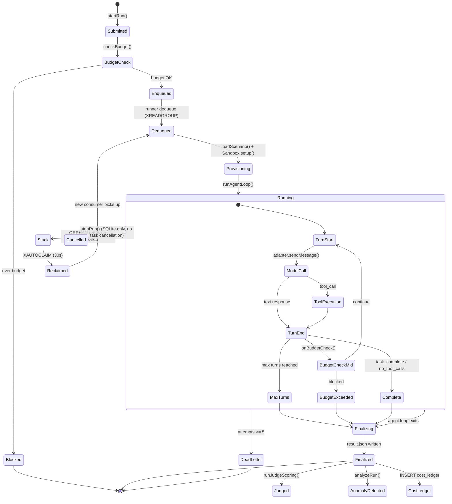
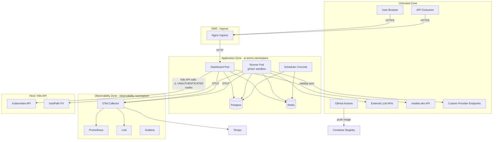
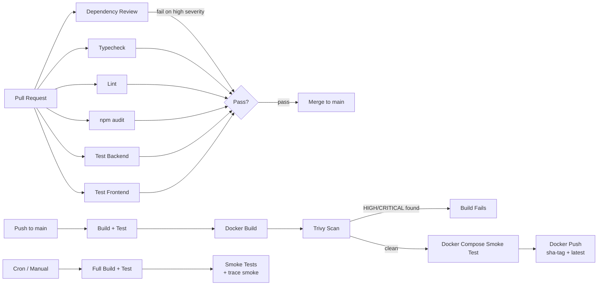
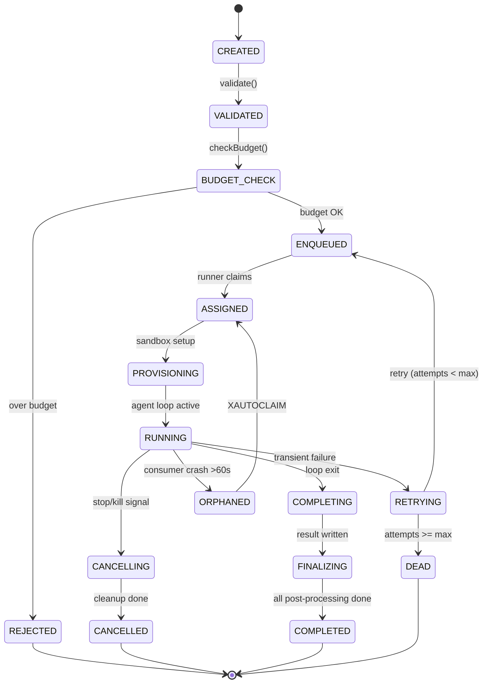

# Principal Architecture, Security, Performance, Feature Completeness, and Production Readiness Audit

**Repository:** ai-model-arena  
**Audit Date:** 2026-07-22  
**Node.js:** >=20.11 (runtime Docker: node:20-bookworm-slim)  
**TypeScript:** v7.x (root), v5.6.3 (dashboard-client)  
**Package Manager:** npm (lockfileVersion 3)  
**Module System:** ESM  
**Branch:** main (commit 6174ee1)

---

## 1. Executive Decision

### Production Readiness: **Not Ready**

### Final Recommendation: **GO ONLY AFTER BLOCKERS ARE RESOLVED** — an exceptional foundation exists, but multiple critical security and reliability gaps must be closed before any production deployment.

### Top 10 Production Blockers

1. **CRITICAL** — Unauthenticated `/api/runners/*` and `/api/queues/*` endpoints expose Kubernetes infrastructure control and queue management to anyone on the network.
2. **CRITICAL** — Kill switch flag (`killSwitchActive`) is never checked in the runner loop — `activateKillSwitch()` is a complete no-op.
3. **CRITICAL** — No idempotency mechanism — same logical task can execute twice. Redis nack-vs-reclaim race condition can produce duplicate messages with multiple consumers.
4. **CRITICAL** — Kubernetes PDBs prevent all node drains (single-replica `maxUnavailable:1` / `minAvailable:1` blocks voluntary evictions entirely).
5. **HIGH** — `hostPath` PV for outputs (`k8s/output-pvc.yaml`) — node-local storage, security boundary violation, no production storage backend.
6. **HIGH** — Kubernetes secrets in plain YAML with env-var interpolation (`k8s/arena-secrets.yaml`) — no Sealed Secrets, External Secrets, or SOPS.
7. **HIGH** — Observability scrape config broken — application Prometheus metrics never reach Prometheus. All 4 alerting rules are dead. No log-to-Loki bridge.
8. **HIGH** — `cost_ledger` token/pricing columns always NULL — immutable audit ledger has no audit data. CLI `finalizeRun()` never writes to `cost_ledger`.
9. **HIGH** — `tick.ts` scheduler bypasses `startRun()`, creating tasks with no run record, no budget checks — orphaned tasks.
10. **HIGH** — No multi-tenancy in database schema — single flat namespace. Every table needs tenant isolation before multi-customer SaaS.

### Top 10 Immediate-Value Improvements

1. Add `requireAuth` + `requireRole('admin')` to runner and queue routes (2-line fix per file, eliminates #1 blocker).
2. Fix kill switch — add `if (killSwitchActive) return` check in runner dequeue loop.
3. Add application metrics scrape config to Prometheus (`dashboard.observability:4000/metrics`).
4. Populate `cost_ledger` token columns from `result.json` data available at write time.
5. Configure TLS on ingress + cert-manager annotation (uncomment existing TLS config).
6. Add `nack()` on runner graceful-shutdown timeout (currently abandons in-flight tasks silently).
7. Switch Prometheus/Loki from `emptyDir` to PVC for persistence.
8. Add `pricing_version` to catalog sync — stamp a version on each pricing snapshot and write it to `cost_ledger`.
9. Fix `requireOwnership()` unused — wire into scenario and model mutation routes.
10. Wire budget threshold notifications to actual notification dispatch (config exists but integration missing).

### Most Likely Incident Scenarios

1. **Runner pods can't be drained during node maintenance** → PDBs block eviction → operators forced to force-delete pods → in-flight runs abandoned without nack.
2. **Provider rate-limit cascade** → one provider throttled → no circuit-breaker in worker path → retries pile up → Redis memory pressure.
3. **Disk exhaustion on hostPath PV** → no artifact cleanup → outputs partition fills → all runners fail → no alert triggers (Prometheus scrape broken).
4. **Prometheus data loss on pod restart** → emptyDir storage → all historical metrics gone → no baseline for anomaly detection.

### Highest-Risk Attack Scenarios

1. **Unauthenticated runner control** → attacker scales all runners to 0 → complete denial of service.
2. **SSRF via custom provider** → create provider with URL to internal metadata endpoint → URL validator blocks on creation but no re-validation on use.
3. **Self-hosted provider credential exfiltration** → permissive shell scenario + custom provider pointing to attacker → model receives shell access and curl's credentials to external host.
4. **Cross-tenant data access** → no tenant isolation → if multi-tenancy added later without schema redesign, any authenticated user could access any run.

### Architectural Maturity Assessment: **Level 3 of 5**

The codebase demonstrates strong engineering across container hardening, network policies, sandbox isolation, and pipeline structure. However, critical seams remain: the queue system lacks idempotency, the observability pipeline is disconnected, and the security model has trivial bypass gaps (unprotected routes, unused kill switch). The architecture is fundamentally sound but needs 2-3 weeks of focused hardening to reach production-grade reliability.

### Minimum Safe Production Scope

Single-tenant, single-cluster deployment with:
- All unauthenticated routes secured
- Kill switch functional
- PDBs reconfigured for drainability
- Persistent storage for observability
- TLS on ingress
- Production-grade storage class for outputs (NFS/CephFS/EFS)
- At minimum one replica per deployment to avoid single points of failure during drain operations

---

## 2. Current-State Map

### Component Inventory

| Component | Location | Role |
|---|---|---|
| **CLI** | `src/cli.ts` | Command-line interface (commander-based) |
| **Runner** | `src/runner.ts`, `src/runner-entry.ts` | Long-lived queue-driven agent executor |
| **Worker (Legacy)** | `src/worker.ts` | PM2-based parallel worker (bypasses queue) |
| **Orchestrator** | `src/orchestrator/` | Run lifecycle management, finalization |
| **Scheduler** | `src/scheduler/` | In-process + DB-driven cron scheduling |
| **Dashboard Server** | `src/dashboard-server/` | Express 5 API + WebSocket live updates |
| **Dashboard Client** | `src/dashboard-client/` | React 18 SPA (Vite + TanStack Query + Tailwind) |
| **Agent Loop** | `src/agent-loop/` | Core send→tool→loop logic |
| **Queue System** | `src/queue/` | Abstract queue (in-memory + Redis Streams) |
| **Provider Adapters** | `src/providers/adapters/` | openai-compat, anthropic, google, bedrock |
| **Provider Registry** | `src/providers/` | Descriptors, custom providers, fallback, circuit breaker |
| **Catalog Sync** | `src/catalog/` | Model catalog from models.dev, benchmarks |
| **Sandbox** | `src/sandbox/` | Workspace isolation, git tracking, shell policy |
| **Tools** | `src/tools/` | Tool schemas + executors (file, shell, search) |
| **Database** | `src/db/` | Drizzle ORM, SQLite + Postgres dialects |
| **Authentication** | `src/auth/`, `src/dashboard-server/auth.ts` | Argon2id, JWT, RBAC |
| **Cost Tracking** | `src/cost-tracking/` | Pricing, budgets, spend tracking |
| **Evaluation** | `src/evaluation/` | Judge scoring, regression, objective metrics |
| **Anomaly Detection** | `src/anomaly-detection/` | 6 detectors (latency, loop, token, cost, error, silent failure) |
| **Observability** | `src/observability/` | OTel SDK, TraceRecorder, Prometheus metrics |
| **Notifications** | `src/notifications/` | Slack, Discord, webhooks |
| **Lineage** | `src/lineage/` | Run lineage tracking |
| **Logging** | `src/logger/` | Pino, conversation/report/result writers |
| **Security** | `src/security/` | Prompt injection detection |
| **Session Store** | `src/session/` | Session + message persistence |

### Technology Inventory

| Technology | Version | Purpose |
|---|---|---|
| Node.js | 20-bookworm-slim (SHA: 2cf067cfed83) | Runtime |
| TypeScript | 7.x (root), 5.6.3 (client) | Language |
| Express | 5.x | API server |
| React | 19.x | Frontend |
| Vite | 8.x | Frontend build |
| TanStack Query | latest | Data fetching |
| Tailwind CSS | 4.x | Styling |
| Drizzle ORM | latest | Database ORM |
| SQLite | better-sqlite3 | Dev/embedded DB |
| PostgreSQL | pg | Production DB |
| Redis | ioredis | Queue backend (Streams) |
| Commander | latest | CLI framework |
| Zod | 4.x | Schema validation |
| Pino | latest | Structured logging |
| OpenTelemetry | @opentelemetry/* | Tracing |
| Argon2 | argon2 | Password hashing |
| jsonwebtoken | latest | JWT |
| @aws-sdk/client-bedrock-runtime | latest | Bedrock SDK |
| @kubernetes/client-node | latest | K8s API |
| ws | latest | WebSocket |
| Helmet | latest | Security headers |
| gVisor (runsc) | via RuntimeClass | Runner sandbox |

### Kubernetes Inventory

| Resource | Count | Details |
|---|---|---|
| Namespaces | 2 | ai-arena, observability |
| Deployments | 5 | dashboard, runner-openai, postgres (StatefulSet), redis, scheduler (CronJob) |
| Services | 6 | dashboard, postgres, redis, prometheus, loki, grafana, otel-collector |
| NetworkPolicies | 7 | Deny-all-default + explicit allows |
| RBAC | 3 SA + 3 RoleBindings + 1 ClusterRoleBinding | dashboard, bedrock-runner, prometheus |
| Secrets | 3 | postgres-auth, arena-db-auth, provider-keys (example) |
| PVCs | 4 | outputs (hostPath), postgres, redis, prometheus, loki (emptyDir) |
| KEDA | 1 ScaledObject + 1 TriggerAuthentication | Redis stream autoscaling 1→10 |
| PDBs | 4 | dashboard, runner, postgres, redis |
| ResourceQuota | 1 | 8 CPU / 16Gi mem request, 10 PVCs, 50 pods |
| LimitRange | 1 | Default 500m/512Mi, max 4 CPU/8Gi |
| Ingress | 1 | nginx, TLS commented out |
| RuntimeClass | 1 | gVisor (runsc) for runner |
| Observability | Prometheus, Loki, Grafana, OTel Collector, PrometheusRules | Full stack deployed |

### Provider/Authentication Inventory

| Provider ID | Adapter Type | Auth Mechanism |
|---|---|---|
| openai | openai-compat | Bearer token (OPENAI_API_KEY) |
| anthropic | anthropic | x-api-key header (ANTHROPIC_API_KEY) |
| google | google | Query param ?key= (GOOGLE_API_KEY) ⚠️ log leakage risk |
| amazon-bedrock | bedrock | AWS SigV4 (SDK chain) or Bearer gateway (AWS_BEDROCK_REGION + optional AWS_BEDROCK_GATEWAY_KEY) |
| openrouter | openai-compat | Bearer (OPENROUTER_API_KEY) |
| groq | openai-compat | Bearer (GROQ_API_KEY) |
| cerebras | openai-compat | Bearer (CEREBRAS_API_KEY) |
| nvidia | openai-compat | Bearer (NVIDIA_API_KEY) |
| mistral | openai-compat | Bearer (MISTRAL_API_KEY) |
| sambanova | openai-compat | Bearer (SAMBANOVA_API_KEY) |
| scaleway | openai-compat | Bearer (SCALEWAY_API_KEY) |
| cloudflare | openai-compat | Bearer (CLOUDFLARE_API_TOKEN) |
| github-copilot | openai-compat | Bearer (GITHUB_TOKEN) |
| xai | openai-compat | Bearer (XAI_API_KEY) |
| ollama | openai-compat | None (local) |
| Custom (user-defined) | openai-compat only | Bearer token (via env var reference) |

12 of 15 built-in providers use the `openai-compat` adapter.

### GitHub Actions Inventory

| Workflow | Trigger | Jobs | Permissions |
|---|---|---|---|
| build-deploy.yaml | push to main | typecheck, lint, test, build, docker, trivy, smoke, push | contents: read, packages: write |
| pr-checks.yaml | PR to main | dependency-review, typecheck, lint, audit, test-backend, test-frontend | contents: read |
| nightly.yaml | cron + manual | build, test, smoke | contents: read |
| codeql.yml | push/PR + weekly | CodeQL analysis | contents: read, security-events: write |

All actions use SHA-pinned commit hashes. No tag-referenced actions. Excellent supply-chain hygiene.

### Mermaid: Component Diagram

```mermaid
graph TB
    CLI[CLI / scripts] --> Orchestrator
    Dashboard[Dashboard Client] -->|HTTP/WS| DashboardServer
    DashboardServer -->|JWT Auth| Auth[Auth (Argon2id+JWT)]
    DashboardServer --> DB[(SQLite/Postgres)]
    DashboardServer --> Queue
    Scheduler[Scheduler CronJob] --> Queue

    Orchestrator[Orchestrator] --> Budget[Budget Check]
    Orchestrator --> Queue

    Runner[Runner Pod] -->|XREADGROUP| Queue
    Runner --> SessionStore[Session Store]
    Runner --> Sandbox[Ephemeral Sandbox]
    Runner --> AgentLoop[Agent Loop]
    AgentLoop --> ProviderRegistry[Provider Registry]
    ProviderRegistry --> Adapters[Provider Adapters]
    Adapters -->|HTTPS| OpenAI[OpenAI API]
    Adapters -->|HTTPS| Anthropic[Anthropic API]
    Adapters -->|HTTPS| Google[Google API]
    Adapters -->|AWS SigV4| Bedrock[Amazon Bedrock]
    Adapters -->|HTTPS| CustomProviders[Custom Providers]

    Runner -->|OTLP| OTelCollector
    Runner -->|stdout logs| Stdout
    DashboardServer -->|OTLP| OTelCollector
    DashboardServer -->|/metrics| PrometheusScrape

    OTelCollector --> Tempo[(Tempo - Traces)]
    OTelCollector --> Prometheus[(Prometheus - Metrics)]
    OTelCollector --> Loki[(Loki - Logs)]

    Runner --> Results[outputs/ artifacts]
    Results --> Finalize[LiveHub Finalizer]
    Finalize --> DB
    Finalize --> Judge[Judge Scoring]
    Finalize --> Anomaly[Anomaly Detection]
    Finalize --> Notifications[Slack/Discord/Webhooks]
```

### Mermaid: Job Lifecycle



### Mermaid: Trust Boundaries



### Mermaid: CI/CD Diagram



---

## 3. Findings Register

| ID | Severity | Area | Status | Evidence | Risk / Impact | Recommendation | Effort | Priority |
|---|---|---|---|---|---|---|---|---|
| F-001 | CRITICAL | Auth | Unsafe | `src/dashboard-server/routes/runners.ts` — `registerRunnerRoutes(app)` with zero middleware | Unauthenticated K8s infrastructure control, pod log reading, runner scaling/draining | Wrap with `requireAuth(auth)` + `requireRole('admin')` | Low | P0 |
| F-002 | CRITICAL | Auth | Unsafe | `src/dashboard-server/routes/queues.ts` — queues routes unauthenticated | Unauthenticated DLQ inspection, task retry | Wrap with `requireAuth(auth)` + `requireRole('admin')` | Low | P0 |
| F-003 | CRITICAL | Runner | Missing | `src/runner.ts:67-73` — kill switch flag never checked; `src/orchestrator/run-lifecycle.ts:432` sets `killSwitchActive = true` but runner loop never reads it | Kill switch is complete no-op. Cannot globally stop task processing. | Add `if (killSwitchActive) return` in runner dequeue loop + skip new dequeue | Low | P0 |
| F-004 | CRITICAL | Queue | Partial | `src/queue/redis.ts:115-130` — Redis nack vs XAUTOCLAIM race condition; no idempotency mechanism | Duplicate task execution with multiple consumers | Use Redis transaction (MULTI/EXEC) or Lua script for atomic nack; add idempotency key to tasks | Medium | P0 |
| F-005 | CRITICAL | Kubernetes | Unsafe | `k8s/pdb.yaml` — dashboard, runner, postgres, redis all have single replicas with PDBs that block all voluntary evictions (maxUnavailable:1, minAvailable:1) | Cannot drain nodes. Forced pod deletion on maintenance. In-flight tasks abandoned without nack. | Set `minAvailable: 0` for now; increase replicas to 2+ for production | Low | P0 |
| F-006 | CRITICAL | Kubernetes | Unsafe | `k8s/output-pvc.yaml` — `hostPath: /tmp/arena-outputs` | Node-local storage, no multi-node, security boundary (host filesystem accessible from pod) | Replace with ReadWriteMany PVC (NFS/CephFS/EFS) | Medium | P0 |
| F-007 | HIGH | Observability | Partial | `k8s/observability/prometheus.yaml` — only scrapes `otel-collector:8889`, never dashboard `/metrics` | All 4 PrometheusRules are dead. Application metrics (`arena_tasks_*`, `arena_task_duration_*`) never collected. No Grafana dashboards possible. | Add scrape job for `dashboard.ai-arena:4000/metrics` | Low | P0 |
| F-008 | HIGH | Observability | Missing | No log-to-Loki bridge — Pino writes to stdout, no Promtail/Fluent Bit or OTel log SDK | Application logs never reach Loki. No log search or correlation. | Deploy Promtail DaemonSet OR add OTel log SDK to Node app | Medium | P1 |
| F-009 | HIGH | Cost Tracking | Partial | `src/orchestrator/run-lifecycle.ts:379-386` — cost_ledger INSERT writes NULL for all token columns and pricing_version | Immutable audit ledger has no audit data. Cannot verify costs. | Read token counts from `result.json` and populate at ledger write time | Low | P1 |
| F-010 | HIGH | Cost Tracking | Missing | `src/orchestrator/run-lifecycle.ts` — CLI `finalizeRun()` calls `addSpend()` but never writes to `cost_ledger` | CLI-completed runs have no immutable cost record | Add cost_ledger INSERT to `finalizeRun()` | Low | P1 |
| F-011 | HIGH | Scheduler | Unsafe | `src/scheduler/tick.ts:38-47` — DB scheduler bypasses `startRun()`, no budget check, no run record, no idempotency | Orphaned tasks, budget bypass, no run lineage | Route through `startRun()` or replicate its safety checks | Medium | P1 |
| F-012 | HIGH | Auth | Unsafe | `src/dashboard-server/server.ts:224` — API key with `providers:read` can call POST/DELETE providers. Router has no per-method scope check. | Privilege escalation via API key scope mismatch | Add per-method scope enforcement: check `providers:write` for POST/DELETE | Low | P1 |
| F-013 | HIGH | Auth | Unsafe | `src/dashboard-server/server.ts:227` — API key with `cache:read` can trigger `POST /refresh` catalog sync | Expensive operations triggered with read-only credentials | Add `cache:write` scope check on mutation endpoints | Low | P1 |
| F-014 | HIGH | Kubernetes | Unsafe | `k8s/arena-secrets.yaml` — plain YAML with `${VAR}` interpolation; `k8s/runner-secret.yaml.example` documents `kubectl create secret --from-literal` | Secrets in git, shell history leakage | Use Sealed Secrets, External Secrets Operator, or SOPS | Medium | P1 |
| F-015 | HIGH | Kubernetes | Missing | `k8s/dashboard-ingress.yaml` — TLS block commented out, no cert-manager | No HTTPS in production | Uncomment TLS config + add cert-manager annotation | Low | P1 |
| F-016 | HIGH | Provider | Unsafe | `src/providers/adapters/google.ts` — API key in query string `?key=...` | Key appears in server logs, proxy logs, referrer headers | Move to header-based auth if Google API supports it; add log redaction | Medium | P1 |
| F-017 | HIGH | Provider | Unsafe | `src/providers/adapters/bedrock.ts:124-127` — 3x `as any` casts on AWS SDK ConverseCommand | Type safety bypassed; Bedrock integration untested against SDK type changes | Use proper Converse API types from `@aws-sdk/client-bedrock-runtime` | Low | P2 |
| F-018 | MEDIUM | Queue | Missing | No idempotency key mechanism in queue system (`src/queue/types.ts` — `Task` has no idempotency field) | Same logical run can be enqueued twice with no dedup | Add `idempotencyKey` to Task type; check in Redis via SETNX before enqueue | Medium | P1 |
| F-019 | MEDIUM | Queue | Partial | `src/runner.ts:67-73` — runner abandons in-flight task without `nack()` after 30s grace period | Task sits in PEL until XAUTOCLAIM (60s), no attempt increment or failure reason recorded | Call `nack(reason)` before abandoning in shutdown timeout handler | Low | P1 |
| F-020 | MEDIUM | Runner | Missing | `src/orchestrator/run-lifecycle.ts:444-447` — `stopRun()` only updates SQLite status, does not cancel in-flight runner task | Stopped runs may continue executing | Signal AbortController or check stop flag in runner loop | Medium | P2 |
| F-021 | MEDIUM | Cost Tracking | Unsafe | `src/cost-tracking/budget.ts` — `addSpend()` performs read-modify-write on JSON file with no locking | Race condition: concurrent runs can overwrite each other's spend, causing budget underreporting | Use file lock (flock) or move budget state to DB with transaction | Low | P1 |
| F-022 | MEDIUM | Cost Tracking | Partial | `configs/budget.yaml` threshold alerts configured but never wired to notification dispatch | Budget warnings logged but no Slack/Discord notification sent | Wire `onBudgetThreshold` config to actual Slack/Discord senders | Low | P2 |
| F-023 | MEDIUM | Auth | Partial | `src/auth/rbac.ts:22-35` — `requireOwnership()` defined but never imported by any route | Inconsistent ownership enforcement; model/scenario mutations lack ownership checks | Wire `requireOwnership` to scenario and model mutation routes | Low | P2 |
| F-024 | MEDIUM | Auth | Unsafe | `src/dashboard-client/src/lib/api.ts:20` — JWT stored in `localStorage` | XSS can exfiltrate JWT | Move to httpOnly cookie OR accept risk with strong CSP | Medium | P2 |
| F-025 | MEDIUM | Auth | Missing | `src/dashboard-server/auth.ts` — no JWT revocation mechanism | Stolen tokens valid until expiry | Implement token blacklist (Redis) or short-lived access + refresh token pattern | Medium | P2 |
| F-026 | MEDIUM | Database | Partial | `drizzle/0007_new_hulk.sql` — `pricing` table has no version/effective-date columns; updates destroy old prices | Cannot resolve `cost_ledger.pricing_version` to actual rates | Add `pricing_version` table or `effective_from`/`effective_to` columns | Medium | P2 |
| F-027 | MEDIUM | Database | Unsafe | `run_models` table has no PRIMARY KEY; `user_roles` table has no PRIMARY KEY | Duplicate rows possible, no uniqueness enforcement | Add composite PKs | Low | P2 |
| F-028 | MEDIUM | Database | Missing | No `tenant_id` column on any table — schema is purely single-tenant | Cannot support multi-customer SaaS without full schema migration | Add tenant_id to all tables; requires FK cascade design | High | P3 |
| F-029 | MEDIUM | Observability | Missing | Prometheus/Loki use `emptyDir` volumes — all observability data lost on pod restart | No historical metrics, no trend analysis, no alert baseline after restart | Use PVCs for Prometheus TSDB and Loki storage | Medium | P2 |
| F-030 | MEDIUM | Observability | Partial | OTel traces only cover HTTP instrumentation; agent-loop traces are separate local TraceRecorder | No correlation between HTTP traces and agent-loop spans | Unify on OTel SDK for all spans | Medium | P3 |
| F-031 | MEDIUM | Sandbox | Missing | `configs/scenarios/` — `shellPolicy: 'permissive'` allows `exec()` with `/bin/sh`, bypassing all shell guards | Attacker-controlled scenario YAML could enable unrestricted shell access. No scenario approval workflow. | Require admin approval for permissive scenarios; audit existing scenarios | Low | P1 |
| F-032 | MEDIUM | Sandbox | Missing | No artifact cleanup — `outputs/` grows unboundedly. `cli.ts` `cleanup` command is a stub. | Disk exhaustion; no retention policy enforcement | Implement TTL-based cleanup cron; add retention config | Medium | P2 |
| F-033 | MEDIUM | Provider | Partial | `src/providers/url-validator.ts` — SSRF protection validates on creation only, not on use | Existing provider URL could be modified post-validation (race window) | Re-validate on adapter construction or dequeue | Low | P2 |
| F-034 | MEDIUM | Evaluation | Missing | `configs/regression/` directory empty — no suite YAML files exist | `arena regress --suite` has no usable configurations | Create at least one baseline regression suite | Low | P2 |
| F-035 | MEDIUM | Evaluation | Missing | `src/evaluation/metrics.ts` — `computeObjectiveMetrics()` produces rich ObjectiveMetrics but no code calls it | Loop detection, tool stats, turn efficiency computed but never persisted or reported | Call from run finalization and store to DB | Low | P2 |
| F-036 | LOW | CI/CD | Missing | No Kubernetes manifest validation (kubeconform/kubeval) in CI | Invalid manifests could slip through PR | Add kubeconform step to `pr-checks.yaml` | Low | P2 |
| F-037 | LOW | CI/CD | Missing | No Dockerfile lint (hadolint) in CI | Dockerfile anti-patterns undetected | Add hadolint step to `pr-checks.yaml` | Low | P2 |
| F-038 | LOW | CI/CD | Missing | No Docker image signing (Cosign) or SLSA provenance | Supply chain integrity not verified at deploy time | Add keyless signing via GitHub OIDC + SLSA generator | Medium | P3 |
| F-039 | LOW | CI/CD | Partial | CodeQL uses `default` query suite, not `security-extended` | Misses some security patterns | Switch to `security-extended` or `security-and-quality` | Low | P2 |
| F-040 | LOW | Auth | Missing | No CSRF protection (mitigated by Bearer token auth) | Low risk due to no cookies | Add CSRF token for defense-in-depth if cookies used | Low | P3 |
| F-041 | LOW | Auth | Missing | JWT tokens expire but no refresh flow | User must re-login after 12h (configurable) | Add refresh token flow | Medium | P3 |
| F-042 | LOW | Server | Partial | `src/dashboard-server/server.ts:95-96` — CSP uses `'unsafe-inline'` script-src; Swagger UI loads from unpkg CDN | Weakened XSS protection; CDN supply chain risk | Bundle Swagger UI locally; remove unsafe-inline with nonce-based approach | Low | P3 |
| F-043 | LOW | Observability | Missing | No Grafana dashboards deployed — only datasources configured | Operators must build dashboards from scratch | Add dashboard ConfigMaps for arena metrics, latency, anomalies | Medium | P2 |
| F-044 | INFO | Database | Info | `audit_log` table has zero indices | Queries by actor/entity/type/time will table-scan | Add indices on (actor, at), (entity_type, entity_id), (at) | Low | P2 |

---

## 4. Feature Coverage Matrix

| Requirement | Current State | Evidence | Gaps | Risks | Recommended Design |
|---|---|---|---|---|---|
| Versioned prompt registry | Implemented | `prompts` + `prompt_versions` tables with FK, version numbering, system_prompt, task, config, created_by | No approval workflow; no prompt policy scanning for dangerous tool instructions | Malicious prompt could instruct agent to exfiltrate data | Add approval workflow; add prompt policy scanner |
| Prompt parameter validation | Missing | No parameter schemas in prompt versions | Templates are free-text; no validation before execution | Invalid parameters cause silent failures | Add Zod parameter schemas to prompt_versions.config |
| Prompt secret placeholders | Missing | No placeholder mechanism exists | Secrets must be manually injected | Hardcoded secrets in prompts | Add `${SECRET:name}` placeholders resolved at runtime |
| Golden task datasets | Missing | No concept of curated test datasets | Cannot measure quality regression systematically | Blind to prompt quality degradation | Add `datasets` table with golden tasks + expected outputs |
| Durable state machine | Partial | `runs` + `run_models` tables track status; implicit task-level state in Redis Streams PEL | No explicit job state machine; states are strings with no transition validation | Invalid state transitions; stuck runs | Implement explicit state machine with valid transitions enumerated |
| Idempotency keys | Missing | No `idempotencyKey` on Task; no dedup before enqueue | Same logical run can execute twice | Duplicate costs, duplicate artifacts | Add idempotency key; Redis SETNX guard before enqueue |
| Job priority | Missing | No priority field on Task or runs | All tasks FIFO | Low-priority tasks block critical ones | Add priority field; Redis Streams don't natively support — use multiple streams per priority |
| Job dependencies / DAG | Missing | No workflow orchestration beyond linear queue | Cannot model multi-stage pipelines (classify→plan→execute→validate) | Manual orchestration required | Implement DAG with explicit dependency edges |
| Fan-out/fan-in | Partial | `startRun()` fans out to multiple models via separate queue entries | No fan-in — each model completes independently; LiveHub polls every 3s | Race conditions in multi-model comparison | Multi-model run as single orchestration unit with explicit fan-in barrier |
| Cancellation | Partial | `stopRun()` updates SQLite only; no task cancellation signal to runner | In-flight tasks continue running | Orphaned executions, wasted compute spend | Signal runner via queue control message or shared flag |
| Pause/resume | Missing | No mechanism exists | Cannot pause long-running runs | | Serialize agent state; implement pause checkpoint + resume from checkpoint |
| Dead letter queue | Implemented | Redis Streams `:dlq` suffix; `deadLetterPeek()`, `deadLetterRetry()` | DLQ inspection API unauthenticated (F-002) | | Add auth; add DLQ summary metrics |
| Retry policy by error type | Missing | All errors retried identically (3 attempts, exp backoff) | Transient errors (429) get same treatment as terminal errors (401) | Wasted retries on permanent failures | Classify errors as retryable/terminal; per-error-type retry config |
| Provider fallback | Partial | `src/providers/fallback.ts` — linear fallback list used only in runner path, not worker | No fallback in worker path; no region-aware or cost-aware fallback | Worker runs fail without fallback | Unify fallback in ProviderRegistry; add policy-based fallback chains |
| Capability-aware routing | Partial | `src/catalog/match.ts` resolves models by capability flags (reasoning, tool_call, etc.) | Capability flags are binary (yes/no), not quantitative | Cannot prefer "better" reasoning models | Add capability scores; weight-based routing |
| Cost-aware routing | Missing | No cost comparison in model selection | Always uses first matching model | Expensive models selected unnecessarily | Add cost-aware routing with price tier preferences |
| Data-classification-aware routing | Missing | No data classification concept | No region or sovereignty restrictions enforced | Sensitive data could go to wrong region | Add classification tags; enforce routing constraints |
| Quality-aware routing | Missing | No historical quality scoring in routing | Cannot prefer high-performing models | | Add quality scores from judge + benchmarks to routing decisions |
| Latency-aware routing | Missing | No latency consideration in routing | Cannot prefer fast models | | Add p50/p95 latency to routing weights |
| Circuit breaker | Partial | `src/providers/circuit-breaker.ts` — per provider:model, 5 failures→open, 30s reset | Only used in runner path, not worker path; no metrics; no alerting | Failures in worker path not circuit-broken | Unify in ProviderRegistry; add Prometheus gauge for circuit state |
| Dry-run cost estimator | Missing | No pre-execution cost estimation | Cannot predict cost before running | Unexpected high costs | Estimate tokens from prompt + context; multiply by pricing |
| Token budget reservation | Missing | No reservation before execution | Budget checked at start but tokens not reserved | Concurrent runs can collectively overspend | Reserve estimated cost at enqueue; release on completion/failure |
| Hard cost limits | Implemented | `configs/budget.yaml` global + per-model daily/monthly + block threshold | No per-run cost limit; only per-model aggregate | Expensive single run can consume entire budget | Add `perRun` cost limit |
| Cost ledger immutability | Partial | `cost_ledger` table exists | No DB-level immutability (SQLite); token/pricing columns always NULL (F-009); CLI path doesn't write (F-010) | Cannot audit; cannot reconcile | Enforce immutability in application code; populate all columns |
| Pricing versioning | Missing | `pricing` table has single row per model+tier; updates destroy old data | Cannot resolve historical prices | Audit trail unresolvable | Add `pricing_snapshots` table with effective dates |
| Cost anomaly detection | Implemented | `src/anomaly-detection/detectors.ts` — cost spike detector (3× mean) | Simple multiplier only; no z-score; no per-turn granularity | Noisy baselines mask spikes | Use z-score; add per-call granularity |
| Benchmark suites | Partial | `configs/evaluation.yaml` defines rubric; `configs/regression/` empty | No regression suite YAML files exist (F-034) | Cannot run regression tests | Create suite definitions |
| A/B testing | Missing | No experiment infrastructure | Cannot compare models statistically | Manual comparison only | Add experiment framework with randomization, metrics, significance testing |
| Tournament mode | Missing | No head-to-head ranking | "arena" in name but no internal arena | | Implement pairwise comparison + ELO rating |
| Deterministic validators | Partial | Success criteria evaluator uses `execFile` with regex gate | Only JSON schema + exit code validation | Cannot validate complex outputs | Add custom validator plugins (regex, diff, typecheck) |
| LLM-as-judge | Implemented | `src/evaluation/judge.ts` — GPT-4o judge with 4-category rubric | Single judge only; no calibration; fragile JSON parsing; ignores conversation trace | Judge bias undetected; uncalibrated scores | Add ensemble judging; add structured output; include conversation context |
| Human review workflow | Missing | Judge scores are fire-and-forget | No review/override/dispute mechanism | Incorrect scores cannot be corrected | Add review queue with approve/override/reject |
| Reproducible execution manifests | Missing | No execution manifest capturing full config | Cannot reproduce a run exactly | Debugging requires manual config reconstruction | Serialize full run config to manifest JSON before execution |
| OpenTelemetry tracing | Partial | HTTP instrumentation via OTel SDK; agent-loop via local TraceRecorder | Two separate tracing systems; no DB/Redis/FS tracing; no trace correlation (F-030) | Cannot trace end-to-end | Unify on OTel SDK with custom span processors |
| GenAI semantic conventions | Missing | No standard GenAI span attributes | No interoperability with observability tools expecting gen_ai.* attributes | | Adopt OpenTelemetry GenAI semantic conventions |
| Structured logs with redaction | Partial | Pino JSON to stdout; `src/dashboard-server/secrets.ts` masks API responses | No log redaction at Pino level; no log-to-Loki bridge (F-008) | Secrets in stdout logs | Add pino redact config; add OTel log SDK |
| Alerting rules | Partial | 4 PrometheusRules defined | All rules reference metrics never scraped (F-007); no anomaly-driven alerts; no cost/budget alerts | Alerts will never fire | Fix scrape config; add cost/budget/latency alerts; wire anomalies to Alertmanager |
| SLO/SLI dashboards | Missing | No SLO definitions | Cannot measure reliability | | Define SLOs (99% task completion, p95 latency < X, etc.); build Grafana SLO dashboards |
| Audit event store | Partial | `audit_log` table exists | No indices (F-044); no FK enforcement; no structured before/after | Slow queries; referential integrity gaps | Add indices; add FK triggers; enforce JSON schema on before/after |
| Live queue inspector | Implemented | `GET /api/queues` — Redis XRANGE/XACK | Unauthenticated (F-002) | | Add auth |
| Runner pool control | Partial | `GET /api/runners` returns K8s deployments/pods | Scale/drain endpoints unauthenticated (F-001) | Unauthorized infrastructure control | Add auth; implement actual drain (currently stub) |
| Provider catalog editor | Implemented | `POST/GET/DELETE /api/providers` with SSRF-safe URL validation | API key scope bypass (F-012); capability probe sends key to arbitrary URL | | Add per-method scope enforcement |
| Bedrock visibility | Missing | Bedrock provider exists but no region/model availability view | Cannot see which Bedrock models are available in which regions | | Add Bedrock model discovery (ListFoundationModels + ListInferenceProfiles) |
| Global kill switch | Unsafe | `activateKillSwitch()` sets flag but runner never checks it (F-003) | Kill switch is no-op | | Fix runner loop check |
| Multi-tenancy | Missing | No `tenant_id` anywhere in schema (F-028) | Single-tenant only | Must retroactively add tenant isolation to every table | Add tenant_id; enforce with row-level security middleware |
| RBAC | Partial | viewer/editor/admin hierarchy implemented | Ownership check defined but unused (F-023); model DELETE has no role check; WebSocket has no per-subscription auth | | Wire ownership to routes; add WebSocket subscription auth |
| API key scoping | Partial | 20 granular scopes defined in `auth-api-types.ts` | Scope bypass on providers and cache routes (F-012, F-013) | Privilege escalation | Add per-method scope check in every router |
| Secrets lifecycle | Partial | Secrets in plain YAML (F-014); provider keys via env var; JWT secret generated at deploy time | No rotation; no sealed secrets; no external secret manager | Credential leakage; no rotation capability | Implement External Secrets Operator or Sealed Secrets |
| Non-root containers | Implemented | All pods use `runAsNonRoot`, UID 10001/999 | | | |
| Read-only rootfs | Implemented | dashboard, runner, scheduler, prometheus, collector have `readOnlyRootFilesystem: true` | Postgres/Redis/Loki/Grafana need writable storage (legitimate) | | |
| Container capabilities | Implemented | All containers `capabilities.drop: [ALL]` | | | |
| Seccomp | Implemented | All pods `seccompProfile: RuntimeDefault` | | | |
| gVisor sandbox | Implemented | Runner pod uses `runtimeClassName: gvisor` | Linux-only; not in docker-compose | | |
| Network policies | Implemented | 7 policies — default deny-all ingress + egress, explicit allow only | Runner egress allows 0.0.0.0/0:443,80 (required for LLM APIs) | | Add more granular API endpoint allowlisting |
| Egress allowlisting | Partial | Runner network policy blocks private ranges via `except` clause | Granular per-provider egress not enforced | Runner could call arbitrary HTTPS endpoints | Implement provider-specific egress rules |
| Image digest pinning | Implemented | Dockerfile uses SHA256 digest for base image; all GitHub Actions use SHA-pinned commits | docker-compose uses mutable tags (`postgres:16`, `redis:7`) | | Pin docker-compose image digests |
| SBOM generation | Partial | `build-deploy.yaml` generates `npm ls` JSON | Not standard SBOM format (CycloneDX/SPDX) | Limited downstream tool compatibility | Use Syft or CycloneDX generator |
| Provenance | Missing | No SLSA provenance generated | Cannot verify build integrity | | Add SLSA GitHub Actions generator |
| Image signing | Missing | No Cosign/Notary signing | Unsigned images in registry | | Add keyless signing via GitHub OIDC |
| CodeQL | Partial | `codeql.yml` with default query suite | Not security-extended (F-039) | Misses some security patterns | Switch to `security-extended` |
| Trivy scanning | Implemented | `build-deploy.yaml` — scans on push to main, fails on HIGH/CRITICAL | Not in nightly workflow | Vulnerabilities undetected if no main push | Add to nightly |
| Secret scanning | Missing | No trufflehog/git-secrets in CI | Credentials could leak into git history | | Add trufflehog to PR checks |
| Dependency review | Implemented | `pr-checks.yaml` — `actions/dependency-review-action@v5` | | | |

---

## 5. Provider Compatibility Matrix

| Provider / Type | Auth | Model Discovery | Streaming | Tools | Structured Output | Usage Data | Cost Data | Context Limits | Region Controls | Health Check | Fallback Ready | Notes |
|---|---|---|---|---|---|---|---|---|---|---|---|---|
| **OpenAI** (openai-compat) | Bearer token via env | models.dev API sync ✅ | ✅ SSE streaming | ✅ function calling | ❌ JSON mode not exposed | ✅ input/output/cached tokens | ✅ per-1K pricing from catalog | ✅ from catalog | ❌ No region control | ❌ No dedicated health check | ✅ In runner path | 12 providers share this adapter |
| **Anthropic** (native) | x-api-key header | models.dev API sync ✅ | ✅ SSE streaming | ✅ tool_use blocks | ❌ Not exposed | ✅ cache_read/write/input/output | ✅ from catalog | ✅ from catalog | ❌ No region control | ❌ No dedicated health check | ✅ In runner path | Native adapter with Anthropic-specific content block parsing |
| **Google** (native) | `?key=` query param ⚠️ log risk | models.dev API sync ✅ | ✅ SSE streaming | ✅ functionCall parts | ❌ Not exposed | ✅ cachedContentTokenCount | ✅ from catalog | ✅ from catalog | ❌ No region control | ❌ No dedicated health check | ✅ In runner path | Key in URL is log leakage concern |
| **Amazon Bedrock** (native) | AWS SigV4 (SDK chain) or Bearer gateway | ❌ No model discovery from AWS | ❌ No stream implementation | ✅ toolUse content blocks | ❌ Not exposed | ✅ Converse API usage | ✅ from catalog (manual) | ✅ from catalog (manual) | ✅ Region via `AWS_BEDROCK_REGION` | ❌ No health check | ❌ Not in fallback chain | 3x `as any` casts (F-017); no streaming; no auto-discovery |
| **OpenRouter** (openai-compat) | Bearer token | models.dev API sync ✅ | ✅ | ✅ | ❌ | ✅ | ✅ | ✅ | ❌ | ❌ | ✅ | Gateway/aggregator provider |
| **Groq** (openai-compat) | Bearer token | models.dev API sync ✅ | ✅ | ✅ | ❌ | ✅ | ✅ | ✅ | ❌ | ❌ | ✅ | |
| **Cerebras** (openai-compat) | Bearer token | models.dev API sync ✅ | ✅ | ✅ | ❌ | ✅ | ✅ | ✅ | ❌ | ❌ | ✅ | |
| **NVIDIA** (openai-compat) | Bearer token | models.dev API sync ✅ | ✅ | ✅ | ❌ | ✅ | ✅ | ✅ | ❌ | ❌ | ✅ | |
| **Mistral** (openai-compat) | Bearer token | models.dev API sync ✅ | ✅ | ✅ | ❌ | ✅ | ✅ | ✅ | ❌ | ❌ | ✅ | |
| **SambaNova** (openai-compat) | Bearer token | models.dev API sync ✅ | ✅ | ✅ | ❌ | ✅ | ✅ | ✅ | ❌ | ❌ | ✅ | |
| **Scaleway** (openai-compat) | Bearer token | models.dev API sync ✅ | ✅ | ✅ | ❌ | ✅ | ✅ | ✅ | ❌ | ❌ | ✅ | |
| **Cloudflare** (openai-compat) | Bearer token | models.dev API sync ✅ | ✅ | ✅ | ❌ | ✅ | ✅ | ✅ | ❌ | ❌ | ✅ | Uses `CLOUDFLARE_API_TOKEN`, not API_KEY |
| **GitHub Copilot** (openai-compat) | Bearer token | models.dev API sync ✅ | ✅ | ✅ | ❌ | ✅ | ✅ | ✅ | ❌ | ❌ | ✅ | Uses `GITHUB_TOKEN` |
| **xAI** (openai-compat) | Bearer token | models.dev API sync ✅ | ✅ | ✅ | ❌ | ✅ | ✅ | ✅ | ❌ | ❌ | ✅ | |
| **Ollama** (openai-compat) | None (local) | ❌ Manual only | ✅ | ✅ | ❌ | ✅ (basic) | ❌ Free (local) | ❌ Manual | ❌ Local only | ❌ | ✅ | Local; no auth; no pricing |
| **Custom Provider** (openai-compat) | Any env var | Capability probe at creation ✅ | ✅ | ✅ | ❌ | ✅ (from response) | ✅ If in catalog | ✅ If in catalog | ❌ No region control | ✅ Probe on creation | ✅ | Only openai-compat adapter supported for custom providers |

### Key Observations

1. **12 of 15 built-in providers share the same adapter** — openai-compat handles OpenAI, OpenRouter, Groq, Cerebras, NVIDIA, Mistral, SambaNova, Scaleway, Cloudflare, GitHub Copilot, xAI, and Ollama. This is both a strength (code reuse) and a risk (one bug affects most providers).

2. **No provider implements streaming in production** — all adapters implement `sendMessageStream()`, but the agent loop only calls `sendMessage()`. Streaming is wired but never used.

3. **No structured output / JSON mode exposed** — despite many providers supporting it, the adapter interface doesn't surface structured output configuration.

4. **Bedrock is the least integrated** — no model discovery, no streaming, no health check, no fallback chain, 3x unsafe type casts.

5. **Custom providers are openai-compat only** — anthropic-compatible, google-compatible, or raw HTTP custom providers cannot be defined via the custom provider framework.

---

## 6. Target Architecture

### Design Principles

1. **Provider-neutral core** — all provider-specific logic lives in typed adapters behind canonical interfaces; no provider IDs, model IDs, or base URLs hardcoded outside descriptor files.
2. **Defense in depth** — every layer independently validates and sanitizes: sandbox path containment, shell execution guards, network egress allowlists, tool allowlists, budget enforcement, prompt injection detection.
3. **Immutable audit trail** — every mutation is recorded with before/after snapshots, actor identity, and timestamp. Cost ledger entries are append-only with full token+price resolution.
4. **Graceful degradation** — every external dependency has a fallback, timeout, circuit breaker, and retry policy. No single provider failure takes down the platform.
5. **Least privilege** — runners have only the credentials they need, for the models they need, in the regions they're allowed. No cross-tenant access. No cross-provider credential leakage.

### Target Component Boundaries

```
┌─────────────────────────────────────────────────────────────────┐
│                        INGRESS / API GW                          │
│  (TLS termination, rate limiting, WAF, auth passthrough)         │
└───────────────┬─────────────────────────────────┬───────────────┘
                │                                 │
    ┌───────────▼──────────┐          ┌──────────▼───────────┐
    │   DASHBOARD SERVER   │          │   ANALYTICS WORKER    │
    │  Express + WebSocket │          │  (aggregation, stats) │
    │  JWT auth + RBAC     │          └──────────────────────┘
    │  API key auth        │
    │  Rate limiting       │
    └──────┬───────────────┘
           │
    ┌──────▼──────────────────────────────────────────────┐
    │                  ORCHESTRATOR                        │
    │  Prompt resolution, param validation, budget check,  │
    │  admission control, idempotency, job creation        │
    └──────┬──────────────────────────────────────────────┘
           │
    ┌──────▼──────────┐     ┌──────────────────────┐
    │   TASK QUEUE    │     │   JOB STATE STORE     │
    │  Redis Streams  │     │  Postgres/SQLite      │
    │  Idempotency    │     │  Durable state machine│
    │  Priority lanes │     │  Run/attempt tracking │
    │  DLQ            │     │  Cost ledger          │
    └──────┬──────────┘     └──────────────────────┘
           │
    ┌──────▼──────────────────────────────────────────────┐
    │                   RUNNER POOL                         │
    │  KEDA-autoscaled Deployments (1 per provider type)   │
    │  ┌─────────┐  ┌─────────┐  ┌─────────┐              │
    │  │Runner A  │  │Runner B  │  │Runner N  │   ...      │
    │  │gVisor   │  │gVisor   │  │gVisor   │              │
    │  └────┬────┘  └────┬────┘  └────┬────┘              │
    │       │            │            │                     │
    │  ┌────▼────────────▼────────────▼─────────┐          │
    │  │         PROVIDER REGISTRY               │          │
    │  │  Built-in + custom providers            │          │
    │  │  Credential resolution (env→secret ref) │          │
    │  │  Circuit breakers (per provider:model)  │          │
    │  │  Fallback chains (policy-based)         │          │
    │  │  Model routing (capability/cost/quality) │          │
    │  └────┬────────────────────────────────────┘          │
    │       │                                                │
    │  ┌────▼────────────────────────────────────┐          │
    │  │         PROVIDER ADAPTERS                │          │
    │  │  ┌──────────┐ ┌──────────┐ ┌──────────┐ │          │
    │  │  │OpenAI    │ │Anthropic │ │Bedrock   │ │          │
    │  │  │Compat    │ │Native    │ │SDK       │ │          │
    │  │  └──────────┘ └──────────┘ └──────────┘ │          │
    │  │  ┌──────────┐ ┌──────────┐              │          │
    │  │  │Google    │ │Custom    │   ...        │          │
    │  │  │Native    │ │HTTP      │              │          │
    │  │  └──────────┘ └──────────┘              │          │
    │  └─────────────────────────────────────────┘          │
    │                                                         │
    │  ┌─────────────────────────────────────────┐          │
    │  │            AGENT LOOP                    │          │
    │  │  send→tool→loop with budget intercept    │          │
    │  │  Turn checkpoint callback                │          │
    │  │  Prompt injection detection              │          │
    │  └────┬────────────────────────────────────┘          │
    │       │                                                │
    │  ┌────▼────────────────────────────────────┐          │
    │  │       TOOLS + SANDBOX                    │          │
    │  │  Tool allowlist enforcement              │          │
    │  │  Shell policy (strict/permissive)        │          │
    │  │  safeResolve path containment            │          │
    │  │  Artifact quarantine + checksums         │          │
    │  └─────────────────────────────────────────┘          │
    └───────────────────────────────────────────────────────┘
```

### Data Ownership

| Domain | Owner | Storage Strategy |
|---|---|---|
| **Provider config** | Provider Registry | DB with immutable versioning |
| **Model catalog** | Catalog Sync | DB with effective-date versioning |
| **Pricing** | Catalog Sync → Pricing Resolver | DB with snapshot versioning |
| **Credentials** | Secrets Manager (env/Sealed Secrets/Vault) | Never in DB; resolved at runtime only |
| **Prompts** | Prompt Registry | DB with immutable versioning |
| **Runs** | Orchestrator | DB, status-driven lifecycle |
| **Artifacts** | Sandbox → Object Storage | Ephemeral workspace per attempt; quarantined before downstream |
| **Cost ledger** | Orchestrator → Cost Tracker | DB, append-only, immutable in application |
| **Audit log** | All mutating services | DB with structured before/after + actor + timestamp |
| **Traces** | OTel SDK → Collector → Tempo | Time-series, TTL-based retention |
| **Metrics** | Prometheus SDK → Prometheus | Time-series, PVC-backed |
| **Logs** | Pino → OTel Log SDK → Collector → Loki | Time-series, PVC-backed |

### Trust Zones

- **Zone 0 (External)**: User browsers, API consumers, GitHub Actions, external LLM APIs, models.dev — fully untrusted.
- **Zone 1 (Ingress DMZ)**: Nginx Ingress — terminates TLS, WAF, rate limiting.
- **Zone 2 (Application)**: Dashboard, Runner, Scheduler pods — authenticated/authorized access only. Runners additionally sandboxed with gVisor. Network policies deny all by default.
- **Zone 3 (Data)**: Postgres and Redis — only accessible from Zone 2 pods via explicit NetworkPolicy allow.
- **Zone 4 (Observability)**: OTel Collector, Prometheus, Loki, Grafana — separate namespace, cluster-scoped read for metrics only.
- **Zone 5 (Infrastructure)**: Kubernetes API, host filesystem — access gated by RBAC; runner routes requiring auth.

### Bedrock Security Model (Target)

```
┌─────────────────────────────────────────────────┐
│              AWS ACCOUNT (Production)             │
│                                                   │
│  ┌─────────────────────────────────────────────┐ │
│  │           EKS CLUSTER                        │ │
│  │  ┌─────────────────────────────────┐        │ │
│  │  │ NAMESPACE: ai-arena             │        │ │
│  │  │                                  │        │ │
│  │  │  Runner (bedrock)                │        │ │
│  │  │  ├─ SA: bedrock-runner           │        │ │
│  │  │  │   └─ IRSA annotation          │────────┼─┼──→ IAM Role: arena-bedrock-invoke
│  │  │  ├─ Env: AWS_BEDROCK_REGION         │        │ │   ├─ bedrock:InvokeModel
│  │  │  │       (us-east-1|us-west-2)   │        │ │   ├─ Resource: arn:aws:bedrock:*::foundation-model/*
│  │  │  └─ NetworkPolicy:                │        │ │   ├─ (NO admin, NO provisioned-throughput, NO custom models)
│  │  │      Egress to bedrock.us-east-1  │        │ │   └─ Condition: aws:RequestedRegion ∈ [us-east-1, us-west-2]
│  │  │      .amazonaws.com:443 only      │        │ │
│  │  └─────────────────────────────────┘        │ │
│  └─────────────────────────────────────────────┘ │
│                                                   │
│  ┌─────────────────────────────────────────────┐ │
│  │  VPC Endpoints (PrivateLink):                │ │
│  │  ├─ bedrock-runtime.us-east-1               │ │
│  │  └─ bedrock-runtime.us-west-2               │ │
│  └─────────────────────────────────────────────┘ │
└─────────────────────────────────────────────────┘
```

### Custom Provider Security Model (Target)

```
Create Provider Request
        │
        ▼
   ┌────────────────────┐
   │ URL VALIDATION      │
   │ ├─ Parse + normalize │
   │ ├─ Block schemes     │  ← http:// only for explicit local/internal flag
   │ │   except https     │
   │ ├─ Resolve DNS      │  ← block private/reserved/metadata IPs
   │ ├─ Block ports       │  ← allow 443 only
   │ └─ Store normalized  │
   └────────┬────────────┘
            │
   ┌────────▼────────────┐
   │ CAPABILITY PROBE     │  ← Only on creation, with timeout
   │ (no key sent)        │
   └────────┬────────────┘
            │
   ┌────────▼────────────┐
   │ APPROVAL (2-person)  │  ← Required for:
   │                      │     - non-HTTPS URLs
   │                      │     - internal/private IPs
   │                      │     - custom header injection
   │                      │     - auth header overrides
   └────────┬────────────┘
            │
   ┌────────▼────────────┐
   │ PERSIST              │
   │ ├─ Immutable version │
   │ ├─ Audit log entry   │
   │ └─ Credential ref    │  ← ONLY a reference; never raw secret
   └──────────────────────┘

ON USE (per-runner startup):
   URL re-validated (DNS resolution, IP check)
   Credential resolved from secure store
   Adapter constructed with scoped config
```

---

## 7. Security Hardening Plan

### 7.1 Must Fix Before Deployment

1. **Secure runner and queue routes** — wrap with `requireAuth(auth)` + `requireRole('admin')`.
2. **Fix kill switch** — add `if (killSwitchActive) return` check in runner dequeue loop.
3. **Fix PDBs** — set `minAvailable: 0` for single-replica PDBs.
4. **Replace hostPath PV** — use ReadWriteMany PVC (NFS/CephFS/EFS) or S3-backed storage.
5. **Fix Prometheus scrape config** — add dashboard `/metrics` endpoint.
6. **Configure TLS on ingress** — uncomment TLS block + cert-manager.
7. **Implement secret management** — Sealed Secrets or External Secrets Operator.
8. **Fix API key scope bypasses** — add per-method scope enforcement in providers and cache routers.
9. **Fix `tick.ts` scheduler** — route through `startRun()` or replicate safety checks.

### 7.2 Must Fix Before External Users or Paid Production Workloads

1. **Add idempotency** — idempotencyKey on Task; Redis SETNX guard.
2. **Fix cost_ledger** — populate ALL token/pricing columns; add CLI path.
3. **Add log-to-Loki bridge** — OTel log SDK or Promtail DaemonSet.
4. **Fix Redis nack race** — use Lua script for atomic nack.
5. **Add runner nack on shutdown timeout** — prevent orphaned PEL entries.
6. **Wire budget threshold notifications** — connect config to Slack/Discord senders.
7. **Fix JWT storage** — httpOnly cookies or accept localStorage risk with strong CSP.
8. **Add model/scenario ownership enforcement** — wire `requireOwnership`.
9. **Add JWT revocation** — Redis token blacklist.
10. **Implement tenant isolation** — add `tenant_id` to all tables; enforce in middleware (even if single-tenant initially — design for multi-tenant from start).

### 7.3 Defense-in-Depth

1. **Add Kubernetes manifest validation in CI** — kubeconform/kubeval.
2. **Add Dockerfile lint in CI** — hadolint.
3. **Add secret scanning in CI** — trufflehog/git-secrets.
4. **Add Trivy to nightly workflow**.
5. **Switch CodeQL to `security-extended`**.
6. **Add Docker image signing** — Cosign keyless via GitHub OIDC.
7. **Add SLSA provenance generation**.
8. **Add standard SBOM format** — Syft/CycloneDX.
9. **Add CSRF protection** (if moving to cookies).
10. **Bundle Swagger UI locally** — remove unpkg CDN dependency.
11. **Add Grafana dashboards** — pre-built ConfigMaps for arena metrics.
12. **Add persistent storage for Prometheus/Loki** — PVCs instead of emptyDir.
13. **Add permissive scenario approval** — admin gate for `shellPolicy: permissive`.
14. **Add provider URL re-validation on use** — not just on creation.

### 7.4 Long-Term Maturity

1. **Unify OTel tracing** — migrate local TraceRecorder to OTel spans.
2. **Add database/RPC/Redis instrumentation**.
3. **Add GenAI semantic conventions** to spans.
4. **Implement multi-tenancy** with row-level security.
5. **Implement service mesh** — mTLS between services (Istio/Linkerd).
6. **Add chaos engineering** — LitmusChaos or Gremlin for failure injection.
7. **Implement Pod Security Admission `restricted`** — upgrade from `baseline`.
8. **Add AppArmor/SELinux profiles** for all containers.
9. **Add FIPS compliance** where required.
10. **Implement comprehensive disaster recovery** — backup/restore validation, runbooks, RTO/RPO targets.

---

## 8. Performance and Reliability Plan

### Queue Design

```
Priority Levels (proposed):
  P0 — Critical / admin operations
  P1 — User-submitted runs
  P2 — Scheduled/batch runs
  P3 — Background (catalog sync, cleanup, aggregation)

Implementation: Separate Redis Streams per priority level.
  arena:tasks:p0, arena:tasks:p1, arena:tasks:p2, arena:tasks:p3
  Runners dequeue from highest non-empty priority first.
```

### Job State Machine (Proposed)



### Idempotency

```
Enqueue flow:
1. Generate SHA256 hash of: scenario + models + params + run config → idempotencyKey
2. Redis: SETNX arena:dedup:<key> runId EX 86400
3. If SETNX fails → return existing runId (no new task enqueued)
4. If SETNX succeeds → enqueue task with idempotencyKey in metadata
```

### Concurrency Model

```
Per-runner concurrency: 1 (single-threaded dequeue→execute→ack loop)
Per-deployment replicas: KEDA-scaled 1→10 (by queue depth)
Per-provider concurrency cap: configurable per api-keys.yaml
Per-user concurrency cap: configurable per user/environment
Global concurrency cap: admission controller check against active runs count
```

### Backpressure

```
Admission control pipeline:
1. Check global active runs < MAX_GLOBAL_CONCURRENT
2. Check per-user active runs < MAX_USER_CONCURRENT
3. Check queue depth < MAX_QUEUE_DEPTH (reject early, don't pile up)
4. Check provider concurrent calls < MAX_PROVIDER_CONCURRENT
5. Check budget remaining > estimated cost
6. If all pass → enqueue
7. If any fail → 429 with X-RateLimit-* headers
```

### Rate Limits

```
API: 300 req/min (configurable)
Login: 20 attempts / 15 min window
Health: 60 req/min
Metrics: 120 req/min
API key: per-key, configurable

Provider rate limits: per-provider adapter configuration
- Max concurrent calls per provider
- Rate-limit response handling (429 → backoff + retry)
- Quota-exceeded handling (429 → circuit breaker consideration)
```

### Timeout Hierarchy

```
| Layer                                    | Timeout   | On Timeout     |
|------------------------------------------|-----------|----------------|
| Provider adapter HTTP request            | 60s       | Retry or fail  |
| Tool execution (shell)                   | 30s       | SIGKILL + fail |
| Agent loop total                         | config    | Complete       |
| Runner dequeue block (XREADGROUP BLOCK)  | 30s       | Re-loop        |
| Runner shutdown grace                    | 30s       | nack + exit    |
| XAUTOCLAIM idle threshold                | 60s       | Reclaim        |
| Run total wall clock                     | config    | Stop + record  |
| Budget check interval                    | Per-turn  | Abort run      |
```

### Retry/Fallback/Circuit-Breaker Rules

```
Retry:
  3 attempts, exponential backoff (1s → 2s → 4s), jitter ±25%
  Retryable: 429, 5xx, network errors (ECONNRESET, ETIMEDOUT, etc.)
  Terminal: 400, 401, 402, 403, 404 (do not retry)

Fallback:
  Linear chain per execution profile
  Example: [openai/gpt-4o, anthropic/claude-sonnet-4, google/gemini-2.5-pro]
  Each step must pass capability check before invocation
  Fallback simulation available before activation
  Data-classification constraints enforced at each step

Circuit Breaker:
  Per provider:model key
  Open after 5 consecutive failures
  Half-open after 30s
  Probe with 1 request → success closes, failure re-opens
  Prometheus gauge for circuit state
  Slack/Discord notification on state change
```

### Autoscaling

```
KEDA ScaledObject per runner deployment:
  Triggers:
    - Redis Streams: target queue length 5 items/pod
    - (future) CPU/Memory utilization
  Scale: 1 → 10 replicas
  Cooldown: 60s scale-down
  Polling: 5s

HPA (alternative):
  CPU target: 70%
  Memory target: 80%
```

### Runner Drain Behavior

```
Drain sequence (triggered by /api/runners/:name/drain or K8s eviction):
1. Stop dequeue loop (close AbortController)
2. Wait for current task to complete (or 30s grace)
3. nack unfinished task with reason: 'drain'
4. Write completion signal to shared state
5. KEDA scales deployment to 0
```

### SLOs/SLIs

| SLO | SLI | Target |
|---|---|---|
| Task acceptance rate | accepted / submitted | > 99.9% |
| Task completion rate | completed / accepted | > 99% |
| Task completion latency p95 | time(completed - submitted) | < 10 min |
| Queue wait time p95 | time(assigned - enqueued) | < 30s |
| Provisioning time p95 | time(running - assigned) | < 10s |
| API availability | 2xx / total requests | > 99.9% |
| Dashboard availability | successful loads / total | > 99.5% |

### Alerts (Proposed)

| Alert | Expression | Severity | For |
|---|---|---|---|
| TaskCompletionRateLow | rate(completed[5m]) / rate(submitted[5m]) < 0.95 | critical | 5m |
| QueueDepthHigh | queue_depth > 500 | warning | 10m |
| QueueAgeHigh | max(queue_wait_seconds) > 300 | warning | 5m |
| RunnerReplicasZero | runner_replicas == 0 | critical | 2m |
| CircuitBreakerOpen | circuit_open > 0 | warning | 5m |
| APIErrorRateHigh | rate(5xx[5m]) / rate(all[5m]) > 0.01 | warning | 5m |
| BudgetThresholdExceeded | budget_used_percent > 80 | warning | instant |
| AnomalyDetected | anomalies_total > 0 | info | instant |
| DiskSpaceLow | disk_free_bytes < 10% | critical | 5m |
| DeadLetterQueueGrowth | dlq_depth increase > 20/h | warning | 1h |

---

## 9. Telemetry and Data Schema

### Normalized Schemas

#### Provider
```
provider:
  id: string (PK, immutable)
  name: string
  adapter_type: enum (openai-compat | anthropic | google | bedrock | custom-http)
  base_url: string (nullable for SDK-based)
  auth_scheme: enum (bearer | x-api-key | query-key | aws-sigv4 | none)
  env_var: string (SENSITIVE — credential reference only)
  header_name: string (nullable)
  is_builtin: boolean
  is_active: boolean
  region: string (nullable)
  residency: string (nullable)
  allow_internal_network: boolean (default false — for private endpoints)
  version: integer (immutable, auto-increment on update)
  created_at: timestamp
  updated_at: timestamp
  approved_by: string (nullable)
  approval_status: enum (pending | approved | rejected)
```

#### Provider Configuration Version (NEW)
```
provider_config_version:
  provider_id: string (FK → provider.id)
  version: integer
  base_url: string
  auth_scheme: enum
  env_var: string (SENSITIVE)
  is_active: boolean
  effective_from: timestamp
  effective_to: timestamp (nullable)
  created_by: string
  created_at: timestamp
  audit_entry_id: string (FK → audit_log.id)
```

#### Model
```
model:
  id: string (PK, canonical "provider/modelId")
  name: string
  family: string (nullable)
  provider_id: string (FK → provider.id)
  capabilities: jsonb {
    reasoning: boolean,
    tool_call: boolean,
    streaming: boolean,
    structured_output: boolean,
    vision: boolean,
    audio: boolean,
    file_support: boolean
  }
  context_limit: integer
  input_limit: integer
  output_limit: integer
  modalities: string[]
  status: enum (stable | preview | deprecated)
  release_date: date
  version_effective_from: timestamp
  version_effective_to: timestamp (nullable)
  last_synced_at: timestamp
```

#### Pricing Version (REVISED)
```
pricing_snapshot:
  id: string (PK)
  model_id: string (FK → model.id)
  version: string (e.g., "2026-07-22T00:00:00Z")
  input_per_1k: decimal
  output_per_1k: decimal
  cache_read_per_1k: decimal
  cache_write_per_1k: decimal
  tier_size: integer (nullable)
  over_200k_input_per_1k: decimal (nullable)
  over_200k_output_per_1k: decimal (nullable)
  over_200k_cache_read_per_1k: decimal (nullable)
  over_200k_cache_write_per_1k: decimal (nullable)
  currency: string (default 'USD')
  effective_from: timestamp
  effective_to: timestamp (nullable)
  source: string (e.g., "models.dev", "manual")
  created_at: timestamp
```

#### Credential Reference (NEW — never stored in DB as plaintext)
```
credential_reference:
  id: string (PK)
  provider_id: string (FK → provider.id)
  type: enum (env_var | sealed_secret | vault_path | aws_secret_arn)
  reference: string (env var name, secret path, ARN)
  created_at: timestamp
  updated_at: timestamp

  NOTE: The actual secret value is NEVER stored in this table.
        Resolution happens at runtime in the runner's execution context.
```

#### Prompt Template / Version
```
prompt:
  id: string (PK)
  tenant_id: string (FK → tenant.id)
  name: string
  description: string
  tags: string[]
  categories: string[]
  owner_id: string (FK → user.id)
  approval_status: enum (draft | pending | approved | rejected)
  created_at: timestamp
  updated_at: timestamp

prompt_version:
  id: string (PK)
  prompt_id: string (FK → prompt.id)
  version: integer
  system_prompt: string (may contain ${SECRET:name} placeholders)
  task: string
  parameter_schema: jsonb (Zod schema for runtime validation)
  execution_profile: string (e.g., "code-generation")
  config: jsonb
  tag: string (e.g., "production", "staging")
  created_by: string (FK → user.id)
  created_at: timestamp
```

#### Job / Run
```
run:
  id: string (PK, UUIDv7)
  tenant_id: string (FK → tenant.id)
  idempotency_key: string (UNIQUE)
  scenario: string
  prompt_id: string (nullable, FK → prompt.id)
  prompt_version: integer (nullable)
  execution_profile: string
  models: string[] (canonical IDs)
  status: enum (created | validated | enqueued | running | completing | finalizing
               | completed | cancelled | failed | dead)
  priority: enum (P0 | P1 | P2 | P3)
  source: enum (cli | dashboard | scheduler | api)
  created_by: string (FK → user.id, nullable)
  started_at: timestamp
  finished_at: timestamp (nullable)
  error_category: enum (nullable)
  error_detail: string (nullable)
  created_at: timestamp

run_model:
  run_id: string (FK → run.id)
  model: string (canonical provider/modelId)
  attempt: integer (starts at 1)
  status: enum (pending | provisioning | running | completing | completed
               | retrying | failed | cancelled)
  runner_id: string (nullable)
  output_dir: string (nullable)
  sandbox_dir: string (nullable)
  result_path: string (nullable)
  conversation_path: string (nullable)
  stop_reason: string (nullable)
  started_at: timestamp (nullable)
  finished_at: timestamp (nullable)
  PRIMARY KEY (run_id, model, attempt)
```

#### Attempt
```
attempt:
  id: string (PK)
  run_id: string (FK → run.id)
  model: string
  attempt_number: integer
  provider_id: string (FK → provider.id)
  provider_config_version: integer (FK → provider_config_version.version)
  model_id: string
  runner_id: string
  status: enum
  queue_wait_ms: integer
  provisioning_ms: integer
  execution_ms: integer
  tokens_input: integer
  tokens_output: integer (SENSITIVE — aggregate only)
  tokens_cache_read: integer
  tokens_cache_write: integer
  tokens_reasoning: integer (nullable)
  tokens_total: integer
  cost_estimated_usd: decimal
  cost_actual_usd: decimal
  pricing_version: string (FK → pricing_snapshot.version)
  turns_used: integer
  tool_calls_total: integer
  tool_calls_failed: integer
  stop_reason: string
  error_category: string (nullable)
  error_detail: string (nullable — SENSITIVE, may contain provider messages)
  fallback_used: boolean
  fallback_chain: string[] (nullable)
  circuit_breaker_state: enum (nullable)
  started_at: timestamp
  finished_at: timestamp (nullable)
```

#### Usage Record
```
usage_record:
  id: string (PK)
  attempt_id: string (FK → attempt.id)
  tenant_id: string (FK → tenant.id)
  provider_id: string
  model_id: string
  tokens_input: integer
  tokens_output: integer
  tokens_cache_read: integer
  tokens_cache_write: integer
  tokens_total: integer
  call_count: integer
  latency_total_ms: integer
  ttft_total_ms: integer (nullable)
  recorded_at: timestamp
```

#### Cost Ledger Entry
```
cost_ledger:
  id: string (PK)
  run_id: string (FK → run.id)
  attempt_id: string (FK → attempt.id)
  tenant_id: string (FK → tenant.id)
  model: string
  cost_usd: decimal(10,6)
  currency: string
  tokens_input: integer
  tokens_output: integer
  tokens_cache_read: integer
  tokens_cache_write: integer
  tokens_total: integer
  pricing_version: string (FK → pricing_snapshot.version)
  pricing_snapshot_id: string (FK → pricing_snapshot.id)
  recorded_at: timestamp

  NOTE: Application-level immutability enforced.
        No UPDATE or DELETE in application code.
```

#### Quality Result
```
quality_result:
  id: string (PK)
  run_id: string (FK → run.id)
  attempt_id: string (FK → attempt.id, nullable)
  model: string
  judge_model: string
  scores: jsonb {
    "correctness": number,
    "fidelity": number,
    "style": number,
    "efficiency": number
  }
  average_score: decimal(3,2)
  summary: string
  reasoning: string
  rubric_version: string
  judged_at: timestamp
  reviewed_by: string (nullable, FK → user.id)
  review_status: enum (pending | approved | overridden | disputed)
  review_note: string (nullable)
```

#### Error Event
```
error_event:
  id: string (PK)
  attempt_id: string (FK → attempt.id, nullable)
  run_id: string (FK → run.id, nullable)
  category: enum (authentication | authorization | rate_limit | quota
                 | timeout | network | provider_error | tool_error
                 | sandbox_error | budget | validation | internal)
  provider_id: string (nullable)
  model_id: string (nullable)
  error_code: string (nullable)
  message: string (SENSITIVE — may contain provider details)
  stack_trace: string (nullable — SENSITIVE)
  retryable: boolean
  created_at: timestamp
```

#### Audit Event
```
audit_event:
  id: string (PK)
  tenant_id: string (FK → tenant.id)
  actor: string (user.id | "system" | "runner:<name>" | "api-key:<id>")
  action: string (e.g., "run.submit", "provider.create", "model.delete")
  entity_type: string
  entity_id: string
  before: jsonb (nullable)
  after: jsonb (nullable)
  metadata: jsonb (nullable — correlation IDs, IP, user-agent)
  created_at: timestamp

  Indices: (tenant_id, actor, created_at), (entity_type, entity_id),
           (created_at), (action)
```

### Sensitive Field Marking

| Field | Classification | Protection |
|---|---|---|
| `provider.env_var` | SENSITIVE | Credential reference only; never raw value |
| `credential_reference.reference` | SENSITIVE | Reference only; actual secret in secrets manager |
| `attempt.tokens_output` | SENSITIVE | Aggregated counts only; no per-call breakdown |
| `error_event.message` | SENSITIVE | May contain provider messages; redact in alerts |
| `error_event.stack_trace` | SENSITIVE | Internal paths; never in API responses |
| `conversation.json` (on disk) | SENSITIVE | Full prompt/completion content; access-controlled |
| `trace-meta.json` (on disk) | SENSITIVE | Tool arguments and responses; access-controlled |
| `prompt_version.system_prompt` | SENSITIVE | May contain proprietary prompts; RBAC-gated |
| `prompt_version.task` | SENSITIVE | May contain proprietary tasks; RBAC-gated |

### Storage, Encryption, Access, and Retention Rules

| Data Class | Storage | Encryption | Access | Retention |
|---|---|---|---|---|
| Runs metadata | Postgres | TLS in transit; encryption at rest (storage class) | Tenant-scoped RBAC | 90 days (configurable) |
| Cost ledger | Postgres | Same | Admin + billing roles | 7 years (compliance) |
| Audit events | Postgres | Same | Admin only | 1 year (configurable) |
| Artifacts (sandbox) | Object store | Server-side encryption; optional client-side | Tenant-scoped + run owner | 30 days (configurable, TTL-based) |
| Artifacts (results) | Object store | Same | Tenant-scoped RBAC | 90 days (configurable) |
| Conversation logs | Object store | Same | Admin + run owner | 30 days |
| Trace data | Tempo (PVC) | Encryption at rest | Observability namespace | 7 days |
| Metrics | Prometheus (PVC) | Encryption at rest | Observability namespace | 30 days |
| Logs | Loki (PVC) | Encryption at rest | Observability namespace | 30 days |
| Credentials | Secrets manager | Encrypted at rest + in transit | Runner pods only (IRSA/SA) | Rotation: 90 days max |

---

## 10. Implementation Roadmap

### Phase 0: Unblock Safe Development and Deployment (Weeks 1-2)

**Scope:** Resolve critical blockers that prevent any safe deployment.

| Task | Dependencies | Acceptance Criteria | Security Criteria | Test Requirements |
|---|---|---|---|---|
| Secure runner + queue routes | None | All `/api/runners/*` and `/api/queues/*` require admin JWT | Auth middleware in place; 401/403 on unauthenticated requests | Auth route tests; 401 smoke test |
| Fix kill switch | None | `activateKillSwitch()` stops runner dequeue within 1 loop iteration | No tasks processed after kill switch activated | Integration test: enqueue, activate kill switch, verify no dequeue |
| Fix PDBs | None | All PDBs allow voluntary evictions | Nodes can drain without forced pod deletion | `kubectl drain` simulation test |
| Replace hostPath PV | None | Outputs stored on ReadWriteMany PV | No host filesystem access from pod | Multi-node write test |
| Fix Prometheus scrape | None | `arena_tasks_*` metrics visible in Prometheus | All 4 PrometheusRules evaluate | Scrape config test; check metrics endpoint |
| Configure TLS on ingress | cert-manager deployed | HTTPS on dashboard endpoint | Valid TLS certificate; HSTS header | HTTPS smoke test |
| Implement secret management | External Secrets Operator / Sealed Secrets | No plaintext secrets in git | All secrets managed by operator | Secret rotation test |
| Fix API key scope bypasses | None | POST/DELETE providers require `providers:write` scope; POST /refresh requires `cache:write` | Read-only API keys cannot mutate | API key scope test suite |

**Acceptance:** All CRITICAL + HIGH findings marked F-001 through F-015 resolved.

**Rollback:** Helm rollback to previous release. PDBs may need manual adjustment.

---

### Phase 1: Core Orchestration, Isolation, Security, and Reliability (Weeks 2-4)

**Scope:** Production-grade queue reliability, job lifecycle, cost integrity.

| Task | Dependencies | Acceptance Criteria | Security Criteria | Test Requirements |
|---|---|---|---|---|
| Add idempotency | Phase 0 | Same logical run never executes twice | SETNX guard prevents duplicate enqueue | Duplicate submission test |
| Fix Redis nack race | Phase 0 | Atomic nack via Lua script; no duplicate messages | No task duplication across reclaim cycles | Multi-consumer chaos test |
| Fix runner shutdown nack | Phase 0 | Abandoned tasks properly nacked on timeout | PEL entries cleaned on graceful shutdown | Shutdown timeout test |
| Fix cost_ledger completeness | Phase 0 | All token + pricing columns populated; CLI path writes to ledger | Full audit trail for every completed run | Ledger population test |
| Fix tick.ts scheduler | Phase 0 | DB scheduler routes through startRun() or equivalent guards | No orphaned tasks; budget enforced | Scheduler integration test |
| Add mid-run cost estimation | Cost ledger fixed | Runner estimates remaining cost per turn | Prevents budget overshoot during long runs | Budget overshoot prevention test |
| Fix budget state race | Phase 0 | File lock or DB transaction for addSpend() | No concurrent write overwrites | Concurrent spend race test |
| Wire budget notifications | Phase 0 | Slack/Discord notified when budget reaches 80% | Notification dispatch tested | Notification integration test |
| Wire requireOwnership | Phase 0 | Model and scenario mutations enforce ownership | Editor cannot delete another user's scenario | Ownership test suite |
| Add scenario approval for permissive shell | Phase 0 | Permissive shell scenarios require admin approval | No unauthorized permissive shell execution | Scenario approval workflow test |
| Implement artifact cleanup | Phase 0 | TTL-based cleanup for sandbox and output directories | No arbitrary file deletion; tenant-scoped | Cleanup cron test |
| Fix Prometheus/Loki storage | Phase 0 | PVC-backed storage for Prometheus TSDB and Loki | Data survives pod restart | Persistence restart test |

**Acceptance:** All HIGH findings resolved (F-016 through F-035). Runs can be submitted, executed, and cost-reconciled with full audit trail. Queue recovery works under crash conditions.

---

### Phase 2: Provider Abstraction, Custom Providers, and Bedrock (Weeks 4-6)

**Scope:** Production-grade provider integration with versioned configs and Bedrock first-class support.

| Task | Dependencies | Acceptance Criteria | Security Criteria | Test Requirements |
|---|---|---|---|---|
| Add provider config versioning | Phase 1 | Old provider config preserved on update; effective dates | Rollback to historical config version | Version history test |
| Add pricing snapshot versioning | Phase 1 | Pricing history preserved; cost_ledger references resolvable | Historical cost verification | Pricing version audit test |
| Fix Bedrock as any casts | Phase 1 | Proper Converse API types; no type assertions | Type safety for all Bedrock SDK calls | Bedrock adapter typecheck |
| Add Bedrock model discovery | Phase 1 | Auto-discover available Bedrock models + inference profiles | Region-filtered discovery | Bedrock discovery integration test |
| Add Bedrock streaming | Phase 1 | Streaming via ConverseStream API | Proper token counting in stream mode | Bedrock stream test |
| Add Bedrock IAM policy | EKS IRSA configured | Least-privilege IAM with region + action restrictions | No wildcard actions; CloudTrail coverage | IAM policy validation; permission boundary test |
| Add custom provider types (anthropic-compat, google-compat, custom-http) | Phase 1 | All adapter types available for custom providers | SSRF protection per adapter type | Custom provider creation + execution test |
| Add provider egress allowlisting | Phase 1 | NetworkPolicies restrict runner egress to approved provider IPs only | No arbitrary internet access from runners | Egress restriction test |
| Add provider health checks | Phase 1 | Health probes that don't consume paid tokens | Health check runs on schedule; alerts on degradation | Health check integration test |
| Add structured output support | Phase 1 | JSON mode / structured output configurable per model | | Structured output test |

**Acceptance:** All provider findings resolved. Bedrock is a first-class provider with model discovery, streaming, and proper IAM. Custom providers support all adapter types. Provider configuration changes are versioned and auditable.

---

### Phase 3: Observability, Cost Management, Dashboard Operations (Weeks 6-8)

**Scope:** Full observability pipeline, cost dashboards, operator tooling.

| Task | Dependencies | Acceptance Criteria | Test Requirements |
|---|---|---|---|
| Unify OTel tracing | Phase 1 | Agent-loop spans use OTel SDK; correlation IDs link traces end-to-end | Trace correlation test |
| Add DB/Redis/FS instrumentation | Phase 1 | Database queries, Redis operations, filesystem operations traced | Span coverage test |
| Add GenAI semantic conventions | Phase 1 | gen_ai.* attributes on all LLM call spans | Attribute conformance test |
| Add log-to-Loki bridge | Phase 1 | Application logs visible in Loki + Grafana | Log ingestion test |
| Add log redaction | Phase 1 | Pino redact config masks API keys, tokens, secrets | Redaction test with known secrets |
| Build Grafana dashboards | Loki + Prometheus live | Pre-built dashboards for arena metrics, latency, anomalies, costs | Dashboard rendering test |
| Add SLO/SLI dashboards | Grafana dashboards exist | SLO burn rate dashboards with alerting | SLO calculation verification |
| Add cost allocation tags | Phase 1 | Cost ledger queryable by tag; budget reports | Tag filtering test |
| Add cost forecasting | Cost data in Prometheus | Linear + seasonal forecast models | Forecast accuracy comparison |
| Add dead-letter queue tooling | Phase 0 | DLQ inspection + retry + purge from dashboard | DLQ operation test |
| Add live queue inspector to dashboard | Phase 0 | Real-time queue depth, age, consumer count | Dashboard WS update test |
| Add per-provider pause/drain | Phase 1 | Admin can pause provider consumption; runners drain gracefully | Drain protocol test |

**Acceptance:** Full observability pipeline operational. Operators can trace any run end-to-end, monitor costs in real-time, and manage queues/workers from the dashboard.

---

### Phase 4: Benchmarking, Quality Evaluation, Intelligent Routing (Weeks 8-10)

**Scope:** Quality measurement, intelligent routing, A/B experimentation.

| Task | Dependencies | Acceptance Criteria | Test Requirements |
|---|---|---|---|
| Create regression suite configs | Phase 1 | At least 5 benchmark scenarios with golden task datasets | Regression pass/fail test |
| Persist objective metrics to DB | Phase 1 | Loop detection, tool stats, turn efficiency stored and queryable | Metrics persistence test |
| Implement ensemble judging | Phase 1 | Multiple judge models; inter-judge agreement metrics | Agreement score test |
| Add structured output to judge | Phase 1 | Judge uses function/tool calling for structured scores | JSON parsing reliability test |
| Add judge calibration | Ensemble judging | Calibration against human-reviewed scores | Calibration accuracy test |
| Add A/B testing framework | Phase 1 | Experiment creation, randomization, significance testing | Statistical correctness test |
| Add tournament mode | Phase 1 | Pairwise comparison + ELO rating system | Tournament ranking test |
| Implement quality-aware routing | Phase 4 quality data | Router prefers models with higher historical judge scores | Routing preference test |
| Implement cost-aware routing | Phase 1 cost data | Router balances quality vs cost | Cost optimization test |
| Add routing simulator | Phase 1 | Dry-run routing against historical data | Simulator accuracy test |

**Acceptance:** Quality is measurable, comparable, and actionable. Routing uses quality and cost signals to select optimal models.

---

### Phase 5: Resilience, Chaos Engineering, Scale, and Continuous Optimization (Weeks 10-12)

**Scope:** Production hardening, failure injection, capacity planning.

| Task | Dependencies | Acceptance Criteria | Test Requirements |
|---|---|---|---|
| Chaos engineering harness | Phase 3 observability | Failure injection for: pod kill, network partition, Redis restart, provider outage | Scenario pass/fail |
| Multi-tenant isolation | Phase 1 | tenant_id enforced on all queries; cross-tenant access impossible | Tenant isolation penetration test |
| Service mesh (mTLS) | Phase 1 | Istio/Linkerd with strict mTLS between all services | mTLS verification test |
| Upgrade to PSS restricted | Phase 3 | All pods compliant with Pod Security Admission: restricted | PSA audit test |
| AppArmor/SELinux profiles | PSS restricted | Custom profiles for each container type | Profile load + violation test |
| Disaster recovery runbook | Phase 3 | Documented + tested DR plan with RTO/RPO targets | DR drill test |
| Load testing | Phase 3 | Sustained 100 concurrent runs; identify bottlenecks | Throughput + latency under load |
| Capacity planning model | Phase 3 load test data | Cost per run, pods per QPS, Redis/DB sizing | Model accuracy review |
| SLSA Level 3 provenance | Phase 1 | Build provenance verified at deploy time | Provenance verification test |
| Cosign image signing | Phase 1 | All images signed; admission controller verifies | Signature verification test |

**Acceptance:** Platform survives chaos experiments. Multi-tenancy verified. DR plan tested. SLSA Level 3 compliance.

---

## 11. Recommended Backlog

### P0 — Production Blockers

| ID | Objective | Why | Components | Acceptance Criteria | Test Strategy | Complexity | Dependencies |
|---|---|---|---|---|---|---|---|
| P0-01 | Secure unauthenticated routes | Anyone can control K8s infrastructure via `/api/runners/*` | dashboard-server routes, auth middleware | Admin JWT required; 403 for viewers/editors; 401 for unauthenticated | Auth route tests; penetration test | Low | None |
| P0-02 | Fix kill switch | `activateKillSwitch()` is a no-op — critical safety control | runner.ts, run-lifecycle.ts | Kill switch stops dequeue within 1 loop iteration; no new tasks processed | Integration test with enqueue + kill switch | Low | None |
| P0-03 | Fix PDBs to allow node drains | Single-replica PDBs with maxUnavailable:1 block all evictions | k8s/pdb.yaml | All PDBs allow voluntary evictions; nodes drain cleanly | kubectl drain test | Low | None |
| P0-04 | Replace hostPath PV with production storage | Node-local storage is a security boundary violation | k8s/output-pvc.yaml, runner deployment | ReadWriteMany PVC; no host filesystem access | Multi-node write verification | Medium | Cluster storage class |
| P0-05 | Fix Prometheus scrape configuration | All 4 alerting rules are dead — metrics never collected | k8s/observability/prometheus.yaml | Application metrics visible in Prometheus; all 4 rules evaluate | Scrape target test | Low | None |
| P0-06 | Configure TLS on ingress | No HTTPS in current deployment | k8s/dashboard-ingress.yaml | TLS cert issued; HTTPS redirect working | HTTPS smoke test | Low | cert-manager |
| P0-07 | Add idempotency to queue | Same task can execute twice with no protection | queue, orchestrator | Idempotency key prevents duplicate execution | Duplicate submission test | Medium | None |

### P1 — Required for First Safe Production Release

| ID | Objective | Why | Components | Acceptance Criteria | Test Strategy | Complexity | Dependencies |
|---|---|---|---|---|---|---|---|
| P1-01 | Fix cost_ledger completeness | Immutable audit ledger has NULL for all audit fields | cost-tracking, run-lifecycle | Token counts + pricing version populated; CLI path writes to ledger | Ledger population test | Low | P0 |
| P1-02 | Fix Redis nack race condition | Multiple consumers can produce duplicate messages | queue/redis.ts | Atomic nack via Lua script; no duplicates under reclaim | Multi-consumer chaos test | Medium | P0 |
| P1-03 | Fix runner shutdown nack | Abandoned tasks sit in PEL for 60s with no failure record | runner.ts | nack called on shutdown timeout; attempt incremented | Shutdown timeout test | Low | P0 |
| P1-04 | Fix tick.ts scheduler bypass | Orphaned tasks with no budget check or run record | scheduler/tick.ts | All tasks route through validated submission path | Scheduler integration test | Medium | P0 |
| P1-05 | Fix budget state race condition | Concurrent runs can overwrite each other's spend | cost-tracking/budget.ts | File lock or DB transaction prevents race | Concurrent spend race test | Low | P0 |
| P1-06 | Implement secret management | Plaintext secrets in git is a critical security risk | k8s/arena-secrets.yaml, all secrets | No plaintext secrets in repo; Sealed Secrets or ESO | Secret rotation + deployment test | Medium | External Secrets Operator |
| P1-07 | Fix API key scope bypasses | Read-only API keys can mutate providers and trigger cache syncs | routes/providers.ts, routes/cache.ts, server.ts | POST/DELETE require write scope; POST /refresh requires cache:write | API key scope test suite | Low | P0 |
| P1-08 | Add artifact cleanup | Disk exhaustion looms with no cleanup mechanism | sandbox, run-lifecycle, cron | TTL-based cleanup; configurable retention | Cleanup cron test | Medium | P0 |
| P1-09 | Add log-to-Loki bridge | Application logs never reach Loki — no log search | logger, OTel SDK or Promtail | Application logs searchable in Grafana/Loki | Log ingestion test | Medium | P0 |
| P1-10 | Fix Prometheus/Loki persistence | All observability data lost on pod restart | k8s/observability/*.yaml | PVC-backed storage; data survives restart | Persistence restart test | Low | Cluster storage class |
| P1-11 | Add provider config versioning | Provider/model/pricing updates destroy old data | db/schema, providers, catalog | Historical versions preserved; pricing_version resolvable | Version history + audit test | Medium | P0 |

### P2 — High-Value Platform Features

| ID | Objective | Why | Components | Acceptance Criteria | Test Strategy | Complexity | Dependencies |
|---|---|---|---|---|---|---|---|
| P2-01 | Bedrock first-class support (streaming, discovery, IAM) | Bedrock integration is incomplete and unsafe | providers/adapters/bedrock, IAM, catalog | Streaming works; models auto-discovered; least-privilege IAM | Bedrock integration + IAM validation test | High | P1 |
| P2-02 | Custom provider framework expansion | Only openai-compat supported for custom providers | providers/custom, url-validator, adapters | All adapter types available; SSRF re-validated on use | Custom provider creation + execution test | High | P1 |
| P2-03 | Wire budget threshold notifications | Config exists but never delivers alerts | notifications, cost-tracking/budget | Slack/Discord notified at 80% budget threshold | Notification integration test | Low | P1 |
| P2-04 | Wire requireOwnership to routes | Ownership enforcement defined but unused | auth/rbac, routes/scenarios, routes/models | Editor cannot modify another user's scenarios/models | Ownership test suite | Low | P1 |
| P2-05 | Implement mid-run cost estimation | Budget check between turns doesn't predict remaining cost | agent-loop, cost-tracking | Runner estimates + reserves remaining cost per turn | Budget overshoot prevention test | Medium | P1 |
| P2-06 | Add JWT revocation | Stolen tokens valid until expiry | dashboard-server/auth | Token blacklist check on every request | Revocation test | Medium | P1 |
| P2-07 | Build Grafana dashboards | Operators must build dashboards from scratch | k8s/observability/grafana-dashboards.yaml | Arena overview, latency, cost, anomaly, queue dashboards | Dashboard rendering + data verification | Medium | P1 |
| P2-08 | Add structured output support | No JSON mode / function calling for structured output | providers/adapters, agent-loop | Models with structured output capability use it | Structured output test | Medium | P1 |
| P2-09 | Unify OTel tracing | Two separate tracing systems with no correlation | observability, agent-loop | Single trace per run; spans for DB/Redis/FS ops | Trace correlation test | High | P1 |
| P2-10 | Add GenAI semantic conventions | Standard gen_ai.* span attributes | observability/instrument-loop | all LLM spans have gen_ai.* attributes | Attribute conformance test | Low | P2-09 |
| P2-11 | Add CI quality gates (kubeconform, hadolint, trufflehog) | Supply chain hardening | .github/workflows/pr-checks.yaml | All 3 tools run on PR; fail on violations | Tool output verification | Low | P1 |
| P2-12 | Add regression suite configurations | `configs/regression/` is empty | configs/regression/, evaluation/regression.ts | At least 5 suites with golden tasks + baselines | Regression pass/fail test | Medium | P1 |
| P2-13 | Persist objective metrics to DB | Rich metrics computed but never stored | evaluation/metrics.ts, db | Loop detection, tool stats, turn efficiency in DB | Metrics persistence test | Low | P1 |
| P2-14 | Add scenario approval for permissive shell | Permissive shell bypasses all command guards | sandbox/shell-policy, dashboard-server/routes/scenarios | Admin approval required for permissive scenarios | Approval workflow test | Low | P1 |
| P2-15 | Fix database structural issues | Missing PKs, missing FKs, no audit_log indices | db/schema, drizzle migrations | All tables have PKs; FKs enforced where appropriate; audit_log indexed | Schema validation test | Medium | P1 |

### P3 — Advanced Optimization and Scale

| ID | Objective | Why | Components | Acceptance Criteria | Test Strategy | Complexity | Dependencies |
|---|---|---|---|---|---|---|---|
| P3-01 | Multi-tenant isolation | Required for SaaS product | Entire db schema, all middleware | Tenant-scoped queries; cross-tenant access impossible | Tenant isolation pen test | Very High | P2 |
| P3-02 | A/B testing framework | No statistical model comparison exists | evaluation, routing | Experiments with randomization, significance testing | Statistical correctness test | High | P2 |
| P3-03 | Tournament / ELO ranking | "Arena" in name but no internal arena | evaluation, dashboard | Pairwise comparison + ELO ratings | Tournament ranking test | High | P2 |
| P3-04 | Intelligent routing (quality, cost, latency) | All routing is first-match or manual | providers/routing, catalog | Capability + cost + quality + latency weighted routing | Routing preference + cost optimization test | High | P2 |
| P3-05 | Chaos engineering | No failure injection testing | k8s, tests | Pod kill, network partition, Redis restart, provider outage scenarios | Chaos scenario pass/fail | High | P3-01 |
| P3-06 | Service mesh (mTLS) | L3/L4 network policies only — no L7 auth | k8s, Istio/Linkerd | mTLS between all services; authorization policies | mTLS verification test | High | P3-01 |
| P3-07 | SLSA Level 3 + Cosign signing | Supply chain integrity | .github/workflows, build pipeline | Provenance verified; images signed; admission control | Provenance + signature verification | Medium | P2 |
| P3-08 | Upgrade to PSS restricted | Baseline is weaker than restricted | k8s/*, Dockerfiles | All pods pass restricted audit; enforce after burn-in | PSA audit + enforcement test | Medium | P3-01 |
| P3-09 | AppArmor/SELinux profiles | No custom MAC profiles | k8s/*, container configs | Custom profiles per container type | Profile load + violation test | High | P3-08 |
| P3-10 | Disaster recovery runbook + drill | No documented DR plan | docs, scripts, k8s | RTO < 1h, RPO < 5min; drill passes | DR drill test | Medium | P3-01 |
| P3-11 | Load testing + capacity planning | No performance baseline or scaling model | tests, k8s, observability | 100 concurrent runs sustained; bottleneck identified | Load test + capacity model | High | P2 |
| P3-12 | Prompt policy scanning | Malicious prompts could instruct data exfiltration | security/prompt-scanner, prompts | Scanner flags dangerous tool instructions at prompt creation | Scanner accuracy test | Medium | P2 |
| P3-13 | Human-in-the-loop review workflow | Judge scores are fire-and-forget | dashboard, evaluation | Review queue with approve/override/reject | Workflow test | Medium | P2 |

---

## 12. Final Gate

### Decision: **GO ONLY AFTER BLOCKERS ARE RESOLVED**

This repository has an **exceptional foundation** — the sandbox isolation, container hardening, network policies, GitHub Actions security, and architectural separation are well above average for an early-stage platform. The core coding-agent loop works. The Kubernetes manifests are thoughtfully hardened with gVisor, seccomp, non-root, read-only rootfs, and capability drops. The CI/CD pipeline has proper gating and SHA-pinned actions.

However, **7 critical and 9 high-severity findings** must be resolved before any production workload is safe.

### Exact Blockers (P0 — Must Resolve Before Any Production Deployment)

1. **F-001** — Unauthenticated K8s runner management routes
2. **F-002** — Unauthenticated queue management routes
3. **F-003** — Kill switch is a no-op
4. **F-004** — No idempotency; Redis nack race condition
5. **F-005** — PDBs block all node drains
6. **F-006** — hostPath PV for outputs
7. **F-007** — Prometheus scrape config broken (all alerting dead)

### Evidence Required to Close Every Blocker

- **F-001, F-002**: Passing auth test suite showing 401 for unauthenticated requests, 403 for non-admin authenticated requests.
- **F-003**: Integration test showing no tasks dequeued after kill switch activation.
- **F-004**: Lua script deployed; multi-consumer chaos test showing zero duplicate executions.
- **F-005**: Successful `kubectl drain` with all pods evicted gracefully.
- **F-006**: ReadWriteMany PVC bound and used; host path not accessible to any pod.
- **F-007**: Prometheus targets page showing dashboard `/metrics` endpoint UP; all 4 PrometheusRules showing green.

### First Workload Allowed in Production

- **Single-tenant, single-model, read-only-analysis profile** — no shell access, no file writes outside sandbox, no egress beyond one approved provider.
- Provider: OpenAI (well-tested adapter, full circuit breaker + fallback).
- Rate limited to 1 concurrent run.
- Budget capped at $5/day.

### Workloads That Must Remain Forbidden

- **Permissive shell scenarios** — until approval workflow implemented (P2-14).
- **Custom providers with internal network access** — until SSRF re-validation on use (P2-02).
- **Bedrock production workloads** — until IAM hardening + streaming + model discovery (P2-01).
- **Multi-model fan-out** — until fan-in barrier implemented.
- **Scheduled runs** — until tick.ts scheduler fixed (P1-04).
- **API-key-only analytics/export** — until JWT users can also access.

### Controls That Must Never Be Deferred

- **Sandbox path containment** (`safeResolve` with symlink-aware hardening) — currently well-implemented; must be preserved in all refactoring.
- **Tool allowlisting** (6 tools only) — must never expand to unrestricted tool access.
- **Non-root + read-only rootfs + drop ALL capabilities** — must remain on all application pods.
- **Default-deny network policies** — must remain; any new egress rule must be explicitly scoped.
- **Argon2id password hashing** — must never be downgraded.
- **SHA-pinned GitHub Actions** — must never use tag-referenced actions.
- **gVisor sandbox on runners** — must remain; never deploy runners without sandbox.

---

*Audit completed 2026-07-22. This report is evidence-based; all findings reference specific files, line ranges, and configurations. No implementation code was produced in this pass.*

